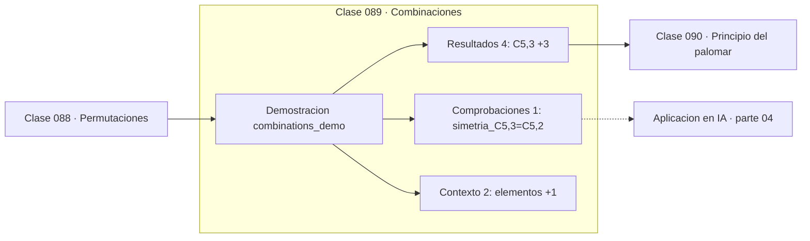

# 089 — Combinaciones

> [⬅️ 088 Permutaciones](../088-permutaciones/README.md) · [📚 Parte 04](../README.md) · [🏠 Programa](../../../README.md) · [090 Principio del palomar ➡️](../090-principio-del-palomar/README.md)

**Parte:** 04 — Matemática discreta para computación · **Nivel:** `intermedio` · **Horas estimadas:** 4
**Motor:** `engines.part04` · **Demostración:** `combinations_demo` · **Clase 9 de 20** de la parte

---

## 🎯 Propósito

**Una combinación cuenta selecciones donde el orden no importa; su simetría refleja que elegir k es descartar n−k.**

Lógica, conjuntos, conteo, inducción, recurrencias, grafos y aritmética modular: la matemática que hace demostrable un programa.

## ✅ Resultados de aprendizaje

Al terminar podrás:

1. Explicar **Combinaciones** con lenguaje cotidiano y con notación matemática.
2. Resolver un caso pequeño a mano y anticipar el orden de magnitud del resultado.
3. Ejecutar y modificar `lab.py`, que corre la demostración `combinations_demo`.
4. Interpretar las 7 salidas del laboratorio y decir qué comprueba cada una.
5. Detectar el error típico de esta parte: asumir que un grafo dirigido es acíclico sin verificarlo.

## 🧩 Fórmulas de la clase

```text
C(n,k) = n!/(k!(n−k)!)
C(n,k) = C(n,n−k)
Σₖ C(n,k) = 2ⁿ
```

## 🗺️ Ubicación en el programa



## 📖 Fundamentos

Una combinación es una permutación a la que se le ha quitado el orden: hay `k!`
ordenaciones de cada selección, así que `C(n,k) = P(n,k)/k!`. Esa deducción es la forma
correcta de recordar la fórmula, en lugar de memorizarla.

La simetría `C(n,k) = C(n,n−k)` tiene una lectura inmediata: elegir k elementos es lo
mismo que decidir cuáles n−k se descartan. Es un ejemplo de **biyección** como técnica
de demostración: dos conteos coinciden porque existe una correspondencia uno a uno
entre lo que cuentan.

La suma de toda una fila del triángulo de Pascal es 2ⁿ, y también tiene lectura
combinatoria: sumar sobre todos los tamaños posibles de subconjunto es contar todos los
subconjuntos, que son 2ⁿ. Este tipo de argumentos —contar lo mismo de dos formas— es la
herramienta central de la combinatoria.

En probabilidad, `C(n,k)` es el coeficiente de la distribución binomial (clase 192): el
número de secuencias con exactamente k éxitos en n ensayos. Y en machine learning
aparece al contar particiones de un conjunto de datos y al calcular el número de
comparaciones en un test estadístico múltiple.

## 🧮 Ejemplo trabajado

Combinaciones de 3 entre 5.

```text
elementos: A B C D E

C(5,3) = 5!/(3!·2!) = 120/(6·2) = 10
  ABC ABD ABE ACD ACE ADE BCD BCE BDE CDE

Simetría: C(5,3) = C(5,2) = 10          ✓
  (elegir 3 ≡ descartar 2)

Fila de Pascal para n=5:
  C(5,0..5) = 1, 5, 10, 10, 5, 1
  suma = 32 = 2⁵                        ✓
```

## 🔬 Qué ejecuta el laboratorio

`combinations_demo` — Combinaciones: el orden no importa.

| Grupo | Salidas |
|---|---|
| 🔢 Resultados numéricos (4) | `C(5,3)`, `math.comb`, `suma_fila_de_pascal`, `2^5` |
| ✅ Comprobaciones de invariante (1) | `simetria_C(5,3)=C(5,2)` |

Las claves booleanas no son adorno: si alguna fuera `False`, el resultado numérico
no sería fiable aunque el programa terminase sin error.

```bash
python classes/part-04-matematica-discreta-para-computacion/089-combinaciones/lab.py
compmath run 089
```

> [!TIP]
> Antes de ejecutar, **escribe tu predicción**. Un laboratorio que confirma lo que
> esperabas enseña tanto como uno que te contradice, pero solo si la predicción
> existía antes del resultado.

## ⚠️ Errores conceptuales frecuentes

1. Usar combinaciones donde el orden sí importa.
2. Calcular el factorial completo en lugar de usar math.comb, que evita desbordar.
3. Confundir C(n,k) con P(n,k): difieren en el factor k!.

## 🚀 Dónde se usa de verdad

Distribución binomial, número de comparaciones en tests múltiples, muestreo de
subconjuntos y conteo de particiones en validación cruzada.

## 🤖 Conexión con IA

Los grafos de cómputo, la búsqueda en árbol y las GNN son estructuras discretas; el conteo sostiene la probabilidad que después usa todo modelo generativo.

## 📓 Notebooks

| Archivo | Para qué |
|---|---|
| [`notebook.ipynb`](notebook.ipynb) | recorrido guiado con la demostración ejecutada |
| [`notebook_student.ipynb`](notebook_student.ipynb) | versión con `TODO` para resolver |
| [`notebook_solution.ipynb`](notebook_solution.ipynb) | solución de referencia verificada |

## 📝 Evaluación

| Criterio | Peso |
|---|---:|
| Comprensión conceptual | 25 % |
| Resolución manual | 25 % |
| Implementación y verificación | 25 % |
| Interpretación y comunicación | 15 % |
| Conexión con aplicación real | 10 % |

Detalle y criterios de error crítico en [`assessment.md`](assessment.md).

## ❓ Preguntas de comprobación

1. ¿Cuál es la entrada, cuál la salida y qué unidades tienen?
2. ¿Qué operación domina el comportamiento del resultado?
3. ¿Qué caso extremo revelaría un error conceptual?
4. ¿Cómo verificarías el resultado por un método independiente?
5. ¿Dónde aparece esto en algoritmos?

Si necesitas releer el código para responderlas, la clase todavía no está superada.

## 📥 Entregable

`notebook_student.ipynb` resuelto más un párrafo que explique el resultado **sin citar
código**: qué entra, qué sale, qué invariante se comprueba y qué pasaría en un caso límite.

## 📚 Bibliografía de la clase

Esta clase enseña **Matemática discreta · Lógica y demostración · Algoritmos y complejidad · Teoría de números**. Cada obra dice qué aporta aquí y cómo se comprobó su localizador:

- [Python: `math.comb` e `itertools.combinations`](https://docs.python.org/3/library/math.html#math.comb) — documentación de la herramienta que ejecuta el laboratorio · URL de la fuente primaria comprobada en Python Software Foundation (2026-08-19).
- [Graham, Knuth & Patashnik. *Concrete Mathematics*, 2ª ed., 1994, cap. 5](https://www-cs-faculty.stanford.edu/~knuth/gkp.html) — Algoritmos y complejidad y Matemática discreta: el tema de esta clase · ISBN-13 `9788131708415` verificado en International ISBN Agency (2026-08-19).

Bibliografía de todas las clases, con el porqué de cada obra, en [`docs/BIBLIOGRAPHY.md`](../../../docs/BIBLIOGRAPHY.md) · localizador y estado de cada obra en [`sources/bibliography.json`](../../../sources/bibliography.json).

## 📂 Material de la clase

[`intuition.md`](intuition.md) · [`theory.md`](theory.md) · [`derivation.md`](derivation.md) · [`exercises.md`](exercises.md) · [`assessment.md`](assessment.md) · [`where-is-this-used.md`](where-is-this-used.md) · [`lesson.yaml`](lesson.yaml)

---

> [⬅️ 088 Permutaciones](../088-permutaciones/README.md) · [📚 Parte 04](../README.md) · [🏠 Programa](../../../README.md) · [090 Principio del palomar ➡️](../090-principio-del-palomar/README.md)
