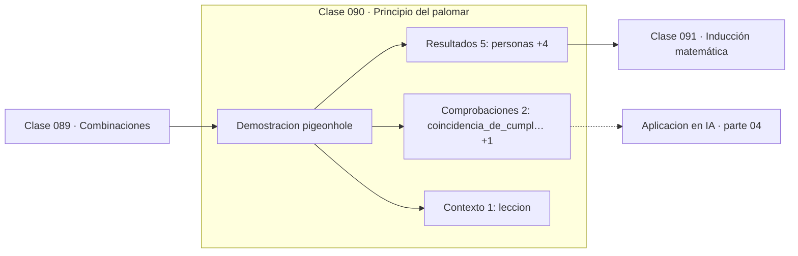

# 090 — Principio del palomar

> [⬅️ 089 Combinaciones](../089-combinaciones/README.md) · [📚 Parte 04](../README.md) · [🏠 Programa](../../../README.md) · [091 Inducción matemática ➡️](../091-induccion-matematica/README.md)

**Parte:** 04 — Matemática discreta para computación · **Nivel:** `intermedio` · **Horas estimadas:** 4
**Motor:** `engines.part04` · **Demostración:** `pigeonhole` · **Clase 10 de 20** de la parte

---

## 🎯 Propósito

**El principio del palomar demuestra que existe una colisión sin construir ninguna.**

Lógica, conjuntos, conteo, inducción, recurrencias, grafos y aritmética modular: la matemática que hace demostrable un programa.

## ✅ Resultados de aprendizaje

Al terminar podrás:

1. Explicar **Principio del palomar** con lenguaje cotidiano y con notación matemática.
2. Resolver un caso pequeño a mano y anticipar el orden de magnitud del resultado.
3. Ejecutar y modificar `lab.py`, que corre la demostración `pigeonhole`.
4. Interpretar las 8 salidas del laboratorio y decir qué comprueba cada una.
5. Detectar el error típico de esta parte: contar dos veces al aplicar el principio de inclusión-exclusión.

## 🧩 Fórmulas de la clase

```text
n objetos en m cajas con n > m ⟹ alguna caja tiene ≥ ⌈n/m⌉
colisión de hash garantizada si entradas > tamaño del espacio
```

## 🗺️ Ubicación en el programa



## 📖 Fundamentos

El principio del palomar es de una simplicidad desarmante: si se reparten n objetos en
m cajas y n > m, alguna caja recibe al menos dos. Su potencia está en que demuestra una
**existencia** sin ofrecer un método para encontrarla, y ese tipo de argumento —no
constructivo— es habitual en matemáticas y muy útil en informática.

La aplicación directa es a las funciones hash. Una función que mapea un dominio infinito
—o simplemente mayor— en un espacio de 2ⁿ valores **tiene** colisiones necesariamente.
No es un defecto de la función: es una consecuencia lógica. Por eso la pregunta correcta
sobre una función hash criptográfica no es «¿tiene colisiones?» sino «¿es
computacionalmente factible encontrarlas?».

La forma generalizada da una cota más fina: alguna caja tiene al menos `⌈n/m⌉` objetos.
Con 400 personas y 365 días del año, alguna fecha tiene al menos dos cumpleaños; con
800, al menos tres.

Conviene no confundirlo con la **paradoja del cumpleaños**, que es un resultado
probabilístico distinto: con solo 23 personas la probabilidad de coincidencia supera el
50 %. El palomar da certeza con 366; la paradoja da probabilidad alta con 23. La segunda
es la que determina la seguridad real de un hash frente a ataques de colisión, y aparece
en la clase 090 como contraste.

## 🧮 Ejemplo trabajado

Cumpleaños y colisiones de hash.

```text
400 personas, 365 días:
  400 > 365 → coincidencia GARANTIZADA
  mínimo de repeticiones: ⌈400/365⌉ = 2

Hash de 16 bits (65 536 valores), 100 000 entradas:
  100 000 > 65 536 → colisión GARANTIZADA

Contraste con la paradoja del cumpleaños:
  con 23 personas, P(coincidencia) > 0.5
  el palomar da certeza; la paradoja da probabilidad

Lección: no hace falta encontrar la colisión
         para demostrar que existe.
```

## 🔬 Qué ejecuta el laboratorio

`pigeonhole` — Principio del palomar: colisiones garantizadas sin construirlas.

| Grupo | Salidas |
|---|---|
| 🔢 Resultados numéricos (5) | `personas`, `dias_del_año`, `minimo_repeticiones`, `espacio_hash`, `entradas` |
| ✅ Comprobaciones de invariante (2) | `coincidencia_de_cumpleaños_garantizada`, `colision_garantizada` |

Las claves booleanas no son adorno: si alguna fuera `False`, el resultado numérico
no sería fiable aunque el programa terminase sin error.

```bash
python classes/part-04-matematica-discreta-para-computacion/090-principio-del-palomar/lab.py
compmath run 090
```

> [!TIP]
> Antes de ejecutar, **escribe tu predicción**. Un laboratorio que confirma lo que
> esperabas enseña tanto como uno que te contradice, pero solo si la predicción
> existía antes del resultado.

## ⚠️ Errores conceptuales frecuentes

1. Confundir el principio del palomar (certeza) con la paradoja del cumpleaños (probabilidad).
2. Suponer que una función hash bien diseñada no tiene colisiones.
3. Aplicar la cota ⌈n/m⌉ como si fuera el máximo en lugar del mínimo garantizado.

## 🚀 Dónde se usa de verdad

Análisis de funciones hash, límites de compresión sin pérdida, diseño de tablas hash y
argumentos de existencia en teoría de la complejidad.

## 🤖 Conexión con IA

Los grafos de cómputo, la búsqueda en árbol y las GNN son estructuras discretas; el conteo sostiene la probabilidad que después usa todo modelo generativo.

## 📓 Notebooks

| Archivo | Para qué |
|---|---|
| [`notebook.ipynb`](notebook.ipynb) | recorrido guiado con la demostración ejecutada |
| [`notebook_student.ipynb`](notebook_student.ipynb) | versión con `TODO` para resolver |
| [`notebook_solution.ipynb`](notebook_solution.ipynb) | solución de referencia verificada |

## 📝 Evaluación

| Criterio | Peso |
|---|---:|
| Comprensión conceptual | 25 % |
| Resolución manual | 25 % |
| Implementación y verificación | 25 % |
| Interpretación y comunicación | 15 % |
| Conexión con aplicación real | 10 % |

Detalle y criterios de error crítico en [`assessment.md`](assessment.md).

## ❓ Preguntas de comprobación

1. ¿Cuál es la entrada, cuál la salida y qué unidades tienen?
2. ¿Qué operación domina el comportamiento del resultado?
3. ¿Qué caso extremo revelaría un error conceptual?
4. ¿Cómo verificarías el resultado por un método independiente?
5. ¿Dónde aparece esto en algoritmos?

Si necesitas releer el código para responderlas, la clase todavía no está superada.

## 📥 Entregable

`notebook_student.ipynb` resuelto más un párrafo que explique el resultado **sin citar
código**: qué entra, qué sale, qué invariante se comprueba y qué pasaría en un caso límite.

## 🔗 Referencias

- [Rosen, K. *Discrete Mathematics and Its Applications*, 8ª ed., 2019, cap. 6](https://www.mheducation.com/highered/product/discrete-mathematics-applications-rosen.html)
- [Stinson & Paterson. *Cryptography: Theory and Practice*, 4ª ed., CRC, 2018](https://www.routledge.com/Cryptography-Theory-and-Practice/Stinson-Paterson/p/book/9781138197015)

Bibliografía completa de la parte en [`../../../docs/BIBLIOGRAPHY.md`](../../../docs/BIBLIOGRAPHY.md).

## 📂 Material de la clase

[`intuition.md`](intuition.md) · [`theory.md`](theory.md) · [`derivation.md`](derivation.md) · [`exercises.md`](exercises.md) · [`assessment.md`](assessment.md) · [`where-is-this-used.md`](where-is-this-used.md) · [`lesson.yaml`](lesson.yaml)

---

> [⬅️ 089 Combinaciones](../089-combinaciones/README.md) · [📚 Parte 04](../README.md) · [🏠 Programa](../../../README.md) · [091 Inducción matemática ➡️](../091-induccion-matematica/README.md)
