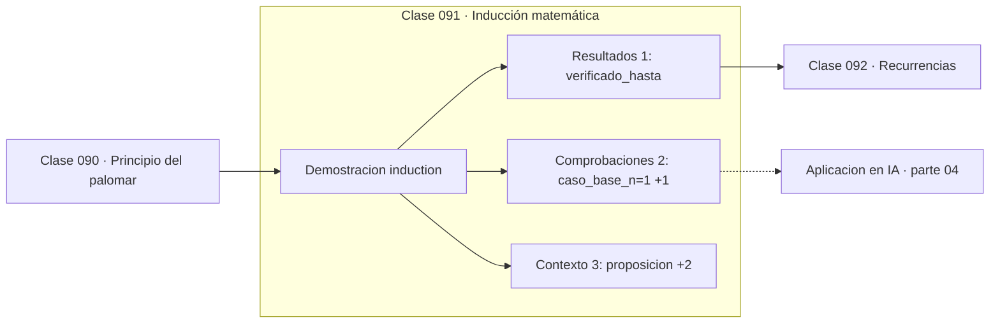

# 091 — Inducción matemática

> [⬅️ 090 Principio del palomar](../090-principio-del-palomar/README.md) · [📚 Parte 04](../README.md) · [🏠 Programa](../../../README.md) · [092 Recurrencias ➡️](../092-recurrencias/README.md)

**Parte:** 04 — Matemática discreta para computación · **Nivel:** `intermedio` · **Horas estimadas:** 4
**Motor:** `engines.part04` · **Demostración:** `induction` · **Clase 11 de 20** de la parte

---

## 🎯 Propósito

**La inducción demuestra infinitos casos con un caso base y un paso que hereda la propiedad.**

Lógica, conjuntos, conteo, inducción, recurrencias, grafos y aritmética modular: la matemática que hace demostrable un programa.

## ✅ Resultados de aprendizaje

Al terminar podrás:

1. Explicar **Inducción matemática** con lenguaje cotidiano y con notación matemática.
2. Resolver un caso pequeño a mano y anticipar el orden de magnitud del resultado.
3. Ejecutar y modificar `lab.py`, que corre la demostración `induction`.
4. Interpretar las 6 salidas del laboratorio y decir qué comprueba cada una.
5. Detectar el error típico de esta parte: confundir implicación con equivalencia lógica.

## 🧩 Fórmulas de la clase

```text
base: P(1) es cierta
paso: P(k) ⟹ P(k+1)
conclusión: P(n) para todo n ≥ 1
```

## 🗺️ Ubicación en el programa



## 📖 Fundamentos

La inducción resuelve un problema que parece imposible: demostrar algo sobre infinitos
números en dos pasos. El caso base establece que la propiedad vale en el primer valor;
el paso inductivo demuestra que **si** vale en k, entonces vale en k+1. La combinación
de ambos hace caer todas las fichas de dominó.

La analogía con un bucle es exacta: el caso base es la inicialización y el paso
inductivo es el invariante que se mantiene en cada iteración. Demostrar la corrección
de un bucle es demostrar por inducción que su invariante se preserva, y esa es la base
de la verificación formal de programas.

El paso inductivo es donde vive la demostración, y su estructura es siempre la misma:
escribir `P(k+1)`, identificar dentro de ella la parte que es `P(k)`, aplicar la
hipótesis y simplificar. Para la suma de Gauss:
`S(k+1) = S(k) + (k+1) = k(k+1)/2 + (k+1) = (k+1)(k+2)/2`, que es exactamente la
fórmula con k+1.

Es importante no confundir inducción con verificación. Comprobar los primeros 50 casos
no demuestra nada, como la clase 019 mostró con el polinomio de Euler. La verificación
empírica es un control de sanidad previo a la demostración, no un sustituto.

## 🧮 Ejemplo trabajado

Demostrar la suma de Gauss por inducción.

```text
Proposición: 1 + 2 + ... + n = n(n+1)/2

Caso base (n=1):
  izquierda = 1
  derecha   = 1·2/2 = 1              ✓

Paso inductivo: suponemos S(k) = k(k+1)/2
  S(k+1) = S(k) + (k+1)
         = k(k+1)/2 + (k+1)
         = (k+1)(k/2 + 1)
         = (k+1)(k+2)/2              ✓ es la fórmula con k+1

Verificación empírica (control de sanidad):
  50 valores comprobados, 0 contraejemplos
  → NO es la demostración, es una comprobación previa
```

## 🔬 Qué ejecuta el laboratorio

`induction` — Inducción: caso base, paso inductivo y verificación empírica.

| Grupo | Salidas |
|---|---|
| 🔢 Resultados numéricos (1) | `verificado_hasta` |
| ✅ Comprobaciones de invariante (2) | `caso_base_n=1`, `la_verificacion_no_es_demostracion` |

Las claves booleanas no son adorno: si alguna fuera `False`, el resultado numérico
no sería fiable aunque el programa terminase sin error.

```bash
python classes/part-04-matematica-discreta-para-computacion/091-induccion-matematica/lab.py
compmath run 091
```

> [!TIP]
> Antes de ejecutar, **escribe tu predicción**. Un laboratorio que confirma lo que
> esperabas enseña tanto como uno que te contradice, pero solo si la predicción
> existía antes del resultado.

## ⚠️ Errores conceptuales frecuentes

1. Omitir el caso base: sin él, el paso inductivo no arranca.
2. Usar la conclusión como hipótesis dentro del paso inductivo.
3. Confundir verificar los primeros n casos con demostrar.

## 🚀 Dónde se usa de verdad

Corrección de algoritmos recursivos, invariantes de bucle, análisis de estructuras de
datos y demostración de cotas de complejidad.

## 🤖 Conexión con IA

Los grafos de cómputo, la búsqueda en árbol y las GNN son estructuras discretas; el conteo sostiene la probabilidad que después usa todo modelo generativo.

## 📓 Notebooks

| Archivo | Para qué |
|---|---|
| [`notebook.ipynb`](notebook.ipynb) | recorrido guiado con la demostración ejecutada |
| [`notebook_student.ipynb`](notebook_student.ipynb) | versión con `TODO` para resolver |
| [`notebook_solution.ipynb`](notebook_solution.ipynb) | solución de referencia verificada |

## 📝 Evaluación

| Criterio | Peso |
|---|---:|
| Comprensión conceptual | 25 % |
| Resolución manual | 25 % |
| Implementación y verificación | 25 % |
| Interpretación y comunicación | 15 % |
| Conexión con aplicación real | 10 % |

Detalle y criterios de error crítico en [`assessment.md`](assessment.md).

## ❓ Preguntas de comprobación

1. ¿Cuál es la entrada, cuál la salida y qué unidades tienen?
2. ¿Qué operación domina el comportamiento del resultado?
3. ¿Qué caso extremo revelaría un error conceptual?
4. ¿Cómo verificarías el resultado por un método independiente?
5. ¿Dónde aparece esto en algoritmos?

Si necesitas releer el código para responderlas, la clase todavía no está superada.

## 📥 Entregable

`notebook_student.ipynb` resuelto más un párrafo que explique el resultado **sin citar
código**: qué entra, qué sale, qué invariante se comprueba y qué pasaría en un caso límite.

## 🔗 Referencias

- [Velleman, D. *How to Prove It*, 3ª ed., Cambridge, 2019, cap. 6](https://www.cambridge.org/core/books/how-to-prove-it/6D2965D625C6836CD4A785A2C843B19A) — *uso:* obra de referencia consultada en «Inducción matemática».
- [Gries, D. *The Science of Programming*. Springer, 1981](https://link.springer.com/book/10.1007/978-1-4612-5983-1) — *uso:* desarrollo formal del tema en «Inducción matemática».

Bibliografía completa de la parte en [`../../../docs/BIBLIOGRAPHY.md`](../../../docs/BIBLIOGRAPHY.md) · localizador verificable de cada obra en [`sources/bibliography.json`](../../../sources/bibliography.json).

## 📂 Material de la clase

[`intuition.md`](intuition.md) · [`theory.md`](theory.md) · [`derivation.md`](derivation.md) · [`exercises.md`](exercises.md) · [`assessment.md`](assessment.md) · [`where-is-this-used.md`](where-is-this-used.md) · [`lesson.yaml`](lesson.yaml)

---

> [⬅️ 090 Principio del palomar](../090-principio-del-palomar/README.md) · [📚 Parte 04](../README.md) · [🏠 Programa](../../../README.md) · [092 Recurrencias ➡️](../092-recurrencias/README.md)
