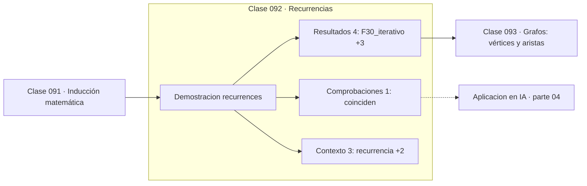

# 092 — Recurrencias

> [⬅️ 091 Inducción matemática](../091-induccion-matematica/README.md) · [📚 Parte 04](../README.md) · [🏠 Programa](../../../README.md) · [093 Grafos: vértices y aristas ➡️](../093-grafos-vertices-y-aristas/README.md)

**Parte:** 04 — Matemática discreta para computación · **Nivel:** `intermedio` · **Horas estimadas:** 4
**Motor:** `engines.part04` · **Demostración:** `recurrences` · **Clase 12 de 20** de la parte

---

## 🎯 Propósito

**Una recurrencia define cada término desde los anteriores; su coste depende radicalmente de si se memoiza.**

Lógica, conjuntos, conteo, inducción, recurrencias, grafos y aritmética modular: la matemática que hace demostrable un programa.

## ✅ Resultados de aprendizaje

Al terminar podrás:

1. Explicar **Recurrencias** con lenguaje cotidiano y con notación matemática.
2. Resolver un caso pequeño a mano y anticipar el orden de magnitud del resultado.
3. Ejecutar y modificar `lab.py`, que corre la demostración `recurrences`.
4. Interpretar las 8 salidas del laboratorio y decir qué comprueba cada una.
5. Detectar el error típico de esta parte: asumir que un grafo dirigido es acíclico sin verificarlo.

## 🧩 Fórmulas de la clase

```text
F(n) = F(n−1) + F(n−2),  F(0)=0, F(1)=1
Binet: F(n) = (φⁿ − (−1/φ)ⁿ)/√5,  φ = (1+√5)/2
```

## 🗺️ Ubicación en el programa



## 📖 Fundamentos

Una recurrencia es una definición autorreferente con casos base. Fibonacci es el
ejemplo canónico, y sirve para ilustrar la diferencia más importante del análisis de
algoritmos: la implementación recursiva ingenua recalcula los mismos valores una y otra
vez y tarda `O(φⁿ)`; la iterativa —o la memoizada— tarda `O(n)`.

La diferencia no es de constante: para n = 50, la ingenua hace del orden de 10¹⁰
llamadas y la iterativa 50 pasos. Es la demostración más clara de que la complejidad
asintótica no es una abstracción académica.

Fibonacci tiene además una fórmula cerrada, la de Binet, que involucra la razón áurea
φ. Que una recurrencia de enteros se exprese con irracionales es notable, y su
deducción —resolver la ecuación característica `x² = x + 1`— es el método general para
recurrencias lineales homogéneas, análogo al de las ecuaciones diferenciales lineales
de la parte 11.

Una precaución numérica: la fórmula de Binet en punto flotante deja de dar el entero
exacto para n grande, porque φⁿ crece y la precisión relativa se agota. Para n = 71 el
redondeo ya falla. Es un buen recordatorio de que una fórmula cerrada no siempre es
preferible a una iteración.

## 🧮 Ejemplo trabajado

Fibonacci por tres caminos.

```text
F(30):
  iterativo:  832040        30 pasos
  Binet:      832040        1 evaluación
  coinciden                            ✓

recursivo ingenuo: 2 692 537 llamadas
  coste O(φⁿ) ≈ O(1.618ⁿ)

Razón entre consecutivos:
  F(31)/F(30) = 1.6180339...
  φ           = 1.6180339...           ✓ converge

Límite de Binet en float64: falla a partir de n ≈ 71
```

## 🔬 Qué ejecuta el laboratorio

`recurrences` — Recurrencia lineal: iterativo, memoizado y forma cerrada.

| Grupo | Salidas |
|---|---|
| 🔢 Resultados numéricos (4) | `F(30)_iterativo`, `F(30)_binet`, `razon_asintotica`, `razon_aurea` |
| ✅ Comprobaciones de invariante (1) | `coinciden` |

Las claves booleanas no son adorno: si alguna fuera `False`, el resultado numérico
no sería fiable aunque el programa terminase sin error.

```bash
python classes/part-04-matematica-discreta-para-computacion/092-recurrencias/lab.py
compmath run 092
```

> [!TIP]
> Antes de ejecutar, **escribe tu predicción**. Un laboratorio que confirma lo que
> esperabas enseña tanto como uno que te contradice, pero solo si la predicción
> existía antes del resultado.

## ⚠️ Errores conceptuales frecuentes

1. Implementar una recurrencia recursivamente sin memoización.
2. Confiar en la fórmula de Binet para n grande en punto flotante.
3. Olvidar los casos base al definir la recurrencia.

## 🚀 Dónde se usa de verdad

Análisis de algoritmos divide y vencerás, programación dinámica, modelos
autorregresivos y recurrencias en RNN (clase 313).

## 🤖 Conexión con IA

Los grafos de cómputo, la búsqueda en árbol y las GNN son estructuras discretas; el conteo sostiene la probabilidad que después usa todo modelo generativo.

## 📓 Notebooks

| Archivo | Para qué |
|---|---|
| [`notebook.ipynb`](notebook.ipynb) | recorrido guiado con la demostración ejecutada |
| [`notebook_student.ipynb`](notebook_student.ipynb) | versión con `TODO` para resolver |
| [`notebook_solution.ipynb`](notebook_solution.ipynb) | solución de referencia verificada |

## 📝 Evaluación

| Criterio | Peso |
|---|---:|
| Comprensión conceptual | 25 % |
| Resolución manual | 25 % |
| Implementación y verificación | 25 % |
| Interpretación y comunicación | 15 % |
| Conexión con aplicación real | 10 % |

Detalle y criterios de error crítico en [`assessment.md`](assessment.md).

## ❓ Preguntas de comprobación

1. ¿Cuál es la entrada, cuál la salida y qué unidades tienen?
2. ¿Qué operación domina el comportamiento del resultado?
3. ¿Qué caso extremo revelaría un error conceptual?
4. ¿Cómo verificarías el resultado por un método independiente?
5. ¿Dónde aparece esto en algoritmos?

Si necesitas releer el código para responderlas, la clase todavía no está superada.

## 📥 Entregable

`notebook_student.ipynb` resuelto más un párrafo que explique el resultado **sin citar
código**: qué entra, qué sale, qué invariante se comprueba y qué pasaría en un caso límite.

## 🔗 Referencias

- [Graham, Knuth & Patashnik. *Concrete Mathematics*, 2ª ed., 1994, cap. 6](https://www-cs-faculty.stanford.edu/~knuth/gkp.html)
- [Cormen, T. et al. *Introduction to Algorithms*, 4ª ed., MIT Press, 2022, cap. 4](https://mitpress.mit.edu/9780262046305/introduction-to-algorithms/)

Bibliografía completa de la parte en [`../../../docs/BIBLIOGRAPHY.md`](../../../docs/BIBLIOGRAPHY.md).

## 📂 Material de la clase

[`intuition.md`](intuition.md) · [`theory.md`](theory.md) · [`derivation.md`](derivation.md) · [`exercises.md`](exercises.md) · [`assessment.md`](assessment.md) · [`where-is-this-used.md`](where-is-this-used.md) · [`lesson.yaml`](lesson.yaml)

---

> [⬅️ 091 Inducción matemática](../091-induccion-matematica/README.md) · [📚 Parte 04](../README.md) · [🏠 Programa](../../../README.md) · [093 Grafos: vértices y aristas ➡️](../093-grafos-vertices-y-aristas/README.md)
