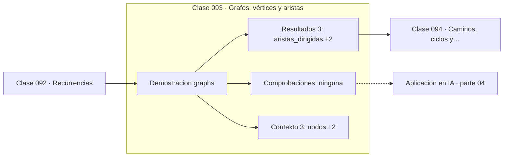

# 093 — Grafos: vértices y aristas

> [⬅️ 092 Recurrencias](../092-recurrencias/README.md) · [📚 Parte 04](../README.md) · [🏠 Programa](../../../README.md) · [094 Caminos, ciclos y conectividad ➡️](../094-caminos-ciclos-y-conectividad/README.md)

**Parte:** 04 — Matemática discreta para computación · **Nivel:** `intermedio` · **Horas estimadas:** 4
**Motor:** `engines.part04` · **Demostración:** `graphs` · **Clase 13 de 20** de la parte

---

## 🎯 Propósito

**Un grafo modela relaciones; el lema del apretón de manos relaciona grados y aristas.**

Lógica, conjuntos, conteo, inducción, recurrencias, grafos y aritmética modular: la matemática que hace demostrable un programa.

## ✅ Resultados de aprendizaje

Al terminar podrás:

1. Explicar **Grafos: vértices y aristas** con lenguaje cotidiano y con notación matemática.
2. Resolver un caso pequeño a mano y anticipar el orden de magnitud del resultado.
3. Ejecutar y modificar `lab.py`, que corre la demostración `graphs`.
4. Interpretar las 6 salidas del laboratorio y decir qué comprueba cada una.
5. Detectar el error típico de esta parte: contar dos veces al aplicar el principio de inclusión-exclusión.

## 🧩 Fórmulas de la clase

```text
no dirigido: Σ grados = 2|E|
dirigido: Σ grados de salida = Σ grados de entrada = |E|
densidad = |E| / (|V|(|V|−1))
```

## 🗺️ Ubicación en el programa



## 📖 Fundamentos

Un grafo es un conjunto de vértices y un conjunto de aristas que los conectan. Es la
estructura más versátil de la computación porque casi cualquier relación se modela así:
dependencias entre tareas, enlaces entre páginas, amistades, rutas, y —lo que importa
en este programa— **operaciones de un cálculo**.

El lema del apretón de manos dice que la suma de los grados es el doble del número de
aristas, porque cada arista contribuye 1 a cada uno de sus dos extremos. De ahí se
deduce inmediatamente que el número de vértices de grado impar es par, resultado que
parece anecdótico y aparece en problemas de emparejamiento.

La representación importa para el rendimiento. Una **matriz de adyacencia** ocupa
`O(V²)` y responde «¿hay arista?» en tiempo constante; una **lista de adyacencia**
ocupa `O(V+E)` y es preferible en grafos dispersos, que son la mayoría de los reales.
Los grafos de redes sociales tienen densidad ínfima, y usar matriz sería inviable.

El grafo del laboratorio es un pipeline de machine learning —entrada, limpieza,
features, split, entrenamiento, evaluación—, y ese ejemplo no es decorativo: la
ejecución de un pipeline, de un sistema de construcción y de un grafo de cómputo de
autodiferenciación son el mismo problema sobre la misma estructura.

## 🧮 Ejemplo trabajado

Grafo de un pipeline de ML.

```text
entrada → limpieza → features    → entrenamiento → evaluacion
                  ↘ split       ↗

vértices: 6
aristas dirigidas: 6

grados de salida:
  entrada 1, limpieza 2, features 1,
  split 1, entrenamiento 1, evaluacion 0
suma = 6 = |E|                        ✓

densidad = 6/(6·5) = 0.2
```

## 🔬 Qué ejecuta el laboratorio

`graphs` — Grados, aristas y el lema del apretón de manos.

| Grupo | Salidas |
|---|---|
| 🔢 Resultados numéricos (3) | `aristas_dirigidas`, `suma_de_grados`, `densidad` |
| ✅ Comprobaciones de invariante (0) | — |

Las claves booleanas no son adorno: si alguna fuera `False`, el resultado numérico
no sería fiable aunque el programa terminase sin error.

```bash
python classes/part-04-matematica-discreta-para-computacion/093-grafos-vertices-y-aristas/lab.py
compmath run 093
```

> [!TIP]
> Antes de ejecutar, **escribe tu predicción**. Un laboratorio que confirma lo que
> esperabas enseña tanto como uno que te contradice, pero solo si la predicción
> existía antes del resultado.

## ⚠️ Errores conceptuales frecuentes

1. Usar matriz de adyacencia en grafos grandes y dispersos.
2. Aplicar el lema del apretón de manos (2|E|) a grafos dirigidos.
3. Olvidar si el grafo es dirigido al contar grados.

## 🚀 Dónde se usa de verdad

Grafos de cómputo y autodiferenciación, sistemas de construcción, redes sociales,
rutas y GNN.

## 🤖 Conexión con IA

Los grafos de cómputo, la búsqueda en árbol y las GNN son estructuras discretas; el conteo sostiene la probabilidad que después usa todo modelo generativo.

## 📓 Notebooks

| Archivo | Para qué |
|---|---|
| [`notebook.ipynb`](notebook.ipynb) | recorrido guiado con la demostración ejecutada |
| [`notebook_student.ipynb`](notebook_student.ipynb) | versión con `TODO` para resolver |
| [`notebook_solution.ipynb`](notebook_solution.ipynb) | solución de referencia verificada |

## 📝 Evaluación

| Criterio | Peso |
|---|---:|
| Comprensión conceptual | 25 % |
| Resolución manual | 25 % |
| Implementación y verificación | 25 % |
| Interpretación y comunicación | 15 % |
| Conexión con aplicación real | 10 % |

Detalle y criterios de error crítico en [`assessment.md`](assessment.md).

## ❓ Preguntas de comprobación

1. ¿Cuál es la entrada, cuál la salida y qué unidades tienen?
2. ¿Qué operación domina el comportamiento del resultado?
3. ¿Qué caso extremo revelaría un error conceptual?
4. ¿Cómo verificarías el resultado por un método independiente?
5. ¿Dónde aparece esto en algoritmos?

Si necesitas releer el código para responderlas, la clase todavía no está superada.

## 📥 Entregable

`notebook_student.ipynb` resuelto más un párrafo que explique el resultado **sin citar
código**: qué entra, qué sale, qué invariante se comprueba y qué pasaría en un caso límite.

## 🔗 Referencias

- [Cormen, T. et al. *Introduction to Algorithms*, 4ª ed., 2022, cap. 20](https://mitpress.mit.edu/9780262046305/introduction-to-algorithms/) — *uso:* desarrollo formal del tema en «Grafos: vértices y aristas».
- [Newman, M. *Networks*, 2ª ed., Oxford University Press, 2018](https://global.oup.com/academic/product/networks-9780198805090) — *uso:* desarrollo formal del tema en «Grafos: vértices y aristas».

Bibliografía completa de la parte en [`../../../docs/BIBLIOGRAPHY.md`](../../../docs/BIBLIOGRAPHY.md) · localizador verificable de cada obra en [`sources/bibliography.json`](../../../sources/bibliography.json).

## 📂 Material de la clase

[`intuition.md`](intuition.md) · [`theory.md`](theory.md) · [`derivation.md`](derivation.md) · [`exercises.md`](exercises.md) · [`assessment.md`](assessment.md) · [`where-is-this-used.md`](where-is-this-used.md) · [`lesson.yaml`](lesson.yaml)

---

> [⬅️ 092 Recurrencias](../092-recurrencias/README.md) · [📚 Parte 04](../README.md) · [🏠 Programa](../../../README.md) · [094 Caminos, ciclos y conectividad ➡️](../094-caminos-ciclos-y-conectividad/README.md)
