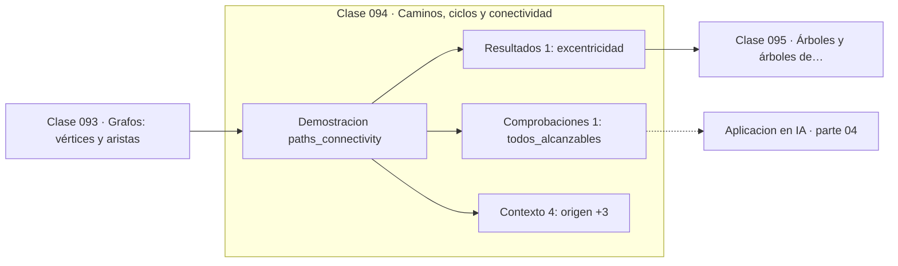

# 094 — Caminos, ciclos y conectividad

> [⬅️ 093 Grafos: vértices y aristas](../093-grafos-vertices-y-aristas/README.md) · [📚 Parte 04](../README.md) · [🏠 Programa](../../../README.md) · [095 Árboles y árboles de expansión ➡️](../095-arboles-y-arboles-de-expansion/README.md)

**Parte:** 04 — Matemática discreta para computación · **Nivel:** `intermedio` · **Horas estimadas:** 4
**Motor:** `engines.part04` · **Demostración:** `paths_connectivity` · **Clase 14 de 20** de la parte

---

## 🎯 Propósito

**BFS recorre por niveles y encuentra el camino con menos aristas en tiempo O(V+E).**

Lógica, conjuntos, conteo, inducción, recurrencias, grafos y aritmética modular: la matemática que hace demostrable un programa.

## ✅ Resultados de aprendizaje

Al terminar podrás:

1. Explicar **Caminos, ciclos y conectividad** con lenguaje cotidiano y con notación matemática.
2. Resolver un caso pequeño a mano y anticipar el orden de magnitud del resultado.
3. Ejecutar y modificar `lab.py`, que corre la demostración `paths_connectivity`.
4. Interpretar las 6 salidas del laboratorio y decir qué comprueba cada una.
5. Detectar el error típico de esta parte: confundir implicación con equivalencia lógica.

## 🧩 Fórmulas de la clase

```text
coste BFS: O(V + E)
distancia BFS = número mínimo de aristas
excentricidad = máxima distancia desde un vértice
```

## 🗺️ Ubicación en el programa



## 📖 Fundamentos

El recorrido en anchura visita primero todos los vecinos, luego los vecinos de los
vecinos, y así sucesivamente. Esa disciplina por niveles garantiza que la primera vez
que se alcanza un vértice se ha hecho por el camino con **menos aristas**, que es el
camino más corto en un grafo no ponderado.

La implementación necesita una cola (FIFO) y un conjunto de visitados. Cambiar la cola
por una pila convierte el algoritmo en DFS, con propiedades muy distintas: DFS no
garantiza caminos mínimos pero sirve para detectar ciclos y para ordenar
topológicamente. La estructura de datos determina el comportamiento.

El coste `O(V + E)` es óptimo: cada vértice y cada arista se procesan una vez. Con
pesos en las aristas, BFS deja de servir y hace falta Dijkstra, cuyo coste sube a
`O((V+E) log V)` por la cola de prioridad.

La **excentricidad** de un vértice —la mayor distancia a cualquier otro— y el diámetro
del grafo se calculan con BFS desde cada vértice. En redes sociales esas métricas dan
lugar al fenómeno de los «seis grados de separación», y en un pipeline indican cuántas
etapas secuenciales hay como mínimo.

## 🧮 Ejemplo trabajado

BFS desde «entrada» en el pipeline.

```text
orden de visita:
  entrada → limpieza → features → split → entrenamiento → evaluacion

distancias (en aristas):
  entrada       0
  limpieza      1
  features      2
  split         2
  entrenamiento 3
  evaluacion    4

todos alcanzables: 6/6                ✓
excentricidad de entrada: 4
coste: O(V + E) = O(6 + 6)
```

## 🔬 Qué ejecuta el laboratorio

`paths_connectivity` — Recorrido BFS: alcanzabilidad y distancia en aristas.

| Grupo | Salidas |
|---|---|
| 🔢 Resultados numéricos (1) | `excentricidad` |
| ✅ Comprobaciones de invariante (1) | `todos_alcanzables` |

Las claves booleanas no son adorno: si alguna fuera `False`, el resultado numérico
no sería fiable aunque el programa terminase sin error.

```bash
python classes/part-04-matematica-discreta-para-computacion/094-caminos-ciclos-y-conectividad/lab.py
compmath run 094
```

> [!TIP]
> Antes de ejecutar, **escribe tu predicción**. Un laboratorio que confirma lo que
> esperabas enseña tanto como uno que te contradice, pero solo si la predicción
> existía antes del resultado.

## ⚠️ Errores conceptuales frecuentes

1. Usar una pila en lugar de una cola y obtener DFS sin darse cuenta.
2. Aplicar BFS a un grafo con pesos esperando el camino de coste mínimo.
3. No marcar los vértices como visitados y entrar en bucle infinito.

## 🚀 Dónde se usa de verdad

Camino más corto en grafos no ponderados, detección de componentes conexas, análisis de
alcance en redes y niveles de un pipeline.

## 🤖 Conexión con IA

Los grafos de cómputo, la búsqueda en árbol y las GNN son estructuras discretas; el conteo sostiene la probabilidad que después usa todo modelo generativo.

## 📓 Notebooks

| Archivo | Para qué |
|---|---|
| [`notebook.ipynb`](notebook.ipynb) | recorrido guiado con la demostración ejecutada |
| [`notebook_student.ipynb`](notebook_student.ipynb) | versión con `TODO` para resolver |
| [`notebook_solution.ipynb`](notebook_solution.ipynb) | solución de referencia verificada |

## 📝 Evaluación

| Criterio | Peso |
|---|---:|
| Comprensión conceptual | 25 % |
| Resolución manual | 25 % |
| Implementación y verificación | 25 % |
| Interpretación y comunicación | 15 % |
| Conexión con aplicación real | 10 % |

Detalle y criterios de error crítico en [`assessment.md`](assessment.md).

## ❓ Preguntas de comprobación

1. ¿Cuál es la entrada, cuál la salida y qué unidades tienen?
2. ¿Qué operación domina el comportamiento del resultado?
3. ¿Qué caso extremo revelaría un error conceptual?
4. ¿Cómo verificarías el resultado por un método independiente?
5. ¿Dónde aparece esto en algoritmos?

Si necesitas releer el código para responderlas, la clase todavía no está superada.

## 📥 Entregable

`notebook_student.ipynb` resuelto más un párrafo que explique el resultado **sin citar
código**: qué entra, qué sale, qué invariante se comprueba y qué pasaría en un caso límite.

## 📚 Bibliografía de la clase

Esta clase enseña **Matemática discreta · Lógica y demostración · Algoritmos y complejidad · Teoría de números**. Cada obra dice qué aporta aquí y cómo se comprobó su localizador:

- [Cormen, T. et al. *Introduction to Algorithms*, 4ª ed., 2022, cap. 20](https://mitpress.mit.edu/9780262046305/introduction-to-algorithms/) — Algoritmos y complejidad y Matemática discreta: el tema de esta clase · ISBN-13 `9780262046305` verificado en International ISBN Agency (2026-08-19).
- [Python: `collections.deque`](https://docs.python.org/3/library/collections.html#collections.deque) — documentación de la herramienta que ejecuta el laboratorio · URL de la fuente primaria comprobada en Python Software Foundation (2026-08-19).

Bibliografía de todas las clases, con el porqué de cada obra, en [`docs/BIBLIOGRAPHY.md`](../../../docs/BIBLIOGRAPHY.md) · localizador y estado de cada obra en [`sources/bibliography.json`](../../../sources/bibliography.json).

## 📂 Material de la clase

[`intuition.md`](intuition.md) · [`theory.md`](theory.md) · [`derivation.md`](derivation.md) · [`exercises.md`](exercises.md) · [`assessment.md`](assessment.md) · [`where-is-this-used.md`](where-is-this-used.md) · [`lesson.yaml`](lesson.yaml)

---

> [⬅️ 093 Grafos: vértices y aristas](../093-grafos-vertices-y-aristas/README.md) · [📚 Parte 04](../README.md) · [🏠 Programa](../../../README.md) · [095 Árboles y árboles de expansión ➡️](../095-arboles-y-arboles-de-expansion/README.md)
