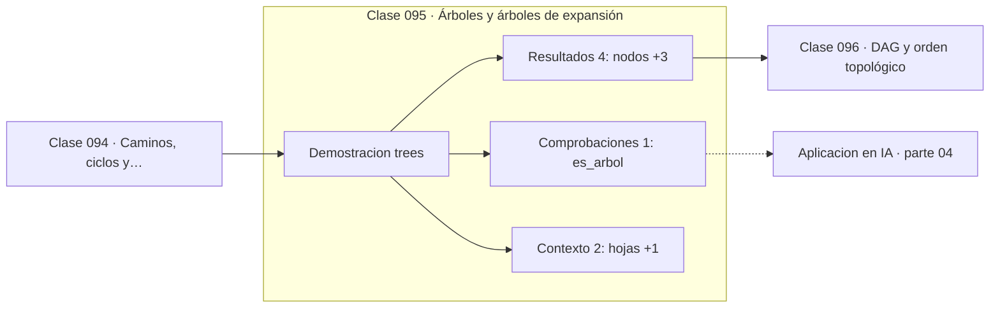

# 095 — Árboles y árboles de expansión

> [⬅️ 094 Caminos, ciclos y conectividad](../094-caminos-ciclos-y-conectividad/README.md) · [📚 Parte 04](../README.md) · [🏠 Programa](../../../README.md) · [096 DAG y orden topológico ➡️](../096-dag-y-orden-topologico/README.md)

**Parte:** 04 — Matemática discreta para computación · **Nivel:** `intermedio` · **Horas estimadas:** 4
**Motor:** `engines.part04` · **Demostración:** `trees` · **Clase 15 de 20** de la parte

---

## 🎯 Propósito

**Un árbol con n vértices tiene exactamente n−1 aristas; añadir una crea un ciclo.**

Lógica, conjuntos, conteo, inducción, recurrencias, grafos y aritmética modular: la matemática que hace demostrable un programa.

## ✅ Resultados de aprendizaje

Al terminar podrás:

1. Explicar **Árboles y árboles de expansión** con lenguaje cotidiano y con notación matemática.
2. Resolver un caso pequeño a mano y anticipar el orden de magnitud del resultado.
3. Ejecutar y modificar `lab.py`, que corre la demostración `trees`.
4. Interpretar las 7 salidas del laboratorio y decir qué comprueba cada una.
5. Detectar el error típico de esta parte: asumir que un grafo dirigido es acíclico sin verificarlo.

## 🧩 Fórmulas de la clase

```text
|E| = |V| − 1
existe un único camino entre cada par de vértices
```

## 🗺️ Ubicación en el programa



## 📖 Fundamentos

Un árbol es un grafo conexo sin ciclos, y esa doble condición tiene una consecuencia
numérica exacta: con n vértices tiene exactamente n−1 aristas. Ni una más —eso crearía
un ciclo— ni una menos —eso lo desconectaría—. Es la estructura conexa mínima.

La unicidad del camino entre cualquier par de vértices se sigue de la ausencia de
ciclos, y es la propiedad que hace útiles a los árboles: no hay ambigüedad sobre cómo
llegar de un nodo a otro. De ahí que se usen para jerarquías, sistemas de archivos,
índices de bases de datos y estructuras de decisión.

La **altura** de un árbol determina el coste de las operaciones. Un árbol binario
equilibrado con n nodos tiene altura `log₂ n`, y por eso las búsquedas cuestan
logarítmicamente; uno degenerado en lista tiene altura n y el coste se vuelve lineal.
Todo el diseño de árboles balanceados (AVL, rojo-negro, B-tree) existe para garantizar
esa altura logarítmica.

En machine learning, los árboles de decisión (clase 291) usan esta estructura para
particionar el espacio de features, y su profundidad es el hiperparámetro que controla
directamente el compromiso sesgo-varianza: más profundo, menos sesgo y más varianza.

## 🧮 Ejemplo trabajado

Verificar la relación en un árbol de seis nodos.

```text
        raiz
       /    \
      a      b
     / \      \
    c   d      e

vértices: 6   (raiz, a, b, c, d, e)
aristas:  5
n − 1 = 5                              ✓ es un árbol

hojas: c, d, e
altura: 2

profundidades:
  raiz 0,  a 1,  b 1,  c 2,  d 2,  e 2
```

## 🔬 Qué ejecuta el laboratorio

`trees` — Un árbol con n nodos tiene exactamente n-1 aristas.

| Grupo | Salidas |
|---|---|
| 🔢 Resultados numéricos (4) | `nodos`, `aristas`, `n-1`, `altura` |
| ✅ Comprobaciones de invariante (1) | `es_arbol` |

Las claves booleanas no son adorno: si alguna fuera `False`, el resultado numérico
no sería fiable aunque el programa terminase sin error.

```bash
python classes/part-04-matematica-discreta-para-computacion/095-arboles-y-arboles-de-expansion/lab.py
compmath run 095
```

> [!TIP]
> Antes de ejecutar, **escribe tu predicción**. Un laboratorio que confirma lo que
> esperabas enseña tanto como uno que te contradice, pero solo si la predicción
> existía antes del resultado.

## ⚠️ Errores conceptuales frecuentes

1. Llamar árbol a un grafo con ciclos.
2. Suponer que un árbol binario está equilibrado sin garantizarlo.
3. Confundir altura (aristas del camino más largo) con número de nodos.

## 🚀 Dónde se usa de verdad

Sistemas de archivos, índices de bases de datos, árboles de decisión, parseo sintáctico
y árboles de expansión mínima.

## 🤖 Conexión con IA

Los grafos de cómputo, la búsqueda en árbol y las GNN son estructuras discretas; el conteo sostiene la probabilidad que después usa todo modelo generativo.

## 📓 Notebooks

| Archivo | Para qué |
|---|---|
| [`notebook.ipynb`](notebook.ipynb) | recorrido guiado con la demostración ejecutada |
| [`notebook_student.ipynb`](notebook_student.ipynb) | versión con `TODO` para resolver |
| [`notebook_solution.ipynb`](notebook_solution.ipynb) | solución de referencia verificada |

## 📝 Evaluación

| Criterio | Peso |
|---|---:|
| Comprensión conceptual | 25 % |
| Resolución manual | 25 % |
| Implementación y verificación | 25 % |
| Interpretación y comunicación | 15 % |
| Conexión con aplicación real | 10 % |

Detalle y criterios de error crítico en [`assessment.md`](assessment.md).

## ❓ Preguntas de comprobación

1. ¿Cuál es la entrada, cuál la salida y qué unidades tienen?
2. ¿Qué operación domina el comportamiento del resultado?
3. ¿Qué caso extremo revelaría un error conceptual?
4. ¿Cómo verificarías el resultado por un método independiente?
5. ¿Dónde aparece esto en algoritmos?

Si necesitas releer el código para responderlas, la clase todavía no está superada.

## 📥 Entregable

`notebook_student.ipynb` resuelto más un párrafo que explique el resultado **sin citar
código**: qué entra, qué sale, qué invariante se comprueba y qué pasaría en un caso límite.

## 📚 Bibliografía de la clase

Esta clase enseña **Matemática discreta · Lógica y demostración · Algoritmos y complejidad · Teoría de números**. Cada obra dice qué aporta aquí y cómo se comprobó su localizador:

- [Cormen, T. et al. *Introduction to Algorithms*, 4ª ed., 2022](https://mitpress.mit.edu/9780262046305/introduction-to-algorithms/) — Algoritmos y complejidad y Matemática discreta: el tema de esta clase · ISBN-13 `9780262046305` verificado en International ISBN Agency (2026-08-19).
- [Knuth, D. *The Art of Computer Programming*, vol. 1, 3ª ed., 1997, secc. 2.3](https://www-cs-faculty.stanford.edu/~knuth/taocp.html) — Algoritmos y complejidad y Matemática discreta y Teoría de números: el tema de esta clase · URL de la fuente primaria comprobada en sitio de la obra o de su editorial (2026-08-19).

Bibliografía de todas las clases, con el porqué de cada obra, en [`docs/BIBLIOGRAPHY.md`](../../../docs/BIBLIOGRAPHY.md) · localizador y estado de cada obra en [`sources/bibliography.json`](../../../sources/bibliography.json).

## 📂 Material de la clase

[`intuition.md`](intuition.md) · [`theory.md`](theory.md) · [`derivation.md`](derivation.md) · [`exercises.md`](exercises.md) · [`assessment.md`](assessment.md) · [`where-is-this-used.md`](where-is-this-used.md) · [`lesson.yaml`](lesson.yaml)

---

> [⬅️ 094 Caminos, ciclos y conectividad](../094-caminos-ciclos-y-conectividad/README.md) · [📚 Parte 04](../README.md) · [🏠 Programa](../../../README.md) · [096 DAG y orden topológico ➡️](../096-dag-y-orden-topologico/README.md)
