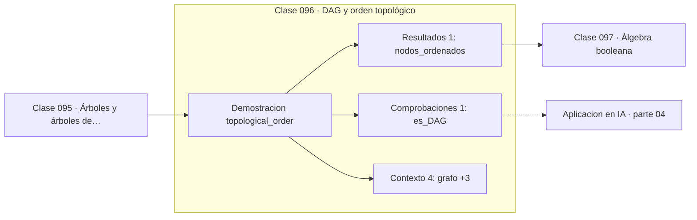

# 096 — DAG y orden topológico

> [⬅️ 095 Árboles y árboles de expansión](../095-arboles-y-arboles-de-expansion/README.md) · [📚 Parte 04](../README.md) · [🏠 Programa](../../../README.md) · [097 Álgebra booleana ➡️](../097-algebra-booleana/README.md)

**Parte:** 04 — Matemática discreta para computación · **Nivel:** `intermedio` · **Horas estimadas:** 4
**Motor:** `engines.part04` · **Demostración:** `topological_order` · **Clase 16 de 20** de la parte

---

## 🎯 Propósito

**El orden topológico existe si y solo si el grafo es acíclico; su ausencia localiza el ciclo.**

Lógica, conjuntos, conteo, inducción, recurrencias, grafos y aritmética modular: la matemática que hace demostrable un programa.

## ✅ Resultados de aprendizaje

Al terminar podrás:

1. Explicar **DAG y orden topológico** con lenguaje cotidiano y con notación matemática.
2. Resolver un caso pequeño a mano y anticipar el orden de magnitud del resultado.
3. Ejecutar y modificar `lab.py`, que corre la demostración `topological_order`.
4. Interpretar las 6 salidas del laboratorio y decir qué comprueba cada una.
5. Detectar el error típico de esta parte: contar dos veces al aplicar el principio de inclusión-exclusión.

## 🧩 Fórmulas de la clase

```text
algoritmo de Kahn: repetir «tomar vértice de grado de entrada 0»
si quedan vértices sin ordenar ⟹ hay ciclo
```

## 🗺️ Ubicación en el programa



## 📖 Fundamentos

Un orden topológico es una ordenación lineal de los vértices tal que toda arista va de
un vértice anterior a uno posterior. Existe **si y solo si** el grafo es acíclico, y
esa equivalencia convierte el algoritmo en un detector de ciclos: si al terminar quedan
vértices sin ordenar, esos vértices forman —o dependen de— al menos un ciclo.

El algoritmo de Kahn es directo: se toman repetidamente los vértices con grado de
entrada cero (los que no dependen de nada pendiente), se emiten y se decrementan los
grados de sus sucesores. Coste `O(V + E)`, el mismo que BFS.

Este algoritmo es el que ejecuta todo sistema de construcción —`make`, Bazel, un DAG de
Airflow— para decidir en qué orden ejecutar tareas. El mensaje «dependencia circular
detectada» que emiten esos sistemas es literalmente el caso en que Kahn no consigue
ordenar todos los nodos.

Y aquí está la conexión que da sentido a esta clase dentro del programa: la
autodiferenciación en modo reverso recorre el grafo de cómputo en **orden topológico
inverso**. La clase 306 lo hace explícito, y la clase 179 lo implementa: `backward()`
construye el orden topológico y luego lo recorre al revés propagando gradientes. Sin
esta clase, esa implementación parecería magia.

## 🧮 Ejemplo trabajado

Orden topológico del pipeline y detección de ciclo.

```text
Grafo (DAG):
  entrada → limpieza → {features, split} → entrenamiento → evaluacion

Grados de entrada iniciales:
  entrada 0, limpieza 1, features 1, split 1,
  entrenamiento 2, evaluacion 1

Orden de Kahn:
  entrada, limpieza, features, split, entrenamiento, evaluacion
6 de 6 vértices ordenados → es un DAG            ✓

Con una arista extra evaluacion → limpieza:
  ningún vértice queda con grado 0 tras entrada
  vértices ordenados: 1 de 6
  → hay un ciclo, y los 5 restantes están dentro o dependen de él
```

## 🔬 Qué ejecuta el laboratorio

`topological_order` — Orden topológico y detección de ciclos por conteo de Kahn.

| Grupo | Salidas |
|---|---|
| 🔢 Resultados numéricos (1) | `nodos_ordenados` |
| ✅ Comprobaciones de invariante (1) | `es_DAG` |

Las claves booleanas no son adorno: si alguna fuera `False`, el resultado numérico
no sería fiable aunque el programa terminase sin error.

```bash
python classes/part-04-matematica-discreta-para-computacion/096-dag-y-orden-topologico/lab.py
compmath run 096
```

> [!TIP]
> Antes de ejecutar, **escribe tu predicción**. Un laboratorio que confirma lo que
> esperabas enseña tanto como uno que te contradice, pero solo si la predicción
> existía antes del resultado.

## ⚠️ Errores conceptuales frecuentes

1. Suponer que un grafo de dependencias es acíclico sin comprobarlo.
2. Interpretar el fallo del orden topológico como un error del algoritmo en lugar de como un diagnóstico.
3. Olvidar que puede haber varios órdenes topológicos válidos.

## 🚀 Dónde se usa de verdad

Sistemas de construcción, planificadores de tareas, resolución de dependencias de
paquetes, evaluación de hojas de cálculo y autodiferenciación en modo reverso.

## 🤖 Conexión con IA

Los grafos de cómputo, la búsqueda en árbol y las GNN son estructuras discretas; el conteo sostiene la probabilidad que después usa todo modelo generativo.

## 📓 Notebooks

| Archivo | Para qué |
|---|---|
| [`notebook.ipynb`](notebook.ipynb) | recorrido guiado con la demostración ejecutada |
| [`notebook_student.ipynb`](notebook_student.ipynb) | versión con `TODO` para resolver |
| [`notebook_solution.ipynb`](notebook_solution.ipynb) | solución de referencia verificada |

## 📝 Evaluación

| Criterio | Peso |
|---|---:|
| Comprensión conceptual | 25 % |
| Resolución manual | 25 % |
| Implementación y verificación | 25 % |
| Interpretación y comunicación | 15 % |
| Conexión con aplicación real | 10 % |

Detalle y criterios de error crítico en [`assessment.md`](assessment.md).

## ❓ Preguntas de comprobación

1. ¿Cuál es la entrada, cuál la salida y qué unidades tienen?
2. ¿Qué operación domina el comportamiento del resultado?
3. ¿Qué caso extremo revelaría un error conceptual?
4. ¿Cómo verificarías el resultado por un método independiente?
5. ¿Dónde aparece esto en algoritmos?

Si necesitas releer el código para responderlas, la clase todavía no está superada.

## 📥 Entregable

`notebook_student.ipynb` resuelto más un párrafo que explique el resultado **sin citar
código**: qué entra, qué sale, qué invariante se comprueba y qué pasaría en un caso límite.

## 📚 Bibliografía de la clase

Esta clase enseña **Matemática discreta · Lógica y demostración · Algoritmos y complejidad · Teoría de números**. Cada obra dice qué aporta aquí y cómo se comprobó su localizador:

- [Kahn, A. B. *Topological sorting of large networks*. CACM, 1962](https://dl.acm.org/doi/10.1145/368996.369025) — Algoritmos y complejidad: el tema de esta clase · DOI `10.1145/368996.369025` verificado en Crossref (2026-08-19).
- [Baydin, A. et al. *Automatic Differentiation in Machine Learning: a Survey*. JMLR, 2018](https://jmlr.org/papers/v18/17-468.html) — Diferenciación automática y Deep learning: conexión declarada de esta parte · URL de la fuente primaria comprobada en Journal of Machine Learning Research (2026-08-19).

Bibliografía de todas las clases, con el porqué de cada obra, en [`docs/BIBLIOGRAPHY.md`](../../../docs/BIBLIOGRAPHY.md) · localizador y estado de cada obra en [`sources/bibliography.json`](../../../sources/bibliography.json).

## 📂 Material de la clase

[`intuition.md`](intuition.md) · [`theory.md`](theory.md) · [`derivation.md`](derivation.md) · [`exercises.md`](exercises.md) · [`assessment.md`](assessment.md) · [`where-is-this-used.md`](where-is-this-used.md) · [`lesson.yaml`](lesson.yaml)

---

> [⬅️ 095 Árboles y árboles de expansión](../095-arboles-y-arboles-de-expansion/README.md) · [📚 Parte 04](../README.md) · [🏠 Programa](../../../README.md) · [097 Álgebra booleana ➡️](../097-algebra-booleana/README.md)
