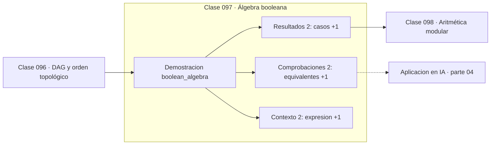

# 097 — Álgebra booleana

> [⬅️ 096 DAG y orden topológico](../096-dag-y-orden-topologico/README.md) · [📚 Parte 04](../README.md) · [🏠 Programa](../../../README.md) · [098 Aritmética modular ➡️](../098-aritmetica-modular/README.md)

**Parte:** 04 — Matemática discreta para computación · **Nivel:** `intermedio` · **Horas estimadas:** 4
**Motor:** `engines.part04` · **Demostración:** `boolean_algebra` · **Clase 17 de 20** de la parte

---

## 🎯 Propósito

**Simplificar una expresión booleana reduce puertas físicas sin cambiar su comportamiento.**

Lógica, conjuntos, conteo, inducción, recurrencias, grafos y aritmética modular: la matemática que hace demostrable un programa.

## ✅ Resultados de aprendizaje

Al terminar podrás:

1. Explicar **Álgebra booleana** con lenguaje cotidiano y con notación matemática.
2. Resolver un caso pequeño a mano y anticipar el orden de magnitud del resultado.
3. Ejecutar y modificar `lab.py`, que corre la demostración `boolean_algebra`.
4. Interpretar las 6 salidas del laboratorio y decir qué comprueba cada una.
5. Detectar el error típico de esta parte: confundir implicación con equivalencia lógica.

## 🧩 Fórmulas de la clase

```text
absorción: a ∨ (a ∧ b) ≡ a
distributiva: a ∧ (b ∨ c) ≡ (a∧b) ∨ (a∧c)
complemento: a ∨ ¬a ≡ 1,  a ∧ ¬a ≡ 0
```

## 🗺️ Ubicación en el programa



## 📖 Fundamentos

El álgebra de Boole, publicada en 1854, describió las leyes del razonamiento con
símbolos. Ochenta años después, Claude Shannon mostró en su tesis de máster —una de las
más influyentes de la historia— que esas mismas leyes describen los circuitos de
conmutación. Ese puente es el fundamento del hardware digital.

Simplificar una expresión booleana tiene una consecuencia física directa: menos
términos significan menos puertas lógicas, menos área de silicio, menos consumo y menor
retardo de propagación. La expresión `(a∧b) ∨ (a∧¬b) ∨ (a∧c)` se reduce a `a` por
absorción y complemento, eliminando cuatro puertas.

La verificación por tabla de verdad es exhaustiva y por tanto concluyente para pocas
variables, pero su coste es 2ⁿ. Con veinte variables ya es un millón de filas, y ahí
empieza el terreno del problema SAT, el primer problema que se demostró NP-completo
(Cook, 1971). Que la verificación sea fácil y la búsqueda difícil es la esencia de esa
clase de complejidad.

En machine learning el álgebra booleana aparece de forma menos visible pero real: las
máscaras de atención son matrices booleanas, los filtros de datos son expresiones
booleanas, y la cuantización binaria de redes (BNN) opera con estas mismas leyes.

## 🧮 Ejemplo trabajado

Simplificar una expresión de tres términos.

```text
original:     (a∧b) ∨ (a∧¬b) ∨ (a∧c)

paso 1: (a∧b) ∨ (a∧¬b) = a∧(b ∨ ¬b) = a∧1 = a
paso 2: a ∨ (a∧c) = a                (absorción)

simplificada: a

Verificación exhaustiva: 8 casos (2³)
  todas las asignaciones coinciden               ✓

Puertas ahorradas: 4
```

## 🔬 Qué ejecuta el laboratorio

`boolean_algebra` — Álgebra booleana: simplificación y equivalencia funcional.

| Grupo | Salidas |
|---|---|
| 🔢 Resultados numéricos (2) | `casos`, `puertas_ahorradas` |
| ✅ Comprobaciones de invariante (2) | `equivalentes`, `absorcion_a∨(a∧b)` |

Las claves booleanas no son adorno: si alguna fuera `False`, el resultado numérico
no sería fiable aunque el programa terminase sin error.

```bash
python classes/part-04-matematica-discreta-para-computacion/097-algebra-booleana/lab.py
compmath run 097
```

> [!TIP]
> Antes de ejecutar, **escribe tu predicción**. Un laboratorio que confirma lo que
> esperabas enseña tanto como uno que te contradice, pero solo si la predicción
> existía antes del resultado.

## ⚠️ Errores conceptuales frecuentes

1. Simplificar sin verificar con tabla de verdad.
2. Aplicar la distributiva de la conjunción como si fuera la de los números.
3. Suponer que la verificación exhaustiva escala a muchas variables.

## 🚀 Dónde se usa de verdad

Diseño de circuitos digitales, optimización de condiciones y consultas, máscaras de
atención y verificación formal de propiedades.

## 🤖 Conexión con IA

Los grafos de cómputo, la búsqueda en árbol y las GNN son estructuras discretas; el conteo sostiene la probabilidad que después usa todo modelo generativo.

## 📓 Notebooks

| Archivo | Para qué |
|---|---|
| [`notebook.ipynb`](notebook.ipynb) | recorrido guiado con la demostración ejecutada |
| [`notebook_student.ipynb`](notebook_student.ipynb) | versión con `TODO` para resolver |
| [`notebook_solution.ipynb`](notebook_solution.ipynb) | solución de referencia verificada |

## 📝 Evaluación

| Criterio | Peso |
|---|---:|
| Comprensión conceptual | 25 % |
| Resolución manual | 25 % |
| Implementación y verificación | 25 % |
| Interpretación y comunicación | 15 % |
| Conexión con aplicación real | 10 % |

Detalle y criterios de error crítico en [`assessment.md`](assessment.md).

## ❓ Preguntas de comprobación

1. ¿Cuál es la entrada, cuál la salida y qué unidades tienen?
2. ¿Qué operación domina el comportamiento del resultado?
3. ¿Qué caso extremo revelaría un error conceptual?
4. ¿Cómo verificarías el resultado por un método independiente?
5. ¿Dónde aparece esto en algoritmos?

Si necesitas releer el código para responderlas, la clase todavía no está superada.

## 📥 Entregable

`notebook_student.ipynb` resuelto más un párrafo que explique el resultado **sin citar
código**: qué entra, qué sale, qué invariante se comprueba y qué pasaría en un caso límite.

## 📚 Bibliografía de la clase

Esta clase enseña **Matemática discreta · Lógica y demostración · Algoritmos y complejidad · Teoría de números**. Cada obra dice qué aporta aquí y cómo se comprobó su localizador:

- [Shannon, C. *A Symbolic Analysis of Relay and Switching Circuits*. MIT, 1937](https://dspace.mit.edu/handle/1721.1/11173) — Lógica y demostración y Matemática discreta: el tema de esta clase · URL de la fuente primaria, pendiente de resolver.
- [Cook, S. *The Complexity of Theorem-Proving Procedures*. STOC, 1971](https://dl.acm.org/doi/10.1145/800157.805047) — Algoritmos y complejidad y Lógica y demostración: el tema de esta clase · DOI `10.1145/800157.805047` verificado en Crossref (2026-08-19).

Bibliografía de todas las clases, con el porqué de cada obra, en [`docs/BIBLIOGRAPHY.md`](../../../docs/BIBLIOGRAPHY.md) · localizador y estado de cada obra en [`sources/bibliography.json`](../../../sources/bibliography.json).

## 📂 Material de la clase

[`intuition.md`](intuition.md) · [`theory.md`](theory.md) · [`derivation.md`](derivation.md) · [`exercises.md`](exercises.md) · [`assessment.md`](assessment.md) · [`where-is-this-used.md`](where-is-this-used.md) · [`lesson.yaml`](lesson.yaml)

---

> [⬅️ 096 DAG y orden topológico](../096-dag-y-orden-topologico/README.md) · [📚 Parte 04](../README.md) · [🏠 Programa](../../../README.md) · [098 Aritmética modular ➡️](../098-aritmetica-modular/README.md)
