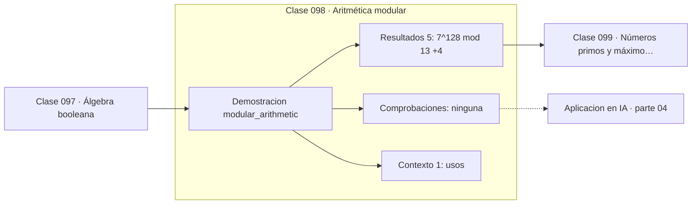

# 098 — Aritmética modular

> [⬅️ 097 Álgebra booleana](../097-algebra-booleana/README.md) · [📚 Parte 04](../README.md) · [🏠 Programa](../../../README.md) · [099 Números primos y máximo común divisor ➡️](../099-numeros-primos-y-maximo-comun-divisor/README.md)

**Parte:** 04 — Matemática discreta para computación · **Nivel:** `intermedio` · **Horas estimadas:** 4
**Motor:** `engines.part04` · **Demostración:** `modular_arithmetic` · **Clase 18 de 20** de la parte

---

## 🎯 Propósito

**La aritmética modular opera con restos y hace factible exponenciar números enormes.**

Lógica, conjuntos, conteo, inducción, recurrencias, grafos y aritmética modular: la matemática que hace demostrable un programa.

## ✅ Resultados de aprendizaje

Al terminar podrás:

1. Explicar **Aritmética modular** con lenguaje cotidiano y con notación matemática.
2. Resolver un caso pequeño a mano y anticipar el orden de magnitud del resultado.
3. Ejecutar y modificar `lab.py`, que corre la demostración `modular_arithmetic`.
4. Interpretar las 6 salidas del laboratorio y decir qué comprueba cada una.
5. Detectar el error típico de esta parte: asumir que un grafo dirigido es acíclico sin verificarlo.

## 🧩 Fórmulas de la clase

```text
(a + b) mod n = ((a mod n) + (b mod n)) mod n
pequeño teorema de Fermat: a^(p−1) ≡ 1 (mod p) si p es primo y p ∤ a
inverso modular: a·a⁻¹ ≡ 1 (mod n), existe si mcd(a,n) = 1
```

## 🗺️ Ubicación en el programa



## 📖 Fundamentos

La aritmética modular trabaja con las clases de equivalencia que la clase 085 definió:
dos números son «el mismo» si difieren en un múltiplo de n. Sobre esas clases, la suma
y el producto están bien definidos, y esa buena definición es lo que permite reducir en
cada paso en lugar de al final.

Esa reducción es lo que hace viable la exponenciación modular. Calcular `7¹²⁸ mod 13`
sin reducir exigiría un número de 108 dígitos; con exponenciación binaria y reducción
en cada paso, son siete multiplicaciones de números pequeños. `pow(base, exp, mod)` en
Python implementa exactamente eso.

El pequeño teorema de Fermat —`a^(p−1) ≡ 1 (mod p)` para p primo— es la base de los
tests de primalidad probabilísticos y de RSA. El **inverso modular** existe cuando
`mcd(a, n) = 1` y se calcula con el algoritmo de Euclides extendido; Python lo expone
como `pow(a, -1, n)` desde la versión 3.8.

Estas operaciones sostienen buena parte de la infraestructura digital: RSA, Diffie-
Hellman, curvas elípticas, funciones hash, sumas de comprobación y generadores
congruenciales de números pseudoaleatorios. La seguridad de varios de esos sistemas
descansa en que la operación inversa —el logaritmo discreto— es computacionalmente
difícil.

## 🧮 Ejemplo trabajado

Exponenciación e inverso modular.

```text
7¹²⁸ mod 13 = 3
  (sin reducir, 7¹²⁸ tendría 109 dígitos)

Pequeño teorema de Fermat (p = 13 primo):
  7¹² mod 13 = 1                        ✓

Inverso de 7 módulo 13:
  pow(7, -1, 13) = 2
  verificación: 7·2 = 14 ≡ 1 (mod 13)   ✓

Suma modular: (25 + 30) mod 13 = 55 mod 13 = 3
```

## 🔬 Qué ejecuta el laboratorio

`modular_arithmetic` — Aritmética modular: exponenciación rápida e inverso modular.

| Grupo | Salidas |
|---|---|
| 🔢 Resultados numéricos (5) | `7^128 mod 13`, `pequeño_teorema_de_fermat`, `inverso_de_7_mod_13`, `verificacion_inverso`, `suma_modular` |
| ✅ Comprobaciones de invariante (0) | — |

Las claves booleanas no son adorno: si alguna fuera `False`, el resultado numérico
no sería fiable aunque el programa terminase sin error.

```bash
python classes/part-04-matematica-discreta-para-computacion/098-aritmetica-modular/lab.py
compmath run 098
```

> [!TIP]
> Antes de ejecutar, **escribe tu predicción**. Un laboratorio que confirma lo que
> esperabas enseña tanto como uno que te contradice, pero solo si la predicción
> existía antes del resultado.

## ⚠️ Errores conceptuales frecuentes

1. Calcular la potencia completa antes de reducir módulo n.
2. Buscar el inverso modular cuando mcd(a,n) ≠ 1: no existe.
3. Usar el operador % con negativos esperando el comportamiento de C: Python devuelve resto no negativo.

## 🚀 Dónde se usa de verdad

RSA y Diffie-Hellman, funciones hash, sumas de comprobación, generadores
pseudoaleatorios y aritmética de campos finitos.

## 🤖 Conexión con IA

Los grafos de cómputo, la búsqueda en árbol y las GNN son estructuras discretas; el conteo sostiene la probabilidad que después usa todo modelo generativo.

## 📓 Notebooks

| Archivo | Para qué |
|---|---|
| [`notebook.ipynb`](notebook.ipynb) | recorrido guiado con la demostración ejecutada |
| [`notebook_student.ipynb`](notebook_student.ipynb) | versión con `TODO` para resolver |
| [`notebook_solution.ipynb`](notebook_solution.ipynb) | solución de referencia verificada |

## 📝 Evaluación

| Criterio | Peso |
|---|---:|
| Comprensión conceptual | 25 % |
| Resolución manual | 25 % |
| Implementación y verificación | 25 % |
| Interpretación y comunicación | 15 % |
| Conexión con aplicación real | 10 % |

Detalle y criterios de error crítico en [`assessment.md`](assessment.md).

## ❓ Preguntas de comprobación

1. ¿Cuál es la entrada, cuál la salida y qué unidades tienen?
2. ¿Qué operación domina el comportamiento del resultado?
3. ¿Qué caso extremo revelaría un error conceptual?
4. ¿Cómo verificarías el resultado por un método independiente?
5. ¿Dónde aparece esto en algoritmos?

Si necesitas releer el código para responderlas, la clase todavía no está superada.

## 📥 Entregable

`notebook_student.ipynb` resuelto más un párrafo que explique el resultado **sin citar
código**: qué entra, qué sale, qué invariante se comprueba y qué pasaría en un caso límite.

## 📚 Bibliografía de la clase

Esta clase enseña **Matemática discreta · Lógica y demostración · Algoritmos y complejidad · Teoría de números**. Cada obra dice qué aporta aquí y cómo se comprobó su localizador:

- [Hardy & Wright. *An Introduction to the Theory of Numbers*, 6ª ed., 2008](https://global.oup.com/academic/product/an-introduction-to-the-theory-of-numbers-9780199219865) — Teoría de números: el tema de esta clase · ISBN-13 `9780199219865` verificado en International ISBN Agency (2026-08-19).
- [Python: `pow` con módulo e inverso](https://docs.python.org/3/library/functions.html#pow) — documentación de la herramienta que ejecuta el laboratorio · URL de la fuente primaria comprobada en Python Software Foundation (2026-08-19).

Bibliografía de todas las clases, con el porqué de cada obra, en [`docs/BIBLIOGRAPHY.md`](../../../docs/BIBLIOGRAPHY.md) · localizador y estado de cada obra en [`sources/bibliography.json`](../../../sources/bibliography.json).

## 📂 Material de la clase

[`intuition.md`](intuition.md) · [`theory.md`](theory.md) · [`derivation.md`](derivation.md) · [`exercises.md`](exercises.md) · [`assessment.md`](assessment.md) · [`where-is-this-used.md`](where-is-this-used.md) · [`lesson.yaml`](lesson.yaml)

---

> [⬅️ 097 Álgebra booleana](../097-algebra-booleana/README.md) · [📚 Parte 04](../README.md) · [🏠 Programa](../../../README.md) · [099 Números primos y máximo común divisor ➡️](../099-numeros-primos-y-maximo-comun-divisor/README.md)
