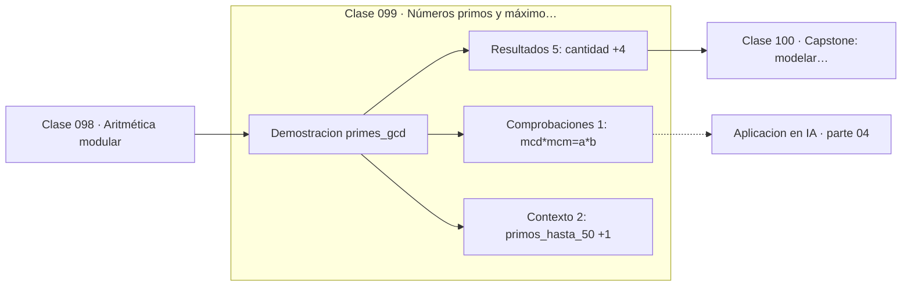

# 099 — Números primos y máximo común divisor

> [⬅️ 098 Aritmética modular](../098-aritmetica-modular/README.md) · [📚 Parte 04](../README.md) · [🏠 Programa](../../../README.md) · [100 Capstone: modelar dependencias con grafos ➡️](../100-capstone-modelar-dependencias-con-grafos/README.md)

**Parte:** 04 — Matemática discreta para computación · **Nivel:** `intermedio` · **Horas estimadas:** 4
**Motor:** `engines.part04` · **Demostración:** `primes_gcd` · **Clase 19 de 20** de la parte

---

## 🎯 Propósito

**La criba encuentra todos los primos hasta n, y mcd·mcm = a·b relaciona ambos conceptos.**

Lógica, conjuntos, conteo, inducción, recurrencias, grafos y aritmética modular: la matemática que hace demostrable un programa.

## ✅ Resultados de aprendizaje

Al terminar podrás:

1. Explicar **Números primos y máximo común divisor** con lenguaje cotidiano y con notación matemática.
2. Resolver un caso pequeño a mano y anticipar el orden de magnitud del resultado.
3. Ejecutar y modificar `lab.py`, que corre la demostración `primes_gcd`.
4. Interpretar las 8 salidas del laboratorio y decir qué comprueba cada una.
5. Detectar el error típico de esta parte: contar dos veces al aplicar el principio de inclusión-exclusión.

## 🧩 Fórmulas de la clase

```text
criba: tachar múltiplos desde i² con i ≤ √n
mcd(a,b)·mcm(a,b) = a·b
Euclides: mcd(a,b) = mcd(b, a mod b)
```

## 🗺️ Ubicación en el programa



## 📖 Fundamentos

La criba de Eratóstenes, del siglo III a.C., sigue siendo el método práctico para
listar todos los primos hasta n. Su eficiencia viene de dos optimizaciones: basta
recorrer hasta `√n`, porque todo compuesto tiene un factor menor o igual a su raíz; y
basta empezar a tachar desde `i²`, porque los múltiplos menores ya fueron tachados por
primos anteriores. El coste es `O(n log log n)`, prácticamente lineal.

El algoritmo de Euclides para el máximo común divisor es aún más antiguo y es un
candidato al algoritmo no trivial más antiguo que se sigue usando. Su idea —`mcd(a,b) =
mcd(b, a mod b)`— reduce el problema en cada paso y termina en `O(log min(a,b))`.

La identidad `mcd·mcm = a·b` permite calcular el mínimo común múltiplo sin factorizar,
que es importante porque **factorizar es difícil** mientras que calcular el mcd es
fácil. Esa asimetría es la que sostiene RSA: multiplicar dos primos grandes es
inmediato, recuperarlos del producto no se sabe hacer eficientemente.

El teorema fundamental de la aritmética —toda factorización en primos es única— es lo
que da sentido a todo esto. Y el hecho de que los primos sean infinitos, demostrado por
Euclides con un argumento por contradicción de tres líneas, garantiza que siempre hay
primos suficientemente grandes para la criptografía.

## 🧮 Ejemplo trabajado

Criba hasta 50 y mcd de dos números.

```text
Primos ≤ 50 (15 en total):
  2 3 5 7 11 13 17 19 23 29 31 37 41 43 47

mcd(252, 198) por Euclides:
  252 = 1·198 + 54
  198 = 3·54  + 36
   54 = 1·36  + 18
   36 = 2·18  + 0     → mcd = 18

mcm = 252·198/18 = 2772

Verificación: 18 · 2772 = 49 896 = 252 · 198    ✓

Factorización de 252 = 2²·3²·7
```

## 🔬 Qué ejecuta el laboratorio

`primes_gcd` — Criba, MCD por Euclides y su relación con el mínimo común múltiplo.

| Grupo | Salidas |
|---|---|
| 🔢 Resultados numéricos (5) | `cantidad`, `a`, `b`, `mcd`, `mcm` |
| ✅ Comprobaciones de invariante (1) | `mcd*mcm=a*b` |

Las claves booleanas no son adorno: si alguna fuera `False`, el resultado numérico
no sería fiable aunque el programa terminase sin error.

```bash
python classes/part-04-matematica-discreta-para-computacion/099-numeros-primos-y-maximo-comun-divisor/lab.py
compmath run 099
```

> [!TIP]
> Antes de ejecutar, **escribe tu predicción**. Un laboratorio que confirma lo que
> esperabas enseña tanto como uno que te contradice, pero solo si la predicción
> existía antes del resultado.

## ⚠️ Errores conceptuales frecuentes

1. Recorrer la criba hasta n en lugar de hasta √n.
2. Calcular el mcm factorizando en lugar de usar la identidad con el mcd.
3. Suponer que factorizar es tan fácil como multiplicar.

## 🚀 Dónde se usa de verdad

Generación de claves criptográficas, simplificación de fracciones, tests de primalidad
y hashing con módulos primos.

## 🤖 Conexión con IA

Los grafos de cómputo, la búsqueda en árbol y las GNN son estructuras discretas; el conteo sostiene la probabilidad que después usa todo modelo generativo.

## 📓 Notebooks

| Archivo | Para qué |
|---|---|
| [`notebook.ipynb`](notebook.ipynb) | recorrido guiado con la demostración ejecutada |
| [`notebook_student.ipynb`](notebook_student.ipynb) | versión con `TODO` para resolver |
| [`notebook_solution.ipynb`](notebook_solution.ipynb) | solución de referencia verificada |

## 📝 Evaluación

| Criterio | Peso |
|---|---:|
| Comprensión conceptual | 25 % |
| Resolución manual | 25 % |
| Implementación y verificación | 25 % |
| Interpretación y comunicación | 15 % |
| Conexión con aplicación real | 10 % |

Detalle y criterios de error crítico en [`assessment.md`](assessment.md).

## ❓ Preguntas de comprobación

1. ¿Cuál es la entrada, cuál la salida y qué unidades tienen?
2. ¿Qué operación domina el comportamiento del resultado?
3. ¿Qué caso extremo revelaría un error conceptual?
4. ¿Cómo verificarías el resultado por un método independiente?
5. ¿Dónde aparece esto en algoritmos?

Si necesitas releer el código para responderlas, la clase todavía no está superada.

## 📥 Entregable

`notebook_student.ipynb` resuelto más un párrafo que explique el resultado **sin citar
código**: qué entra, qué sale, qué invariante se comprueba y qué pasaría en un caso límite.

## 🔗 Referencias

- [Hardy & Wright. *An Introduction to the Theory of Numbers*, 6ª ed., 2008](https://global.oup.com/academic/product/an-introduction-to-the-theory-of-numbers-9780199219865)
- [Python: `math.gcd` y `math.lcm`](https://docs.python.org/3/library/math.html#math.gcd)

Bibliografía completa de la parte en [`../../../docs/BIBLIOGRAPHY.md`](../../../docs/BIBLIOGRAPHY.md).

## 📂 Material de la clase

[`intuition.md`](intuition.md) · [`theory.md`](theory.md) · [`derivation.md`](derivation.md) · [`exercises.md`](exercises.md) · [`assessment.md`](assessment.md) · [`where-is-this-used.md`](where-is-this-used.md) · [`lesson.yaml`](lesson.yaml)

---

> [⬅️ 098 Aritmética modular](../098-aritmetica-modular/README.md) · [📚 Parte 04](../README.md) · [🏠 Programa](../../../README.md) · [100 Capstone: modelar dependencias con grafos ➡️](../100-capstone-modelar-dependencias-con-grafos/README.md)
