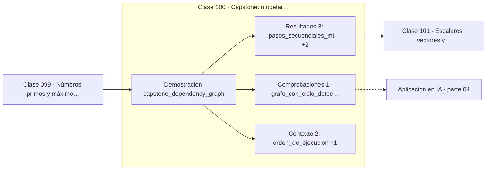

# 100 — Capstone: modelar dependencias con grafos

> [⬅️ 099 Números primos y máximo común divisor](../099-numeros-primos-y-maximo-comun-divisor/README.md) · [📚 Parte 04](../README.md) · [🏠 Programa](../../../README.md) · [101 Escalares, vectores y matrices ➡️](../../part-05-algebra-lineal-i-vectores-y-matrices/101-escalares-vectores-y-matrices/README.md)

**Parte:** 04 — Matemática discreta para computación · **Nivel:** `intermedio` · **Horas estimadas:** 4
**Motor:** `engines.part04` · **Demostración:** `capstone_dependency_graph` · **Clase 20 de 20** de la parte

---

## 🎯 Propósito

**Planificar dependencias es ordenar topológicamente y agrupar por niveles para paralelizar.**

Lógica, conjuntos, conteo, inducción, recurrencias, grafos y aritmética modular: la matemática que hace demostrable un programa.

## ✅ Resultados de aprendizaje

Al terminar podrás:

1. Explicar **Capstone: modelar dependencias con grafos** con lenguaje cotidiano y con notación matemática.
2. Resolver un caso pequeño a mano y anticipar el orden de magnitud del resultado.
3. Ejecutar y modificar `lab.py`, que corre la demostración `capstone_dependency_graph`.
4. Interpretar las 6 salidas del laboratorio y decir qué comprueba cada una.
5. Detectar el error típico de esta parte: confundir implicación con equivalencia lógica.

## 🧩 Fórmulas de la clase

```text
nivel(v) = 1 + máx(nivel(u)) sobre los predecesores u
pasos secuenciales mínimos = máximo nivel + 1
```

## 🗺️ Ubicación en el programa



## 📖 Fundamentos

El capstone monta el problema real que resuelve cualquier sistema de construcción o de
orquestación: dado un grafo de dependencias, decidir en qué orden ejecutar las tareas,
cuáles pueden ir en paralelo y qué hacer si hay un ciclo.

El orden topológico da la secuencia válida. Agrupar por **niveles** —donde el nivel de
una tarea es uno más que el máximo de sus predecesores— da algo más útil: todas las
tareas del mismo nivel son independientes entre sí y pueden ejecutarse simultáneamente.
El número de niveles es el número mínimo de pasos secuenciales, sin importar cuántos
trabajadores haya.

Ese número es el **camino crítico**, y es la cota que ninguna cantidad de paralelismo
puede superar. Si un pipeline tiene cinco niveles, tardará al menos cinco pasos aunque
se disponga de mil máquinas. Es la versión discreta de la ley de Amdahl.

La detección de ciclos completa la herramienta. Un grafo con ciclo no admite orden
topológico, y el algoritmo lo detecta contando cuántos vértices consiguió emitir. Los
vértices no emitidos son exactamente los que están en el ciclo o dependen de él, lo que
convierte el fallo en un **diagnóstico útil** en lugar de en un error opaco.

## 🧮 Ejemplo trabajado

Planificar el pipeline y detectar un ciclo.

```text
Orden de ejecución:
  entrada, limpieza, features, split, entrenamiento, evaluacion

Niveles paralelizables:
  nivel 0: entrada
  nivel 1: limpieza
  nivel 2: features, split      ← pueden ir en paralelo
  nivel 3: entrenamiento
  nivel 4: evaluacion

Tareas: 6
Pasos secuenciales mínimos: 5    (camino crítico)
Con 2 trabajadores: sigue siendo 5 pasos

Con arista evaluacion → limpieza:
  ciclo detectado, 5 nodos bloqueados
```

## 🔬 Qué ejecuta el laboratorio

`capstone_dependency_graph` — Capstone: planificar un pipeline con grafos y detectar dependencias rotas.

| Grupo | Salidas |
|---|---|
| 🔢 Resultados numéricos (3) | `pasos_secuenciales_minimos`, `tareas`, `nodos_bloqueados_por_el_ciclo` |
| ✅ Comprobaciones de invariante (1) | `grafo_con_ciclo_detectado` |

Las claves booleanas no son adorno: si alguna fuera `False`, el resultado numérico
no sería fiable aunque el programa terminase sin error.

```bash
python classes/part-04-matematica-discreta-para-computacion/100-capstone-modelar-dependencias-con-grafos/lab.py
compmath run 100
```

> [!TIP]
> Antes de ejecutar, **escribe tu predicción**. Un laboratorio que confirma lo que
> esperabas enseña tanto como uno que te contradice, pero solo si la predicción
> existía antes del resultado.

## ⚠️ Errores conceptuales frecuentes

1. Suponer que más trabajadores reducen el tiempo por debajo del camino crítico.
2. No detectar ciclos antes de intentar ejecutar el plan.
3. Confundir el número de tareas con el número de pasos secuenciales.

## 🚀 Dónde se usa de verdad

Sistemas de construcción, orquestadores de flujos (Airflow, Dagster), resolución de
dependencias de paquetes, planificación de proyectos y ejecución de grafos de cómputo.

## 🤖 Conexión con IA

Los grafos de cómputo, la búsqueda en árbol y las GNN son estructuras discretas; el conteo sostiene la probabilidad que después usa todo modelo generativo.

## 📓 Notebooks

| Archivo | Para qué |
|---|---|
| [`notebook.ipynb`](notebook.ipynb) | recorrido guiado con la demostración ejecutada |
| [`notebook_student.ipynb`](notebook_student.ipynb) | versión con `TODO` para resolver |
| [`notebook_solution.ipynb`](notebook_solution.ipynb) | solución de referencia verificada |

## 📝 Evaluación

| Criterio | Peso |
|---|---:|
| Comprensión conceptual | 25 % |
| Resolución manual | 25 % |
| Implementación y verificación | 25 % |
| Interpretación y comunicación | 15 % |
| Conexión con aplicación real | 10 % |

Detalle y criterios de error crítico en [`assessment.md`](assessment.md).

## ❓ Preguntas de comprobación

1. ¿Cuál es la entrada, cuál la salida y qué unidades tienen?
2. ¿Qué operación domina el comportamiento del resultado?
3. ¿Qué caso extremo revelaría un error conceptual?
4. ¿Cómo verificarías el resultado por un método independiente?
5. ¿Dónde aparece esto en algoritmos?

Si necesitas releer el código para responderlas, la clase todavía no está superada.

## 📥 Entregable

`notebook_student.ipynb` resuelto más un párrafo que explique el resultado **sin citar
código**: qué entra, qué sale, qué invariante se comprueba y qué pasaría en un caso límite.

## 🔗 Referencias

- [Kahn, A. B. *Topological sorting of large networks*. CACM, 1962](https://dl.acm.org/doi/10.1145/368996.369025)
- [Cormen, T. et al. *Introduction to Algorithms*, 4ª ed., 2022, cap. 20](https://mitpress.mit.edu/9780262046305/introduction-to-algorithms/)

Bibliografía completa de la parte en [`../../../docs/BIBLIOGRAPHY.md`](../../../docs/BIBLIOGRAPHY.md).

## 📂 Material de la clase

[`intuition.md`](intuition.md) · [`theory.md`](theory.md) · [`derivation.md`](derivation.md) · [`exercises.md`](exercises.md) · [`assessment.md`](assessment.md) · [`where-is-this-used.md`](where-is-this-used.md) · [`lesson.yaml`](lesson.yaml)

---

> [⬅️ 099 Números primos y máximo común divisor](../099-numeros-primos-y-maximo-comun-divisor/README.md) · [📚 Parte 04](../README.md) · [🏠 Programa](../../../README.md) · [101 Escalares, vectores y matrices ➡️](../../part-05-algebra-lineal-i-vectores-y-matrices/101-escalares-vectores-y-matrices/README.md)
