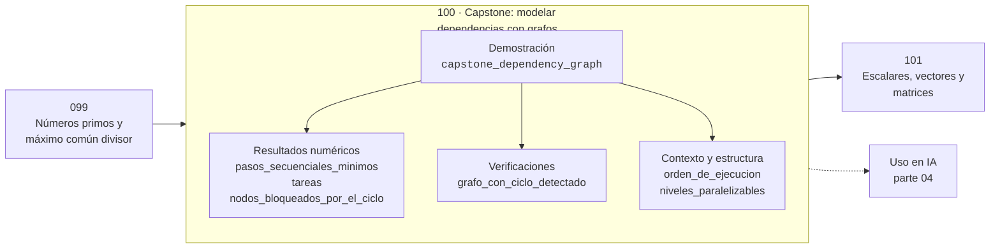

# 100 — Capstone: modelar dependencias con grafos

> [⬅️ 099 Números primos y máximo común divisor](../099-numeros-primos-y-maximo-comun-divisor/README.md) · [📚 Parte 04](../README.md) · [🏠 Programa](../../../README.md) · [101 Escalares, vectores y matrices ➡️](../../part-05-algebra-lineal-i-vectores-y-matrices/101-escalares-vectores-y-matrices/README.md)

**Parte:** 04 — Matemática discreta para computación · **Nivel:** `intermedio` · **Horas estimadas:** 4
**Motor:** `engines.part04` · **Demostración:** `capstone_dependency_graph` · **Clase 20 de 20** de la parte

---

## 🎯 Propósito

Lógica, conjuntos, conteo, inducción, recurrencias, grafos y aritmética modular: la matemática que hace demostrable un programa.

Esta clase concreta ese objetivo sobre **Capstone: modelar dependencias con grafos**: qué es, cómo se
calcula a mano, cómo se implementa sin ocultar el procedimiento y cómo se verifica
que el resultado es correcto y no solo plausible.

## ✅ Resultados de aprendizaje

Al terminar podrás:

1. Explicar **Capstone: modelar dependencias con grafos** con lenguaje cotidiano y con notación matemática.
2. Resolver un caso pequeño a mano y anticipar el orden de magnitud del resultado.
3. Ejecutar y modificar `lab.py`, que corre la demostración `capstone_dependency_graph`.
4. Interpretar las 6 salidas del laboratorio y decir qué comprueba cada una.
5. Detectar el error típico de esta parte: confundir implicación con equivalencia lógica.

## 🗺️ Ubicación en el programa



## 🧠 Idea rectora de la parte 04

> El principio del palomar demuestra colisiones sin construir un ejemplo.

## 🔬 Qué ejecuta el laboratorio

`capstone_dependency_graph` — Capstone: planificar un pipeline con grafos y detectar dependencias rotas.

| Grupo | Salidas |
|---|---|
| 🔢 Resultados numéricos (3) | `pasos_secuenciales_minimos`, `tareas`, `nodos_bloqueados_por_el_ciclo` |
| ✅ Comprobaciones de invariante (1) | `grafo_con_ciclo_detectado` |

Las claves booleanas no son adorno: si alguna fuera `False`, el resultado numérico
no sería fiable aunque el programa terminase sin error.

```bash
python classes/part-04-matematica-discreta-para-computacion/100-capstone-modelar-dependencias-con-grafos/lab.py
compmath run 100
```

> [!TIP]
> Antes de ejecutar, **escribe tu predicción**. Un laboratorio que confirma lo que
> esperabas enseña tanto como uno que te contradice, pero solo si la predicción
> existía antes del resultado.

## ⚠️ Errores frecuentes en esta parte

- Contar dos veces al aplicar el principio de inclusión-exclusión.
- Confundir implicación con equivalencia lógica.
- Asumir que un grafo dirigido es acíclico sin verificarlo.

## 🤖 Conexión con IA

Los grafos de cómputo, la búsqueda en árbol y las GNN son estructuras discretas; el conteo sostiene la probabilidad que después usa todo modelo generativo.

## 📓 Notebooks

| Archivo | Para qué |
|---|---|
| [`notebook.ipynb`](notebook.ipynb) | recorrido guiado con la demostración ejecutada |
| [`notebook_student.ipynb`](notebook_student.ipynb) | versión con `TODO` para resolver |
| [`notebook_solution.ipynb`](notebook_solution.ipynb) | solución de referencia verificada |

## 📝 Evaluación

| Criterio | Peso |
|---|---:|
| Comprensión conceptual | 25 % |
| Resolución manual | 25 % |
| Implementación y verificación | 25 % |
| Interpretación y comunicación | 15 % |
| Conexión con aplicación real | 10 % |

Detalle y criterios de error crítico en [`assessment.md`](assessment.md).

## ❓ Preguntas de comprobación

1. ¿Cuál es la entrada, cuál la salida y qué unidades tienen?
2. ¿Qué operación domina el comportamiento del resultado?
3. ¿Qué caso extremo revelaría un error conceptual?
4. ¿Cómo verificarías el resultado por un método independiente?
5. ¿Dónde aparece esto en algoritmos?

Si necesitas releer el código para responderlas, la clase todavía no está superada.

## 📥 Entregable

`notebook_student.ipynb` resuelto más un párrafo que explique el resultado **sin citar
código**: qué entra, qué sale, qué invariante se comprueba y qué pasaría en un caso límite.

## 🔗 Referencias

- Rosen, K. *Discrete Mathematics and Its Applications*. 8ª ed., McGraw-Hill, 2019.
- Graham, R.; Knuth, D.; Patashnik, O. *Concrete Mathematics*. 2ª ed., Addison-Wesley, 1994.
- Cormen, T. et al. *Introduction to Algorithms*. 4ª ed., MIT Press, 2022.

## 📂 Material de la clase

[`intuition.md`](intuition.md) · [`theory.md`](theory.md) · [`derivation.md`](derivation.md) · [`exercises.md`](exercises.md) · [`assessment.md`](assessment.md) · [`where-is-this-used.md`](where-is-this-used.md) · [`lesson.yaml`](lesson.yaml)

---

> [⬅️ 099 Números primos y máximo común divisor](../099-numeros-primos-y-maximo-comun-divisor/README.md) · [📚 Parte 04](../README.md) · [🏠 Programa](../../../README.md) · [101 Escalares, vectores y matrices ➡️](../../part-05-algebra-lineal-i-vectores-y-matrices/101-escalares-vectores-y-matrices/README.md)
