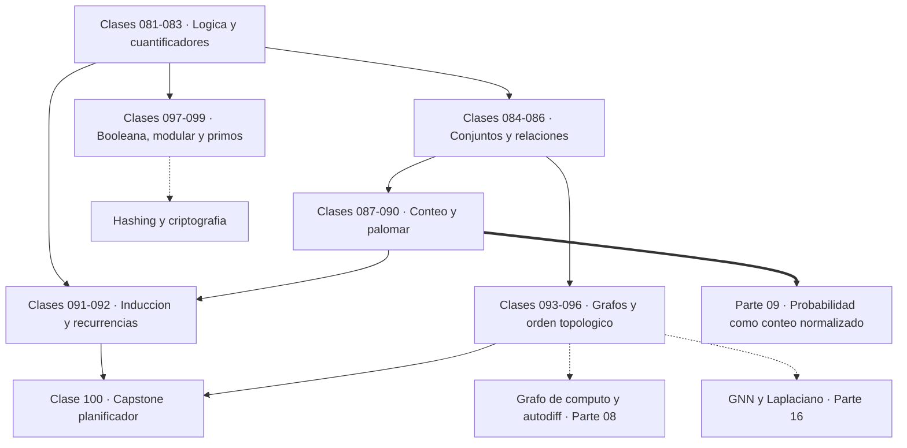

# 🧩 Parte 04 — Matemática discreta para computación

> [⬅️ Parte 03 — Geometría, trigonometría y geometría analítica](../part-03-geometria-trigonometria-y-geometria-analitica/README.md) · [🏠 Programa](../../README.md) · [📇 Catálogo](../README.md) · [Parte 05 — Álgebra lineal I: vectores y matrices ➡️](../part-05-algebra-lineal-i-vectores-y-matrices/README.md)

**Nivel:** `intermedio` · **Clases:** 20 · **Horas estimadas:** 80 · **Motor:** [`part04.py`](../../src/computational_math/engines/part04.py)

---

## 🎯 De qué trata esta parte

Lógica, conjuntos, conteo, inducción, recurrencias, grafos y aritmética modular: la matemática que hace demostrable un programa.

La matemática discreta es la que trata objetos separados y contables —proposiciones,
conjuntos, grafos, enteros— frente a la continua, que trata magnitudes que fluyen. Es la
matemática nativa de la computación, porque un ordenador es un objeto discreto: estados
finitos, memoria numerable, pasos separados.

Las clases 081 a 083 son lógica. Su valor no es filosófico sino operativo: una implicación
es equivalente a su contrarrecíproca pero **no** a su recíproca, y confundirlas es el error
de razonamiento más caro que existe —en matemáticas y fuera de ellas—. El orden de los
cuantificadores cambia el significado: «para todo x existe un y» y «existe un y para todo
x» son afirmaciones distintas, y esa distinción reaparece en las definiciones de
convergencia (parte 07) y en las cotas de aprendizaje (parte 17).

Las clases 084 a 090 construyen el conteo. El principio del producto, las permutaciones,
las combinaciones y el principio del palomar son la base sobre la que la parte 09 define
la probabilidad: un espacio muestral equiprobable convierte cada probabilidad en un
cociente de conteos. El palomar (clase 090) merece atención especial porque demuestra que
las colisiones de hash **existen** sin construir ninguna.

Las clases 091 y 092 son inducción y recurrencias: cómo demostrar algo sobre infinitos
casos con dos pasos, y cómo analizar un algoritmo que se llama a sí mismo. La inducción es
literalmente un bucle `for` con garantía, y la recurrencia es lo que hace que Fibonacci
ingenuo tarde exponencialmente y memoizado tarde linealmente.

Las clases 093 a 096 son teoría de grafos. Un grafo es la estructura más versátil de la
computación: modela dependencias, redes, rutas, jerarquías y —esto importa— los **grafos
de cómputo** sobre los que se ejecuta la autodiferenciación. El orden topológico de la
clase 096 es exactamente el orden en que un framework de deep learning recorre las
operaciones al propagar gradientes.

El cierre (097 a 099) es álgebra booleana y aritmética modular, la base del hardware
digital y de la criptografía. El capstone monta un planificador de dependencias que
detecta ciclos y calcula qué tareas pueden ejecutarse en paralelo, que es el problema real
de cualquier sistema de construcción.

## 🗺️ Mapa conceptual



## 🧠 Ideas centrales

- Una demostración por inducción es un bucle `for` con garantía.
- Permutación cuenta orden; combinación cuenta selección.
- Un DAG sin orden topológico contiene un ciclo: es un diagnóstico, no un error.
- La aritmética modular es la base de hashing, criptografía y checksums.
- El principio del palomar demuestra colisiones sin construir un ejemplo.

## 🤖 Por qué importa en IA

> [!IMPORTANT]
> Los grafos de cómputo, la búsqueda en árbol y las GNN son estructuras discretas; el conteo sostiene la probabilidad que después usa todo modelo generativo.

## ⚠️ Errores frecuentes de esta parte

- Contar dos veces al aplicar el principio de inclusión-exclusión.
- Confundir implicación con equivalencia lógica.
- Asumir que un grafo dirigido es acíclico sin verificarlo.

## 🧭 Secuencia de la parte

```mermaid
flowchart LR
    subgraph B1["Bloque 1"]
        direction TB
        L081["081 · Lógica proposicional"]
        L082["082 · Tablas de verdad y…"]
        L083["083 · Lógica de predicados y…"]
        L084["084 · Conjuntos y operaciones"]
        L085["085 · Relaciones y propiedades"]
        L081 --> L082
        L082 --> L083
        L083 --> L084
        L084 --> L085
    end
    subgraph B2["Bloque 2"]
        direction TB
        L086["086 · Funciones discretas"]
        L087["087 · Principios de conteo"]
        L088["088 · Permutaciones"]
        L089["089 · Combinaciones"]
        L090["090 · Principio del palomar"]
        L086 --> L087
        L087 --> L088
        L088 --> L089
        L089 --> L090
    end
    subgraph B3["Bloque 3"]
        direction TB
        L091["091 · Inducción matemática"]
        L092["092 · Recurrencias"]
        L093["093 · Grafos: vértices y aristas"]
        L094["094 · Caminos, ciclos y conectividad"]
        L095["095 · Árboles y árboles de expansión"]
        L091 --> L092
        L092 --> L093
        L093 --> L094
        L094 --> L095
    end
    subgraph B4["Bloque 4"]
        direction TB
        L096["096 · DAG y orden topológico"]
        L097["097 · Álgebra booleana"]
        L098["098 · Aritmética modular"]
        L099["099 · Números primos y máximo…"]
        L100["100 · Capstone: modelar…"]
        L096 --> L097
        L097 --> L098
        L098 --> L099
        L099 --> L100
    end
    L085 --> L086
    L090 --> L091
    L095 --> L096
```



## 📚 Las clases

| # | Clase | Demostración | Idea central |
|---|---|---|---|
| `081` | [Lógica proposicional](081-logica-proposicional/README.md) | `propositional_logic` | Una implicación equivale a su contrarrecíproca, nunca a su recíproca. |
| `082` | [Tablas de verdad y equivalencias](082-tablas-de-verdad-y-equivalencias/README.md) | `truth_tables` | Las leyes de De Morgan rigen cómo se niega una condición compuesta. |
| `083` | [Lógica de predicados y cuantificadores](083-logica-de-predicados-y-cuantificadores/README.md) | `predicate_logic` | Intercambiar dos cuantificadores cambia el significado de la afirmación. |
| `084` | [Conjuntos y operaciones](084-conjuntos-y-operaciones/README.md) | `sets` | Inclusión-exclusión corrige el doble conteo al unir conjuntos que se solapan. |
| `085` | [Relaciones y propiedades](085-relaciones-y-propiedades/README.md) | `relations` | Reflexiva, simétrica y transitiva son las tres condiciones que hacen de una relación una equivalencia, y toda equivalencia particiona el conjunto. |
| `086` | [Funciones discretas](086-funciones-discretas/README.md) | `discrete_functions` | Inyectiva, sobreyectiva y biyectiva describen qué información conserva una función. |
| `087` | [Principios de conteo](087-principios-de-conteo/README.md) | `counting_principles` | La regla del producto multiplica opciones independientes; la de la suma las suma cuando son excluyentes. |
| `088` | [Permutaciones](088-permutaciones/README.md) | `permutations_demo` | Una permutación cuenta selecciones donde el orden importa. |
| `089` | [Combinaciones](089-combinaciones/README.md) | `combinations_demo` | Una combinación cuenta selecciones donde el orden no importa; su simetría refleja que elegir k es descartar n−k. |
| `090` | [Principio del palomar](090-principio-del-palomar/README.md) | `pigeonhole` | El principio del palomar demuestra que existe una colisión sin construir ninguna. |
| `091` | [Inducción matemática](091-induccion-matematica/README.md) | `induction` | La inducción demuestra infinitos casos con un caso base y un paso que hereda la propiedad. |
| `092` | [Recurrencias](092-recurrencias/README.md) | `recurrences` | Una recurrencia define cada término desde los anteriores; su coste depende radicalmente de si se memoiza. |
| `093` | [Grafos: vértices y aristas](093-grafos-vertices-y-aristas/README.md) | `graphs` | Un grafo modela relaciones; el lema del apretón de manos relaciona grados y aristas. |
| `094` | [Caminos, ciclos y conectividad](094-caminos-ciclos-y-conectividad/README.md) | `paths_connectivity` | BFS recorre por niveles y encuentra el camino con menos aristas en tiempo O(V+E). |
| `095` | [Árboles y árboles de expansión](095-arboles-y-arboles-de-expansion/README.md) | `trees` | Un árbol con n vértices tiene exactamente n−1 aristas; añadir una crea un ciclo. |
| `096` | [DAG y orden topológico](096-dag-y-orden-topologico/README.md) | `topological_order` | El orden topológico existe si y solo si el grafo es acíclico; su ausencia localiza el ciclo. |
| `097` | [Álgebra booleana](097-algebra-booleana/README.md) | `boolean_algebra` | Simplificar una expresión booleana reduce puertas físicas sin cambiar su comportamiento. |
| `098` | [Aritmética modular](098-aritmetica-modular/README.md) | `modular_arithmetic` | La aritmética modular opera con restos y hace factible exponenciar números enormes. |
| `099` | [Números primos y máximo común divisor](099-numeros-primos-y-maximo-comun-divisor/README.md) | `primes_gcd` | La criba encuentra todos los primos hasta n, y mcd·mcm = a·b relaciona ambos conceptos. |
| `100` | [Capstone: modelar dependencias con grafos](100-capstone-modelar-dependencias-con-grafos/README.md) | `capstone_dependency_graph` | Planificar dependencias es ordenar topológicamente y agrupar por niveles para paralelizar. |

## 📖 Glosario de la parte (21 términos)

Definiciones precisas en [`GLOSARIO.md`](GLOSARIO.md).

## 🧰 Stack de referencia

`itertools`, `math`, `collections`

Los laboratorios se ejecutan con biblioteca estándar; estas herramientas aparecen
como contraste profesional, no como requisito.

## 🧪 Ejecutar toda la parte

```bash
compmath run --part 04
compmath catalog --part 04
```

## 📊 Evaluación de la parte

| Componente | Peso |
|---|---:|
| Clases y ejercicios | 40 % |
| Laboratorios y notebooks | 25 % |
| Explicación oral o escrita | 15 % |
| Capstone ([100](100-capstone-modelar-dependencias-con-grafos/README.md)) | 20 % |

## 📖 Bibliografía

- Rosen, K. *Discrete Mathematics and Its Applications*. 8ª ed., McGraw-Hill, 2019.
- Graham, R.; Knuth, D.; Patashnik, O. *Concrete Mathematics*. 2ª ed., Addison-Wesley, 1994.
- Cormen, T. et al. *Introduction to Algorithms*. 4ª ed., MIT Press, 2022.

---

> [⬅️ Parte 03 — Geometría, trigonometría y geometría analítica](../part-03-geometria-trigonometria-y-geometria-analitica/README.md) · [🏠 Programa](../../README.md) · [📇 Catálogo](../README.md) · [Parte 05 — Álgebra lineal I: vectores y matrices ➡️](../part-05-algebra-lineal-i-vectores-y-matrices/README.md)
