# 🧩 Parte 04 — Matemática discreta para computación

> [⬅️ Parte 03 — Geometría, trigonometría y geometría analítica](../part-03-geometria-trigonometria-y-geometria-analitica/README.md) · [🏠 Programa](../../README.md) · [📇 Catálogo](../README.md) · [Parte 05 — Álgebra lineal I: vectores y matrices ➡️](../part-05-algebra-lineal-i-vectores-y-matrices/README.md)

**Nivel:** `intermedio` · **Clases:** 20 · **Horas estimadas:** 80 · **Motor:** [`part04.py`](../../src/computational_math/engines/part04.py)

---

## 🎯 De qué trata esta parte

Lógica, conjuntos, conteo, inducción, recurrencias, grafos y aritmética modular: la matemática que hace demostrable un programa.

## 🧠 Ideas centrales

- Una demostración por inducción es un bucle `for` con garantía.
- Permutación cuenta orden; combinación cuenta selección.
- Un DAG sin orden topológico contiene un ciclo: es un diagnóstico, no un error.
- La aritmética modular es la base de hashing, criptografía y checksums.
- El principio del palomar demuestra colisiones sin construir un ejemplo.

## 🤖 Por qué importa en IA

> [!IMPORTANT]
> Los grafos de cómputo, la búsqueda en árbol y las GNN son estructuras discretas; el conteo sostiene la probabilidad que después usa todo modelo generativo.

## ⚠️ Errores frecuentes de esta parte

- Contar dos veces al aplicar el principio de inclusión-exclusión.
- Confundir implicación con equivalencia lógica.
- Asumir que un grafo dirigido es acíclico sin verificarlo.

## 🧭 Secuencia de la parte

```mermaid
flowchart LR
    subgraph B1["Bloque 1"]
        direction TB
        L081["081<br/>Lógica proposicional"]
        L082["082<br/>Tablas de verdad y<br/>equivalencias"]
        L083["083<br/>Lógica de predicados y<br/>cuantificadores"]
        L084["084<br/>Conjuntos y operaciones"]
        L085["085<br/>Relaciones y propiedades"]
        L081 --> L082
        L082 --> L083
        L083 --> L084
        L084 --> L085
    end
    subgraph B2["Bloque 2"]
        direction TB
        L086["086<br/>Funciones discretas"]
        L087["087<br/>Principios de conteo"]
        L088["088<br/>Permutaciones"]
        L089["089<br/>Combinaciones"]
        L090["090<br/>Principio del palomar"]
        L086 --> L087
        L087 --> L088
        L088 --> L089
        L089 --> L090
    end
    subgraph B3["Bloque 3"]
        direction TB
        L091["091<br/>Inducción matemática"]
        L092["092<br/>Recurrencias"]
        L093["093<br/>Grafos: vértices y<br/>aristas"]
        L094["094<br/>Caminos, ciclos y<br/>conectividad"]
        L095["095<br/>Árboles y árboles de<br/>expansión"]
        L091 --> L092
        L092 --> L093
        L093 --> L094
        L094 --> L095
    end
    subgraph B4["Bloque 4"]
        direction TB
        L096["096<br/>DAG y orden topológico"]
        L097["097<br/>Álgebra booleana"]
        L098["098<br/>Aritmética modular"]
        L099["099<br/>Números primos y máximo<br/>común divisor"]
        L100["100<br/>Capstone: modelar<br/>dependencias con grafos"]
        L096 --> L097
        L097 --> L098
        L098 --> L099
        L099 --> L100
    end
    L085 --> L086
    L090 --> L091
    L095 --> L096
```



## 📚 Las clases

| # | Clase | Demostración | Idea central |
|---|---|---|---|
| `081` | [Lógica proposicional](081-logica-proposicional/README.md) | `propositional_logic` | Implicación, contrarrecíproca y recíproca no son lo mismo. |
| `082` | [Tablas de verdad y equivalencias](082-tablas-de-verdad-y-equivalencias/README.md) | `truth_tables` | Leyes de De Morgan verificadas exhaustivamente. |
| `083` | [Lógica de predicados y cuantificadores](083-logica-de-predicados-y-cuantificadores/README.md) | `predicate_logic` | Cuantificadores: el orden cambia el significado. |
| `084` | [Conjuntos y operaciones](084-conjuntos-y-operaciones/README.md) | `sets` | Operaciones de conjuntos e inclusión-exclusión. |
| `085` | [Relaciones y propiedades](085-relaciones-y-propiedades/README.md) | `relations` | Reflexiva, simétrica y transitiva: la receta de una relación de equivalencia. |
| `086` | [Funciones discretas](086-funciones-discretas/README.md) | `discrete_functions` | Inyectiva, sobreyectiva y biyectiva sobre conjuntos finitos. |
| `087` | [Principios de conteo](087-principios-de-conteo/README.md) | `counting_principles` | Regla del producto, de la suma y conteo de contraseñas. |
| `088` | [Permutaciones](088-permutaciones/README.md) | `permutations_demo` | Permutaciones: el orden importa. |
| `089` | [Combinaciones](089-combinaciones/README.md) | `combinations_demo` | Combinaciones: el orden no importa. |
| `090` | [Principio del palomar](090-principio-del-palomar/README.md) | `pigeonhole` | Principio del palomar: colisiones garantizadas sin construirlas. |
| `091` | [Inducción matemática](091-induccion-matematica/README.md) | `induction` | Inducción: caso base, paso inductivo y verificación empírica. |
| `092` | [Recurrencias](092-recurrencias/README.md) | `recurrences` | Recurrencia lineal: iterativo, memoizado y forma cerrada. |
| `093` | [Grafos: vértices y aristas](093-grafos-vertices-y-aristas/README.md) | `graphs` | Grados, aristas y el lema del apretón de manos. |
| `094` | [Caminos, ciclos y conectividad](094-caminos-ciclos-y-conectividad/README.md) | `paths_connectivity` | Recorrido BFS: alcanzabilidad y distancia en aristas. |
| `095` | [Árboles y árboles de expansión](095-arboles-y-arboles-de-expansion/README.md) | `trees` | Un árbol con n nodos tiene exactamente n-1 aristas. |
| `096` | [DAG y orden topológico](096-dag-y-orden-topologico/README.md) | `topological_order` | Orden topológico y detección de ciclos por conteo de Kahn. |
| `097` | [Álgebra booleana](097-algebra-booleana/README.md) | `boolean_algebra` | Álgebra booleana: simplificación y equivalencia funcional. |
| `098` | [Aritmética modular](098-aritmetica-modular/README.md) | `modular_arithmetic` | Aritmética modular: exponenciación rápida e inverso modular. |
| `099` | [Números primos y máximo común divisor](099-numeros-primos-y-maximo-comun-divisor/README.md) | `primes_gcd` | Criba, MCD por Euclides y su relación con el mínimo común múltiplo. |
| `100` | [Capstone: modelar dependencias con grafos](100-capstone-modelar-dependencias-con-grafos/README.md) | `capstone_dependency_graph` | Capstone: planificar un pipeline con grafos y detectar dependencias rotas. |

## 🧰 Stack de referencia

`itertools`, `math`, `collections`

Los laboratorios se ejecutan con biblioteca estándar; estas herramientas aparecen
como contraste profesional, no como requisito.

## 🧪 Ejecutar toda la parte

```bash
compmath run --part 04
compmath catalog --part 04
```

## 📊 Evaluación de la parte

| Componente | Peso |
|---|---:|
| Clases y ejercicios | 40 % |
| Laboratorios y notebooks | 25 % |
| Explicación oral o escrita | 15 % |
| Capstone ([100](100-capstone-modelar-dependencias-con-grafos/README.md)) | 20 % |

## 📖 Bibliografía

- Rosen, K. *Discrete Mathematics and Its Applications*. 8ª ed., McGraw-Hill, 2019.
- Graham, R.; Knuth, D.; Patashnik, O. *Concrete Mathematics*. 2ª ed., Addison-Wesley, 1994.
- Cormen, T. et al. *Introduction to Algorithms*. 4ª ed., MIT Press, 2022.

---

> [⬅️ Parte 03 — Geometría, trigonometría y geometría analítica](../part-03-geometria-trigonometria-y-geometria-analitica/README.md) · [🏠 Programa](../../README.md) · [📇 Catálogo](../README.md) · [Parte 05 — Álgebra lineal I: vectores y matrices ➡️](../part-05-algebra-lineal-i-vectores-y-matrices/README.md)
