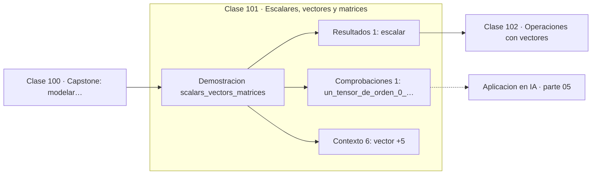

# 101 — Escalares, vectores y matrices

> [⬅️ 100 Capstone: modelar dependencias con grafos](../../part-04-matematica-discreta-para-computacion/100-capstone-modelar-dependencias-con-grafos/README.md) · [📚 Parte 05](../README.md) · [🏠 Programa](../../../README.md) · [102 Operaciones con vectores ➡️](../102-operaciones-con-vectores/README.md)

**Parte:** 05 — Álgebra lineal I: vectores y matrices · **Nivel:** `intermedio` · **Horas estimadas:** 4
**Motor:** `engines.part05` · **Demostración:** `scalars_vectors_matrices` · **Clase 1 de 20** de la parte

---

## 🎯 Propósito

**Escalar, vector, matriz y tensor son el mismo objeto con distinto número de índices.**

Vectores, normas, producto punto, independencia, span, sistemas lineales, eliminación de Gauss, rango, inversa, determinante y proyección ortogonal.

## ✅ Resultados de aprendizaje

Al terminar podrás:

1. Explicar **Escalares, vectores y matrices** con lenguaje cotidiano y con notación matemática.
2. Resolver un caso pequeño a mano y anticipar el orden de magnitud del resultado.
3. Ejecutar y modificar `lab.py`, que corre la demostración `scalars_vectors_matrices`.
4. Interpretar las 8 salidas del laboratorio y decir qué comprueba cada una.
5. Detectar el error típico de esta parte: invertir una matriz mal condicionada en lugar de factorizar.

## 🧩 Fórmulas de la clase

```text
escalar: orden 0 · vector: orden 1 · matriz: orden 2
shape de una matriz m×n: (m, n)
(Aᵀ)ᵢⱼ = Aⱼᵢ
```

## 🗺️ Ubicación en el programa



## 📖 Fundamentos

La jerarquía escalar → vector → matriz → tensor no es una lista de objetos distintos:
es el mismo objeto con distinto número de índices. Un escalar necesita cero índices
para localizar su valor, un vector uno, una matriz dos y un tensor de orden n, n
índices. Esa lectura unifica lo que en muchos cursos se presenta por separado.

El **shape** es el dato operativo: la tupla de tamaños de cada dimensión. La mayoría de
los errores al programar con arrays son errores de shape, y la disciplina más rentable
al escribir código numérico es anotar el shape esperado de cada variable. Un comentario
`# (batch, seq, d_model)` ahorra horas de depuración.

Multiplicar un vector por un escalar escala su magnitud sin cambiar su dirección —salvo
que el escalar sea negativo, que la invierte—. Es la operación más simple y ya contiene
la idea central: las operaciones lineales respetan la estructura del espacio.

La transposición intercambia filas y columnas, y su efecto sobre el shape es invertir
la tupla: una matriz (3,2) transpuesta es (2,3). En deep learning la transposición
aparece constantemente al calcular gradientes, porque la derivada de `Wx` respecto a `x`
involucra `Wᵀ`.

## 🧮 Ejemplo trabajado

Los cuatro objetos y sus shapes.

```text
escalar   3.0                      shape ()      orden 0
vector    [1, 2, 3]                shape (3,)    orden 1
matriz    [[1,2],[3,4],[5,6]]      shape (3,2)   orden 2
tensor    imágenes de un lote      shape (N,C,H,W)  orden 4

escalar × vector:  3·[1,2,3] = [3,6,9]

transpuesta de la matriz (3,2) → shape (2,3)
  [[1,3,5],
   [2,4,6]]
```

## 🔬 Qué ejecuta el laboratorio

`scalars_vectors_matrices` — Escalar, vector y matriz como objetos con forma y significado.

| Grupo | Salidas |
|---|---|
| 🔢 Resultados numéricos (1) | `escalar` |
| ✅ Comprobaciones de invariante (1) | `un_tensor_de_orden_0_es_un_escalar` |

Las claves booleanas no son adorno: si alguna fuera `False`, el resultado numérico
no sería fiable aunque el programa terminase sin error.

```bash
python classes/part-05-algebra-lineal-i-vectores-y-matrices/101-escalares-vectores-y-matrices/lab.py
compmath run 101
```

> [!TIP]
> Antes de ejecutar, **escribe tu predicción**. Un laboratorio que confirma lo que
> esperabas enseña tanto como uno que te contradice, pero solo si la predicción
> existía antes del resultado.

## ⚠️ Errores conceptuales frecuentes

1. Confundir el orden del tensor con el tamaño de sus dimensiones.
2. No anotar el shape esperado de cada variable en código numérico.
3. Suponer que un vector es una matriz columna: en NumPy, (3,) y (3,1) no son lo mismo.

## 🚀 Dónde se usa de verdad

Toda representación de datos en machine learning: un lote de imágenes es un tensor de
orden 4, un lote de secuencias uno de orden 3. Los errores de shape son la categoría de
bug más frecuente al entrenar modelos.

## 🤖 Conexión con IA

Cada capa densa es un producto matriz-vector. Los embeddings viven en subespacios y la similitud entre ellos es producto punto normalizado.

## 📓 Notebooks

| Archivo | Para qué |
|---|---|
| [`notebook.ipynb`](notebook.ipynb) | recorrido guiado con la demostración ejecutada |
| [`notebook_student.ipynb`](notebook_student.ipynb) | versión con `TODO` para resolver |
| [`notebook_solution.ipynb`](notebook_solution.ipynb) | solución de referencia verificada |

## 📝 Evaluación

| Criterio | Peso |
|---|---:|
| Comprensión conceptual | 25 % |
| Resolución manual | 25 % |
| Implementación y verificación | 25 % |
| Interpretación y comunicación | 15 % |
| Conexión con aplicación real | 10 % |

Detalle y criterios de error crítico en [`assessment.md`](assessment.md).

## ❓ Preguntas de comprobación

1. ¿Cuál es la entrada, cuál la salida y qué unidades tienen?
2. ¿Qué operación domina el comportamiento del resultado?
3. ¿Qué caso extremo revelaría un error conceptual?
4. ¿Cómo verificarías el resultado por un método independiente?
5. ¿Dónde aparece esto en sistemas de recomendación?

Si necesitas releer el código para responderlas, la clase todavía no está superada.

## 📥 Entregable

`notebook_student.ipynb` resuelto más un párrafo que explique el resultado **sin citar
código**: qué entra, qué sale, qué invariante se comprueba y qué pasaría en un caso límite.

## 🔗 Referencias

- [Strang, G. *Introduction to Linear Algebra*, 6ª ed., 2023, cap. 1](https://math.mit.edu/~gs/linearalgebra/) — *uso:* exposición alternativa del tema en «Escalares, vectores y matrices».
- [Goodfellow, Bengio & Courville. *Deep Learning*. MIT Press, 2016, cap. 2](https://www.deeplearningbook.org/) — *uso:* obra de referencia consultada en «Escalares, vectores y matrices».

Bibliografía completa de la parte en [`../../../docs/BIBLIOGRAPHY.md`](../../../docs/BIBLIOGRAPHY.md) · localizador verificable de cada obra en [`sources/bibliography.json`](../../../sources/bibliography.json).

## 📂 Material de la clase

[`intuition.md`](intuition.md) · [`theory.md`](theory.md) · [`derivation.md`](derivation.md) · [`exercises.md`](exercises.md) · [`assessment.md`](assessment.md) · [`where-is-this-used.md`](where-is-this-used.md) · [`lesson.yaml`](lesson.yaml)

---

> [⬅️ 100 Capstone: modelar dependencias con grafos](../../part-04-matematica-discreta-para-computacion/100-capstone-modelar-dependencias-con-grafos/README.md) · [📚 Parte 05](../README.md) · [🏠 Programa](../../../README.md) · [102 Operaciones con vectores ➡️](../102-operaciones-con-vectores/README.md)
