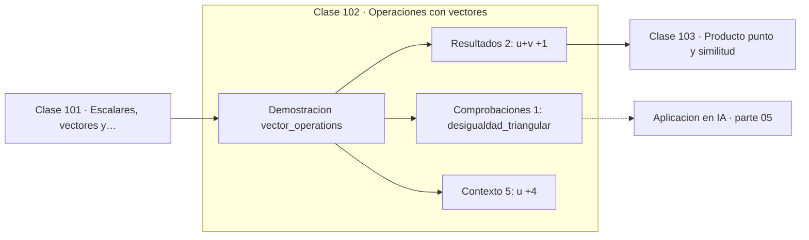

# 102 — Operaciones con vectores

> [⬅️ 101 Escalares, vectores y matrices](../101-escalares-vectores-y-matrices/README.md) · [📚 Parte 05](../README.md) · [🏠 Programa](../../../README.md) · [103 Producto punto y similitud ➡️](../103-producto-punto-y-similitud/README.md)

**Parte:** 05 — Álgebra lineal I: vectores y matrices · **Nivel:** `intermedio` · **Horas estimadas:** 4
**Motor:** `engines.part05` · **Demostración:** `vector_operations` · **Clase 2 de 20** de la parte

---

## 🎯 Propósito

**La suma de vectores es componente a componente, y la desigualdad triangular acota la norma del resultado.**

Vectores, normas, producto punto, independencia, span, sistemas lineales, eliminación de Gauss, rango, inversa, determinante y proyección ortogonal.

## ✅ Resultados de aprendizaje

Al terminar podrás:

1. Explicar **Operaciones con vectores** con lenguaje cotidiano y con notación matemática.
2. Resolver un caso pequeño a mano y anticipar el orden de magnitud del resultado.
3. Ejecutar y modificar `lab.py`, que corre la demostración `vector_operations`.
4. Interpretar las 8 salidas del laboratorio y decir qué comprueba cada una.
5. Detectar el error típico de esta parte: confundir dimensión del espacio con número de vectores.

## 🧩 Fórmulas de la clase

```text
(u + v)ᵢ = uᵢ + vᵢ
‖u + v‖ ≤ ‖u‖ + ‖v‖
```

## 🗺️ Ubicación en el programa



## 📖 Fundamentos

La suma de vectores tiene dos lecturas que conviene mantener a la vez. Algebraicamente
se suman las componentes. Geométricamente se aplica la regla del paralelogramo: el
resultado es la diagonal del paralelogramo que forman ambos vectores. Las dos describen
la misma operación.

La desigualdad triangular —`‖u+v‖ ≤ ‖u‖ + ‖v‖`— dice que el camino directo nunca es más
largo que el rodeo, y es una de las tres condiciones que definen una norma. La igualdad
se alcanza solo cuando los vectores son paralelos y del mismo sentido; en cualquier
otro caso hay cancelación parcial.

Esa desigualdad no es un tecnicismo: es la que permite acotar errores acumulados. Si el
error de cada paso está acotado, el error total lo está por la suma, y de ahí salen las
cotas de estabilidad de los métodos iterativos (parte 11) y las cotas de generalización
(parte 17).

Restar es sumar el opuesto, y `u − v` es el vector que va de `v` a `u`. Esa
interpretación —la diferencia como desplazamiento— es la que convierte `‖u − v‖` en la
distancia entre los dos puntos, conectando con la clase 061.

## 🧮 Ejemplo trabajado

Suma, resta y desigualdad triangular.

```text
u = (1, 2),  v = (3, −1)

u + v = (4, 1)
u − v = (−2, 3)
2u − 3v = (2,4) − (9,−3) = (−7, 7)

‖u+v‖ = √17 = 4.123
‖u‖ + ‖v‖ = √5 + √10 = 2.236 + 3.162 = 5.398

4.123 ≤ 5.398      ✓ desigualdad triangular

La diferencia (5.398 − 4.123) mide cuánto se cancelan entre sí.
```

## 🔬 Qué ejecuta el laboratorio

`vector_operations` — Suma, resta y combinación lineal con interpretación geométrica.

| Grupo | Salidas |
|---|---|
| 🔢 Resultados numéricos (2) | `|u+v|`, `|u|+|v|` |
| ✅ Comprobaciones de invariante (1) | `desigualdad_triangular` |

Las claves booleanas no son adorno: si alguna fuera `False`, el resultado numérico
no sería fiable aunque el programa terminase sin error.

```bash
python classes/part-05-algebra-lineal-i-vectores-y-matrices/102-operaciones-con-vectores/lab.py
compmath run 102
```

> [!TIP]
> Antes de ejecutar, **escribe tu predicción**. Un laboratorio que confirma lo que
> esperabas enseña tanto como uno que te contradice, pero solo si la predicción
> existía antes del resultado.

## ⚠️ Errores conceptuales frecuentes

1. Sumar vectores de dimensiones distintas.
2. Suponer que ‖u+v‖ = ‖u‖ + ‖v‖ en general: solo si son paralelos y del mismo sentido.
3. Confundir u − v con v − u: son opuestos.

## 🚀 Dónde se usa de verdad

Composición de desplazamientos, acumulación de gradientes, cotas de error en métodos
iterativos y agregación de vectores en sistemas de recomendación.

## 🤖 Conexión con IA

Cada capa densa es un producto matriz-vector. Los embeddings viven en subespacios y la similitud entre ellos es producto punto normalizado.

## 📓 Notebooks

| Archivo | Para qué |
|---|---|
| [`notebook.ipynb`](notebook.ipynb) | recorrido guiado con la demostración ejecutada |
| [`notebook_student.ipynb`](notebook_student.ipynb) | versión con `TODO` para resolver |
| [`notebook_solution.ipynb`](notebook_solution.ipynb) | solución de referencia verificada |

## 📝 Evaluación

| Criterio | Peso |
|---|---:|
| Comprensión conceptual | 25 % |
| Resolución manual | 25 % |
| Implementación y verificación | 25 % |
| Interpretación y comunicación | 15 % |
| Conexión con aplicación real | 10 % |

Detalle y criterios de error crítico en [`assessment.md`](assessment.md).

## ❓ Preguntas de comprobación

1. ¿Cuál es la entrada, cuál la salida y qué unidades tienen?
2. ¿Qué operación domina el comportamiento del resultado?
3. ¿Qué caso extremo revelaría un error conceptual?
4. ¿Cómo verificarías el resultado por un método independiente?
5. ¿Dónde aparece esto en sistemas de recomendación?

Si necesitas releer el código para responderlas, la clase todavía no está superada.

## 📥 Entregable

`notebook_student.ipynb` resuelto más un párrafo que explique el resultado **sin citar
código**: qué entra, qué sale, qué invariante se comprueba y qué pasaría en un caso límite.

## 🔗 Referencias

- [Strang, G. *Introduction to Linear Algebra*, 6ª ed., 2023](https://math.mit.edu/~gs/linearalgebra/)
- [Axler, S. *Linear Algebra Done Right*, 4ª ed., Springer, 2024](https://linear.axler.net/)

Bibliografía completa de la parte en [`../../../docs/BIBLIOGRAPHY.md`](../../../docs/BIBLIOGRAPHY.md).

## 📂 Material de la clase

[`intuition.md`](intuition.md) · [`theory.md`](theory.md) · [`derivation.md`](derivation.md) · [`exercises.md`](exercises.md) · [`assessment.md`](assessment.md) · [`where-is-this-used.md`](where-is-this-used.md) · [`lesson.yaml`](lesson.yaml)

---

> [⬅️ 101 Escalares, vectores y matrices](../101-escalares-vectores-y-matrices/README.md) · [📚 Parte 05](../README.md) · [🏠 Programa](../../../README.md) · [103 Producto punto y similitud ➡️](../103-producto-punto-y-similitud/README.md)
