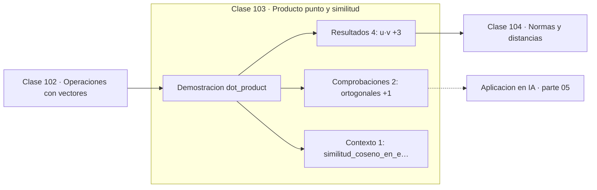

# 103 — Producto punto y similitud

> [⬅️ 102 Operaciones con vectores](../102-operaciones-con-vectores/README.md) · [📚 Parte 05](../README.md) · [🏠 Programa](../../../README.md) · [104 Normas y distancias ➡️](../104-normas-y-distancias/README.md)

**Parte:** 05 — Álgebra lineal I: vectores y matrices · **Nivel:** `intermedio` · **Horas estimadas:** 4
**Motor:** `engines.part05` · **Demostración:** `dot_product` · **Clase 3 de 20** de la parte

---

## 🎯 Propósito

**El producto punto mide alineación; su normalización es la similitud coseno de los embeddings.**

Vectores, normas, producto punto, independencia, span, sistemas lineales, eliminación de Gauss, rango, inversa, determinante y proyección ortogonal.

## ✅ Resultados de aprendizaje

Al terminar podrás:

1. Explicar **Producto punto y similitud** con lenguaje cotidiano y con notación matemática.
2. Resolver un caso pequeño a mano y anticipar el orden de magnitud del resultado.
3. Ejecutar y modificar `lab.py`, que corre la demostración `dot_product`.
4. Interpretar las 7 salidas del laboratorio y decir qué comprueba cada una.
5. Detectar el error típico de esta parte: aplicar producto punto a vectores de escalas incomparables.

## 🧩 Fórmulas de la clase

```text
u·v = Σuᵢvᵢ = ‖u‖‖v‖cos θ
cos θ = u·v / (‖u‖‖v‖)
u·u = ‖u‖²
```

## 🗺️ Ubicación en el programa



## 📖 Fundamentos

El producto punto es la operación más importante de esta parte y probablemente de todo
el programa. Definido como suma de productos componente a componente, resulta ser
`‖u‖‖v‖cos θ`, lo que le da una interpretación geométrica: mide cuánto apuntan dos
vectores en la misma dirección, escalado por sus magnitudes.

Tres lecturas del signo: positivo significa ángulo agudo, cero significa
**ortogonalidad**, negativo significa ángulo obtuso. La ortogonalidad definida como
«producto punto nulo» es la que se generaliza a dimensión arbitraria, donde no se puede
dibujar un ángulo recto.

La **similitud coseno** normaliza por las magnitudes y deja solo el ángulo. Es la
métrica estándar entre embeddings porque la magnitud de un embedding suele codificar
frecuencia o longitud del texto, no significado: dos documentos sobre el mismo tema,
uno largo y otro corto, tienen coseno alto y distancia euclídea grande.

Computacionalmente, el producto punto es la operación que domina el coste de un modelo
moderno. Una capa densa es un conjunto de productos punto; la atención calcula un
producto punto por cada par consulta-clave. Los TFLOPS de una GPU miden, en esencia,
cuántos productos punto por segundo puede hacer.

## 🧮 Ejemplo trabajado

Ángulos entre tres vectores.

```text
u = (1, 0),  v = (1, 1),  w = (0, 1)

u·v = 1        cos = 1/(1·√2) = 0.7071   →  45°
u·w = 0        cos = 0                   →  90°  ortogonales
u·u = 1 = ‖u‖²                            ✓

Similitud coseno en embeddings:
  misma fórmula, dimensión 768 o 1536
  la magnitud se descarta a propósito
```

## 🔬 Qué ejecuta el laboratorio

`dot_product` — Producto punto: proyección, ángulo y similitud.

| Grupo | Salidas |
|---|---|
| 🔢 Resultados numéricos (4) | `u·v`, `coseno_u_v`, `angulo_u_v_grados`, `u·w` |
| ✅ Comprobaciones de invariante (2) | `ortogonales`, `u·u_es_|u|²` |

Las claves booleanas no son adorno: si alguna fuera `False`, el resultado numérico
no sería fiable aunque el programa terminase sin error.

```bash
python classes/part-05-algebra-lineal-i-vectores-y-matrices/103-producto-punto-y-similitud/lab.py
compmath run 103
```

> [!TIP]
> Antes de ejecutar, **escribe tu predicción**. Un laboratorio que confirma lo que
> esperabas enseña tanto como uno que te contradice, pero solo si la predicción
> existía antes del resultado.

## ⚠️ Errores conceptuales frecuentes

1. Comparar vectores por producto punto sin normalizar cuando importa solo la dirección.
2. Calcular acos sin acotar el argumento a [−1,1]: el redondeo puede sacarlo del dominio.
3. Confundir el producto punto con el producto componente a componente (Hadamard).

## 🚀 Dónde se usa de verdad

Similitud coseno en búsqueda semántica y RAG, capas densas, atención escalada, y
cálculo de proyecciones e iluminación en gráficos.

## 🤖 Conexión con IA

Cada capa densa es un producto matriz-vector. Los embeddings viven en subespacios y la similitud entre ellos es producto punto normalizado.

## 📓 Notebooks

| Archivo | Para qué |
|---|---|
| [`notebook.ipynb`](notebook.ipynb) | recorrido guiado con la demostración ejecutada |
| [`notebook_student.ipynb`](notebook_student.ipynb) | versión con `TODO` para resolver |
| [`notebook_solution.ipynb`](notebook_solution.ipynb) | solución de referencia verificada |

## 📝 Evaluación

| Criterio | Peso |
|---|---:|
| Comprensión conceptual | 25 % |
| Resolución manual | 25 % |
| Implementación y verificación | 25 % |
| Interpretación y comunicación | 15 % |
| Conexión con aplicación real | 10 % |

Detalle y criterios de error crítico en [`assessment.md`](assessment.md).

## ❓ Preguntas de comprobación

1. ¿Cuál es la entrada, cuál la salida y qué unidades tienen?
2. ¿Qué operación domina el comportamiento del resultado?
3. ¿Qué caso extremo revelaría un error conceptual?
4. ¿Cómo verificarías el resultado por un método independiente?
5. ¿Dónde aparece esto en sistemas de recomendación?

Si necesitas releer el código para responderlas, la clase todavía no está superada.

## 📥 Entregable

`notebook_student.ipynb` resuelto más un párrafo que explique el resultado **sin citar
código**: qué entra, qué sale, qué invariante se comprueba y qué pasaría en un caso límite.

## 📚 Bibliografía de la clase

Esta clase enseña **Álgebra lineal**. Cada obra dice qué aporta aquí y cómo se comprobó su localizador:

- [Strang, G. *Introduction to Linear Algebra*, 6ª ed., 2023, cap. 1](https://math.mit.edu/~gs/linearalgebra/) — Álgebra lineal: el tema de esta clase · ISBN-13 `9781733146678` verificado en International ISBN Agency (2026-08-19).
- [Vaswani, A. et al. *Attention Is All You Need*. NeurIPS, 2017](https://arxiv.org/abs/1706.03762) — Deep learning y Modelos de lenguaje: conexión declarada de esta parte · DOI `10.48550/arxiv.1706.03762` verificado en DataCite (2026-08-19).

Bibliografía de todas las clases, con el porqué de cada obra, en [`docs/BIBLIOGRAPHY.md`](../../../docs/BIBLIOGRAPHY.md) · localizador y estado de cada obra en [`sources/bibliography.json`](../../../sources/bibliography.json).

## 📂 Material de la clase

[`intuition.md`](intuition.md) · [`theory.md`](theory.md) · [`derivation.md`](derivation.md) · [`exercises.md`](exercises.md) · [`assessment.md`](assessment.md) · [`where-is-this-used.md`](where-is-this-used.md) · [`lesson.yaml`](lesson.yaml)

---

> [⬅️ 102 Operaciones con vectores](../102-operaciones-con-vectores/README.md) · [📚 Parte 05](../README.md) · [🏠 Programa](../../../README.md) · [104 Normas y distancias ➡️](../104-normas-y-distancias/README.md)
