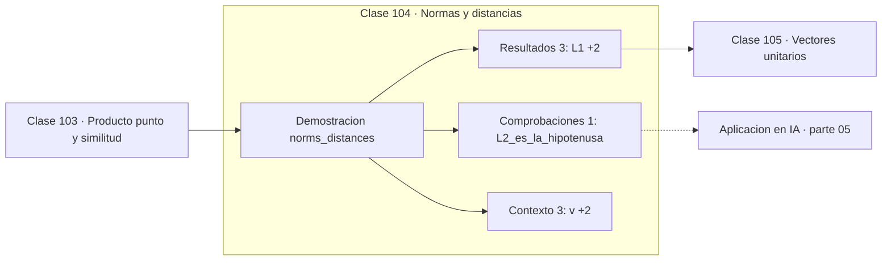

# 104 — Normas y distancias

> [⬅️ 103 Producto punto y similitud](../103-producto-punto-y-similitud/README.md) · [📚 Parte 05](../README.md) · [🏠 Programa](../../../README.md) · [105 Vectores unitarios ➡️](../105-vectores-unitarios/README.md)

**Parte:** 05 — Álgebra lineal I: vectores y matrices · **Nivel:** `intermedio` · **Horas estimadas:** 4
**Motor:** `engines.part05` · **Demostración:** `norms_distances` · **Clase 4 de 20** de la parte

---

## 🎯 Propósito

**La norma elegida determina qué se penaliza: L1 induce dispersión, L2 penaliza los valores grandes.**

Vectores, normas, producto punto, independencia, span, sistemas lineales, eliminación de Gauss, rango, inversa, determinante y proyección ortogonal.

## ✅ Resultados de aprendizaje

Al terminar podrás:

1. Explicar **Normas y distancias** con lenguaje cotidiano y con notación matemática.
2. Resolver un caso pequeño a mano y anticipar el orden de magnitud del resultado.
3. Ejecutar y modificar `lab.py`, que corre la demostración `norms_distances`.
4. Interpretar las 7 salidas del laboratorio y decir qué comprueba cada una.
5. Detectar el error típico de esta parte: invertir una matriz mal condicionada en lugar de factorizar.

## 🧩 Fórmulas de la clase

```text
L1 = Σ|xᵢ| · L2 = √Σxᵢ² · L∞ = máx|xᵢ|
L∞ ≤ L2 ≤ L1
```

## 🗺️ Ubicación en el programa



## 📖 Fundamentos

Una norma asigna una magnitud a un vector cumpliendo tres condiciones: es positiva
salvo en el cero, escala con el valor absoluto del escalar y satisface la desigualdad
triangular. Hay infinitas normas; las tres de la familia Lp son las que se usan en la
práctica.

La elección no es estética: cambia qué se penaliza. La **L2** eleva al cuadrado, así que
castiga desproporcionadamente los componentes grandes y tiende a repartir el valor
entre todos. La **L1** trata todos los componentes por igual y, usada como penalización,
empuja los pequeños exactamente a cero. Esa diferencia es la que separa Ridge de Lasso
(clases 283 y 284) y es puramente geométrica: la bola L1 tiene vértices sobre los ejes
y el óptimo tiende a caer en ellos.

La **L∞** solo mira el peor componente. Es la norma adecuada cuando lo que importa es
garantizar que ningún error individual supere un umbral, y aparece en robustez
adversarial: un ataque «acotado en L∞» limita cuánto puede cambiar cada píxel.

El orden `L∞ ≤ L2 ≤ L1` se cumple siempre y conviene verificarlo numéricamente una vez.
Explica que la misma perturbación parezca grande o pequeña según la norma con la que se
mida, y por qué comparar magnitudes exige declarar la norma.

## 🧮 Ejemplo trabajado

Tres normas del mismo vector.

```text
v = (3, −4, 12)

L1  = 3 + 4 + 12 = 19
L2  = √(9 + 16 + 144) = √169 = 13
L∞  = máx(3, 4, 12) = 12

Orden: 12 ≤ 13 ≤ 19          ✓

Interpretación:
  L1  penaliza la suma total de desviaciones → dispersión
  L2  penaliza los componentes grandes      → reparto
  L∞  solo mira el peor componente          → garantía
```

## 🔬 Qué ejecuta el laboratorio

`norms_distances` — L1, L2 e L∞ sobre el mismo vector.

| Grupo | Salidas |
|---|---|
| 🔢 Resultados numéricos (3) | `L1`, `L2`, `Linf` |
| ✅ Comprobaciones de invariante (1) | `L2_es_la_hipotenusa` |

Las claves booleanas no son adorno: si alguna fuera `False`, el resultado numérico
no sería fiable aunque el programa terminase sin error.

```bash
python classes/part-05-algebra-lineal-i-vectores-y-matrices/104-normas-y-distancias/lab.py
compmath run 104
```

> [!TIP]
> Antes de ejecutar, **escribe tu predicción**. Un laboratorio que confirma lo que
> esperabas enseña tanto como uno que te contradice, pero solo si la predicción
> existía antes del resultado.

## ⚠️ Errores conceptuales frecuentes

1. Reportar una magnitud sin declarar la norma usada.
2. Suponer que Ridge (L2) produce coeficientes exactamente cero.
3. Comparar normas de vectores de dimensiones distintas sin normalizar por la dimensión.

## 🚀 Dónde se usa de verdad

Regularización Ridge y Lasso, funciones de pérdida MSE y MAE, robustez adversarial
acotada en L∞ y criterios de convergencia.

## 🤖 Conexión con IA

Cada capa densa es un producto matriz-vector. Los embeddings viven en subespacios y la similitud entre ellos es producto punto normalizado.

## 📓 Notebooks

| Archivo | Para qué |
|---|---|
| [`notebook.ipynb`](notebook.ipynb) | recorrido guiado con la demostración ejecutada |
| [`notebook_student.ipynb`](notebook_student.ipynb) | versión con `TODO` para resolver |
| [`notebook_solution.ipynb`](notebook_solution.ipynb) | solución de referencia verificada |

## 📝 Evaluación

| Criterio | Peso |
|---|---:|
| Comprensión conceptual | 25 % |
| Resolución manual | 25 % |
| Implementación y verificación | 25 % |
| Interpretación y comunicación | 15 % |
| Conexión con aplicación real | 10 % |

Detalle y criterios de error crítico en [`assessment.md`](assessment.md).

## ❓ Preguntas de comprobación

1. ¿Cuál es la entrada, cuál la salida y qué unidades tienen?
2. ¿Qué operación domina el comportamiento del resultado?
3. ¿Qué caso extremo revelaría un error conceptual?
4. ¿Cómo verificarías el resultado por un método independiente?
5. ¿Dónde aparece esto en sistemas de recomendación?

Si necesitas releer el código para responderlas, la clase todavía no está superada.

## 📥 Entregable

`notebook_student.ipynb` resuelto más un párrafo que explique el resultado **sin citar
código**: qué entra, qué sale, qué invariante se comprueba y qué pasaría en un caso límite.

## 🔗 Referencias

- [Tibshirani, R. *Regression Shrinkage and Selection via the Lasso*. JRSS-B, 1996](https://www.jstor.org/stable/2346178) — *uso:* obra de referencia consultada en «Normas y distancias».
- [Boyd & Vandenberghe. *Convex Optimization*. Cambridge, 2004, cap. 2](https://web.stanford.edu/~boyd/cvxbook/) — *uso:* obra de referencia consultada en «Normas y distancias».

Bibliografía completa de la parte en [`../../../docs/BIBLIOGRAPHY.md`](../../../docs/BIBLIOGRAPHY.md) · localizador verificable de cada obra en [`sources/bibliography.json`](../../../sources/bibliography.json).

## 📂 Material de la clase

[`intuition.md`](intuition.md) · [`theory.md`](theory.md) · [`derivation.md`](derivation.md) · [`exercises.md`](exercises.md) · [`assessment.md`](assessment.md) · [`where-is-this-used.md`](where-is-this-used.md) · [`lesson.yaml`](lesson.yaml)

---

> [⬅️ 103 Producto punto y similitud](../103-producto-punto-y-similitud/README.md) · [📚 Parte 05](../README.md) · [🏠 Programa](../../../README.md) · [105 Vectores unitarios ➡️](../105-vectores-unitarios/README.md)
