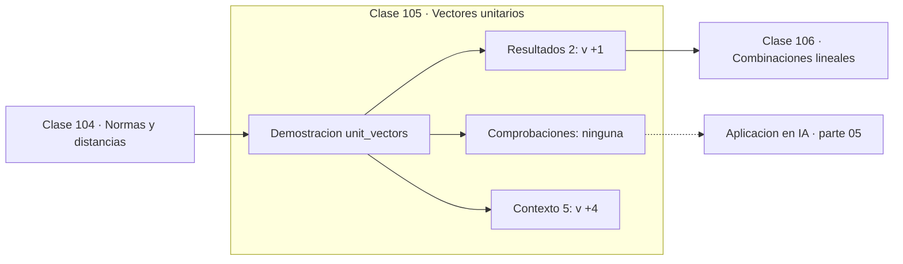

# 105 — Vectores unitarios

> [⬅️ 104 Normas y distancias](../104-normas-y-distancias/README.md) · [📚 Parte 05](../README.md) · [🏠 Programa](../../../README.md) · [106 Combinaciones lineales ➡️](../106-combinaciones-lineales/README.md)

**Parte:** 05 — Álgebra lineal I: vectores y matrices · **Nivel:** `intermedio` · **Horas estimadas:** 4
**Motor:** `engines.part05` · **Demostración:** `unit_vectors` · **Clase 5 de 20** de la parte

---

## 🎯 Propósito

**Normalizar separa dirección de magnitud; el vector cero no tiene dirección definida.**

Vectores, normas, producto punto, independencia, span, sistemas lineales, eliminación de Gauss, rango, inversa, determinante y proyección ortogonal.

## ✅ Resultados de aprendizaje

Al terminar podrás:

1. Explicar **Vectores unitarios** con lenguaje cotidiano y con notación matemática.
2. Resolver un caso pequeño a mano y anticipar el orden de magnitud del resultado.
3. Ejecutar y modificar `lab.py`, que corre la demostración `unit_vectors`.
4. Interpretar las 7 salidas del laboratorio y decir qué comprueba cada una.
5. Detectar el error típico de esta parte: confundir dimensión del espacio con número de vectores.

## 🧩 Fórmulas de la clase

```text
û = v / ‖v‖,  ‖û‖ = 1
v = ‖v‖ · û   (reconstrucción)
```

## 🗺️ Ubicación en el programa



## 📖 Fundamentos

Un vector codifica dos informaciones: hacia dónde apunta y cuánto mide. Normalizar
—dividir por la norma— conserva la primera y descarta la segunda. La reconstrucción es
inmediata: `v = ‖v‖·û`, lo que muestra que la descomposición no pierde nada, solo separa.

La operación tiene una excepción que hay que tratar: el vector cero no se puede
normalizar, porque no tiene dirección. En una implementación, dividir por su norma da
`NaN` o `inf` (clase 033), así que hay que comprobar el caso explícitamente. El motor
del programa devuelve el vector cero sin modificar, decisión que hay que declarar
porque no es la única razonable.

Normalizar es lo que hace que la comparación entre embeddings sea justa. También es lo
que hace la **normalización de capa** (clase 308), aunque allí se normaliza por media y
desviación en lugar de solo por norma. En ambos casos el objetivo es el mismo: que la
escala no domine la comparación.

Un detalle numérico: normalizar un vector de norma muy pequeña amplifica su error
relativo, porque se divide por un número cercano a cero. En cálculos sensibles conviene
comprobar que la norma supera un umbral antes de dividir.

## 🧮 Ejemplo trabajado

Normalizar y reconstruir.

```text
v = (6, 8)
‖v‖ = √(36 + 64) = 10

û = (0.6, 0.8)
‖û‖ = √(0.36 + 0.64) = 1.0        ✓

Reconstrucción: 10 · (0.6, 0.8) = (6, 8)    ✓

Caso límite:
  normalizar (0, 0) → división por cero
  el motor devuelve (0, 0) y lo declara
```

## 🔬 Qué ejecuta el laboratorio

`unit_vectors` — Normalizar separa dirección de magnitud.

| Grupo | Salidas |
|---|---|
| 🔢 Resultados numéricos (2) | `|v|`, `|v_normalizado|` |
| ✅ Comprobaciones de invariante (0) | — |

Las claves booleanas no son adorno: si alguna fuera `False`, el resultado numérico
no sería fiable aunque el programa terminase sin error.

```bash
python classes/part-05-algebra-lineal-i-vectores-y-matrices/105-vectores-unitarios/lab.py
compmath run 105
```

> [!TIP]
> Antes de ejecutar, **escribe tu predicción**. Un laboratorio que confirma lo que
> esperabas enseña tanto como uno que te contradice, pero solo si la predicción
> existía antes del resultado.

## ⚠️ Errores conceptuales frecuentes

1. Normalizar sin comprobar que la norma es no nula.
2. Normalizar vectores de norma muy pequeña y amplificar su error relativo.
3. Suponer que normalizar conserva toda la información: descarta la magnitud a propósito.

## 🚀 Dónde se usa de verdad

Comparación de embeddings, normalización de gradientes (gradient clipping), vectores
normales en gráficos y preparación de datos para similitud coseno.

## 🤖 Conexión con IA

Cada capa densa es un producto matriz-vector. Los embeddings viven en subespacios y la similitud entre ellos es producto punto normalizado.

## 📓 Notebooks

| Archivo | Para qué |
|---|---|
| [`notebook.ipynb`](notebook.ipynb) | recorrido guiado con la demostración ejecutada |
| [`notebook_student.ipynb`](notebook_student.ipynb) | versión con `TODO` para resolver |
| [`notebook_solution.ipynb`](notebook_solution.ipynb) | solución de referencia verificada |

## 📝 Evaluación

| Criterio | Peso |
|---|---:|
| Comprensión conceptual | 25 % |
| Resolución manual | 25 % |
| Implementación y verificación | 25 % |
| Interpretación y comunicación | 15 % |
| Conexión con aplicación real | 10 % |

Detalle y criterios de error crítico en [`assessment.md`](assessment.md).

## ❓ Preguntas de comprobación

1. ¿Cuál es la entrada, cuál la salida y qué unidades tienen?
2. ¿Qué operación domina el comportamiento del resultado?
3. ¿Qué caso extremo revelaría un error conceptual?
4. ¿Cómo verificarías el resultado por un método independiente?
5. ¿Dónde aparece esto en sistemas de recomendación?

Si necesitas releer el código para responderlas, la clase todavía no está superada.

## 📥 Entregable

`notebook_student.ipynb` resuelto más un párrafo que explique el resultado **sin citar
código**: qué entra, qué sale, qué invariante se comprueba y qué pasaría en un caso límite.

## 📚 Bibliografía de la clase

Esta clase enseña **Álgebra lineal**. Cada obra dice qué aporta aquí y cómo se comprobó su localizador:

- [Strang, G. *Introduction to Linear Algebra*, 6ª ed., 2023](https://math.mit.edu/~gs/linearalgebra/) — Álgebra lineal: el tema de esta clase · ISBN-13 `9781733146678` verificado en International ISBN Agency (2026-08-19).
- [Ba, Kiros & Hinton. *Layer Normalization*. arXiv, 2016](https://arxiv.org/abs/1607.06450) — Deep learning: conexión declarada de esta parte · DOI `10.48550/arxiv.1607.06450` verificado en DataCite (2026-08-19).

Bibliografía de todas las clases, con el porqué de cada obra, en [`docs/BIBLIOGRAPHY.md`](../../../docs/BIBLIOGRAPHY.md) · localizador y estado de cada obra en [`sources/bibliography.json`](../../../sources/bibliography.json).

## 📂 Material de la clase

[`intuition.md`](intuition.md) · [`theory.md`](theory.md) · [`derivation.md`](derivation.md) · [`exercises.md`](exercises.md) · [`assessment.md`](assessment.md) · [`where-is-this-used.md`](where-is-this-used.md) · [`lesson.yaml`](lesson.yaml)

---

> [⬅️ 104 Normas y distancias](../104-normas-y-distancias/README.md) · [📚 Parte 05](../README.md) · [🏠 Programa](../../../README.md) · [106 Combinaciones lineales ➡️](../106-combinaciones-lineales/README.md)
