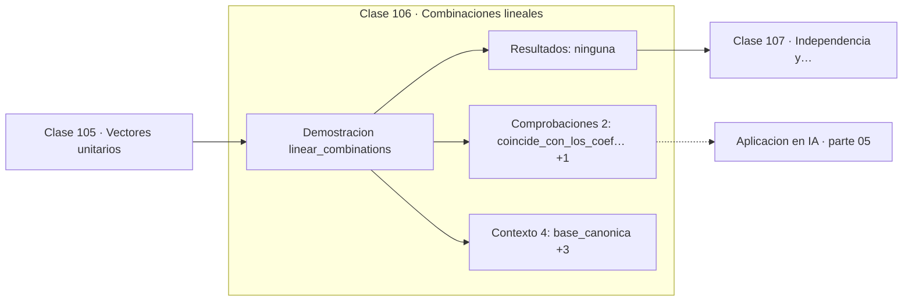

# 106 — Combinaciones lineales

> [⬅️ 105 Vectores unitarios](../105-vectores-unitarios/README.md) · [📚 Parte 05](../README.md) · [🏠 Programa](../../../README.md) · [107 Independencia y dependencia lineal ➡️](../107-independencia-y-dependencia-lineal/README.md)

**Parte:** 05 — Álgebra lineal I: vectores y matrices · **Nivel:** `intermedio` · **Horas estimadas:** 4
**Motor:** `engines.part05` · **Demostración:** `linear_combinations` · **Clase 6 de 20** de la parte

---

## 🎯 Propósito

**Una combinación lineal es la operación fundamental del álgebra lineal, y una capa densa es exactamente eso.**

Vectores, normas, producto punto, independencia, span, sistemas lineales, eliminación de Gauss, rango, inversa, determinante y proyección ortogonal.

## ✅ Resultados de aprendizaje

Al terminar podrás:

1. Explicar **Combinaciones lineales** con lenguaje cotidiano y con notación matemática.
2. Resolver un caso pequeño a mano y anticipar el orden de magnitud del resultado.
3. Ejecutar y modificar `lab.py`, que corre la demostración `linear_combinations`.
4. Interpretar las 6 salidas del laboratorio y decir qué comprueba cada una.
5. Detectar el error típico de esta parte: aplicar producto punto a vectores de escalas incomparables.

## 🧩 Fórmulas de la clase

```text
Σ αᵢvᵢ = α₁v₁ + ... + αₖvₖ
capa densa: y = Wx + b
```

## 🗺️ Ubicación en el programa



## 📖 Fundamentos

Una combinación lineal suma vectores multiplicados por escalares. Toda la estructura
del álgebra lineal se construye sobre esta única operación: independencia, span, base,
dimensión, transformación lineal y rango se definen en términos de combinaciones
lineales.

Con la base canónica la combinación es trivial —los coeficientes son las propias
coordenadas— y por eso las coordenadas de un vector son sus coeficientes en esa base.
Con otra base, los coeficientes cambian aunque el vector sea el mismo, que es
exactamente el contenido de la clase 121.

La conexión con machine learning es directa y merece enunciarse sin rodeos: **una capa
densa calcula combinaciones lineales**. Cada neurona de salida toma los pesos de una
fila de `W` como coeficientes y combina las entradas. `y = Wx + b` es un conjunto de
combinaciones lineales más un desplazamiento.

El sesgo `b` es lo que impide que la capa sea estrictamente lineal: una transformación
lineal manda el cero al cero, y sumar `b` lo mueve. Técnicamente `Wx + b` es una
transformación **afín**, no lineal, y esa distinción es la misma que la clase 073
resolvió con coordenadas homogéneas.

## 🧮 Ejemplo trabajado

Combinación lineal en la base canónica.

```text
e₁ = (1,0,0)   e₂ = (0,1,0)   e₃ = (0,0,1)
coeficientes: 2, −3, 5

2·e₁ + (−3)·e₂ + 5·e₃ = (2, −3, 5)

Los coeficientes SON las coordenadas       ✓
(esto solo ocurre en la base canónica)

Capa densa equivalente:
  y = Wx + b   con W de shape (salidas, entradas)
  cada fila de W son los coeficientes de una combinación
```

## 🔬 Qué ejecuta el laboratorio

`linear_combinations` — Toda combinación lineal de la base canónica reconstruye el vector.

| Grupo | Salidas |
|---|---|
| 🔢 Resultados numéricos (0) | — |
| ✅ Comprobaciones de invariante (2) | `coincide_con_los_coeficientes`, `una_capa_densa_es_una_combinacion_lineal` |

Las claves booleanas no son adorno: si alguna fuera `False`, el resultado numérico
no sería fiable aunque el programa terminase sin error.

```bash
python classes/part-05-algebra-lineal-i-vectores-y-matrices/106-combinaciones-lineales/lab.py
compmath run 106
```

> [!TIP]
> Antes de ejecutar, **escribe tu predicción**. Un laboratorio que confirma lo que
> esperabas enseña tanto como uno que te contradice, pero solo si la predicción
> existía antes del resultado.

## ⚠️ Errores conceptuales frecuentes

1. Confundir los coeficientes con las coordenadas fuera de la base canónica.
2. Llamar lineal a Wx + b: es afín, porque no manda el cero al cero.
3. Olvidar que el número de coeficientes debe coincidir con el de vectores.

## 🚀 Dónde se usa de verdad

Capas densas, mezclas de modelos, interpolación, representación en bases y
superposición de señales.

## 🤖 Conexión con IA

Cada capa densa es un producto matriz-vector. Los embeddings viven en subespacios y la similitud entre ellos es producto punto normalizado.

## 📓 Notebooks

| Archivo | Para qué |
|---|---|
| [`notebook.ipynb`](notebook.ipynb) | recorrido guiado con la demostración ejecutada |
| [`notebook_student.ipynb`](notebook_student.ipynb) | versión con `TODO` para resolver |
| [`notebook_solution.ipynb`](notebook_solution.ipynb) | solución de referencia verificada |

## 📝 Evaluación

| Criterio | Peso |
|---|---:|
| Comprensión conceptual | 25 % |
| Resolución manual | 25 % |
| Implementación y verificación | 25 % |
| Interpretación y comunicación | 15 % |
| Conexión con aplicación real | 10 % |

Detalle y criterios de error crítico en [`assessment.md`](assessment.md).

## ❓ Preguntas de comprobación

1. ¿Cuál es la entrada, cuál la salida y qué unidades tienen?
2. ¿Qué operación domina el comportamiento del resultado?
3. ¿Qué caso extremo revelaría un error conceptual?
4. ¿Cómo verificarías el resultado por un método independiente?
5. ¿Dónde aparece esto en sistemas de recomendación?

Si necesitas releer el código para responderlas, la clase todavía no está superada.

## 📥 Entregable

`notebook_student.ipynb` resuelto más un párrafo que explique el resultado **sin citar
código**: qué entra, qué sale, qué invariante se comprueba y qué pasaría en un caso límite.

## 🔗 Referencias

- [Strang, G. *Introduction to Linear Algebra*, 6ª ed., 2023, cap. 1](https://math.mit.edu/~gs/linearalgebra/) — *uso:* exposición alternativa del tema en «Combinaciones lineales».
- [3Blue1Brown. *Linear combinations, span, and basis vectors*](https://www.3blue1brown.com/lessons/span) — *uso:* exposición alternativa del tema en «Combinaciones lineales».

Bibliografía completa de la parte en [`../../../docs/BIBLIOGRAPHY.md`](../../../docs/BIBLIOGRAPHY.md) · localizador verificable de cada obra en [`sources/bibliography.json`](../../../sources/bibliography.json).

## 📂 Material de la clase

[`intuition.md`](intuition.md) · [`theory.md`](theory.md) · [`derivation.md`](derivation.md) · [`exercises.md`](exercises.md) · [`assessment.md`](assessment.md) · [`where-is-this-used.md`](where-is-this-used.md) · [`lesson.yaml`](lesson.yaml)

---

> [⬅️ 105 Vectores unitarios](../105-vectores-unitarios/README.md) · [📚 Parte 05](../README.md) · [🏠 Programa](../../../README.md) · [107 Independencia y dependencia lineal ➡️](../107-independencia-y-dependencia-lineal/README.md)
