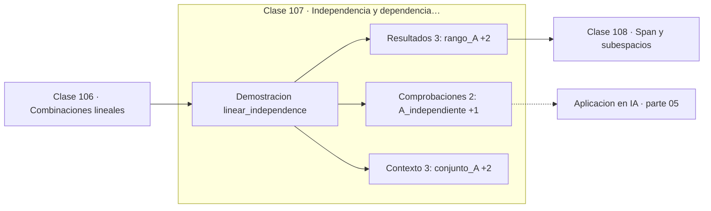

# 107 — Independencia y dependencia lineal

> [⬅️ 106 Combinaciones lineales](../106-combinaciones-lineales/README.md) · [📚 Parte 05](../README.md) · [🏠 Programa](../../../README.md) · [108 Span y subespacios ➡️](../108-span-y-subespacios/README.md)

**Parte:** 05 — Álgebra lineal I: vectores y matrices · **Nivel:** `intermedio` · **Horas estimadas:** 4
**Motor:** `engines.part05` · **Demostración:** `linear_independence` · **Clase 7 de 20** de la parte

---

## 🎯 Propósito

**La independencia lineal se detecta por el rango, no por inspección visual.**

Vectores, normas, producto punto, independencia, span, sistemas lineales, eliminación de Gauss, rango, inversa, determinante y proyección ortogonal.

## ✅ Resultados de aprendizaje

Al terminar podrás:

1. Explicar **Independencia y dependencia lineal** con lenguaje cotidiano y con notación matemática.
2. Resolver un caso pequeño a mano y anticipar el orden de magnitud del resultado.
3. Ejecutar y modificar `lab.py`, que corre la demostración `linear_independence`.
4. Interpretar las 8 salidas del laboratorio y decir qué comprueba cada una.
5. Detectar el error típico de esta parte: invertir una matriz mal condicionada en lugar de factorizar.

## 🧩 Fórmulas de la clase

```text
independientes ⟺ Σαᵢvᵢ = 0 solo con todos los αᵢ = 0
k vectores en ℝⁿ con k > n son siempre dependientes
```

## 🗺️ Ubicación en el programa



## 📖 Fundamentos

Un conjunto de vectores es linealmente independiente si ninguno se puede escribir como
combinación de los demás. La definición formal —la única combinación que da el vector
cero es la trivial— es la operativa, porque se traduce en un sistema homogéneo cuya
única solución debe ser la nula.

En la práctica no se comprueba a ojo: se calcula el **rango**. Si el rango del conjunto
coincide con el número de vectores, son independientes; si es menor, hay al menos una
relación de dependencia. Para conjuntos cuadrados, el determinante nulo es equivalente y
más rápido de calcular.

La dependencia lineal en datos tiene un nombre propio en estadística: **multicolinealidad**.
Cuando dos features son casi combinación lineal una de otra, la matriz `XᵀX` se vuelve
casi singular, los coeficientes de la regresión se disparan y pierden interpretabilidad.
Ridge (clase 283) existe en buena parte para mitigar exactamente eso.

Un hecho de conteo que conviene tener presente: en ℝⁿ no puede haber más de n vectores
independientes. Si un conjunto de datos tiene más features que observaciones, las filas
son necesariamente dependientes, y eso garantiza que el sistema esté indeterminado sin
regularización.

## 🧮 Ejemplo trabajado

Dos conjuntos de tres vectores en ℝ³.

```text
A = base canónica         rango 3 = 3 vectores  → independientes ✓
B = {(1,2,3), (2,4,6), (1,1,1)}

  fila2 = 2 · fila1       → hay dependencia
  rango(B) = 2 < 3        → dependientes       ✗
  det(B) = 0                                   ✓ coherente

En ℝ³ nunca puede haber 4 vectores independientes.
```

## 🔬 Qué ejecuta el laboratorio

`linear_independence` — Independencia detectada por el rango, no por inspección.

| Grupo | Salidas |
|---|---|
| 🔢 Resultados numéricos (3) | `rango_A`, `rango_B`, `determinante_B` |
| ✅ Comprobaciones de invariante (2) | `A_independiente`, `B_independiente` |

Las claves booleanas no son adorno: si alguna fuera `False`, el resultado numérico
no sería fiable aunque el programa terminase sin error.

```bash
python classes/part-05-algebra-lineal-i-vectores-y-matrices/107-independencia-y-dependencia-lineal/lab.py
compmath run 107
```

> [!TIP]
> Antes de ejecutar, **escribe tu predicción**. Un laboratorio que confirma lo que
> esperabas enseña tanto como uno que te contradice, pero solo si la predicción
> existía antes del resultado.

## ⚠️ Errores conceptuales frecuentes

1. Juzgar la independencia por inspección en lugar de calcular el rango.
2. Usar el determinante en matrices no cuadradas: no está definido.
3. Ignorar la multicolinealidad al interpretar coeficientes de una regresión.

## 🚀 Dónde se usa de verdad

Detección de multicolinealidad, selección de features, diagnóstico de sistemas mal
condicionados y reducción de dimensionalidad.

## 🤖 Conexión con IA

Cada capa densa es un producto matriz-vector. Los embeddings viven en subespacios y la similitud entre ellos es producto punto normalizado.

## 📓 Notebooks

| Archivo | Para qué |
|---|---|
| [`notebook.ipynb`](notebook.ipynb) | recorrido guiado con la demostración ejecutada |
| [`notebook_student.ipynb`](notebook_student.ipynb) | versión con `TODO` para resolver |
| [`notebook_solution.ipynb`](notebook_solution.ipynb) | solución de referencia verificada |

## 📝 Evaluación

| Criterio | Peso |
|---|---:|
| Comprensión conceptual | 25 % |
| Resolución manual | 25 % |
| Implementación y verificación | 25 % |
| Interpretación y comunicación | 15 % |
| Conexión con aplicación real | 10 % |

Detalle y criterios de error crítico en [`assessment.md`](assessment.md).

## ❓ Preguntas de comprobación

1. ¿Cuál es la entrada, cuál la salida y qué unidades tienen?
2. ¿Qué operación domina el comportamiento del resultado?
3. ¿Qué caso extremo revelaría un error conceptual?
4. ¿Cómo verificarías el resultado por un método independiente?
5. ¿Dónde aparece esto en sistemas de recomendación?

Si necesitas releer el código para responderlas, la clase todavía no está superada.

## 📥 Entregable

`notebook_student.ipynb` resuelto más un párrafo que explique el resultado **sin citar
código**: qué entra, qué sale, qué invariante se comprueba y qué pasaría en un caso límite.

## 📚 Bibliografía de la clase

Esta clase enseña **Álgebra lineal**. Cada obra dice qué aporta aquí y cómo se comprobó su localizador:

- [Strang, G. *Introduction to Linear Algebra*, 6ª ed., 2023, cap. 3](https://math.mit.edu/~gs/linearalgebra/) — Álgebra lineal: el tema de esta clase · ISBN-13 `9781733146678` verificado en International ISBN Agency (2026-08-19).
- [Hastie, Tibshirani & Friedman. *The Elements of Statistical Learning*, 2ª ed., 2009](https://hastie.su.domains/ElemStatLearn/) — Estadística e inferencia y Machine learning: conexión declarada de esta parte · ISBN-13 `9780387848570` verificado en International ISBN Agency (2026-08-19).

Bibliografía de todas las clases, con el porqué de cada obra, en [`docs/BIBLIOGRAPHY.md`](../../../docs/BIBLIOGRAPHY.md) · localizador y estado de cada obra en [`sources/bibliography.json`](../../../sources/bibliography.json).

## 📂 Material de la clase

[`intuition.md`](intuition.md) · [`theory.md`](theory.md) · [`derivation.md`](derivation.md) · [`exercises.md`](exercises.md) · [`assessment.md`](assessment.md) · [`where-is-this-used.md`](where-is-this-used.md) · [`lesson.yaml`](lesson.yaml)

---

> [⬅️ 106 Combinaciones lineales](../106-combinaciones-lineales/README.md) · [📚 Parte 05](../README.md) · [🏠 Programa](../../../README.md) · [108 Span y subespacios ➡️](../108-span-y-subespacios/README.md)
