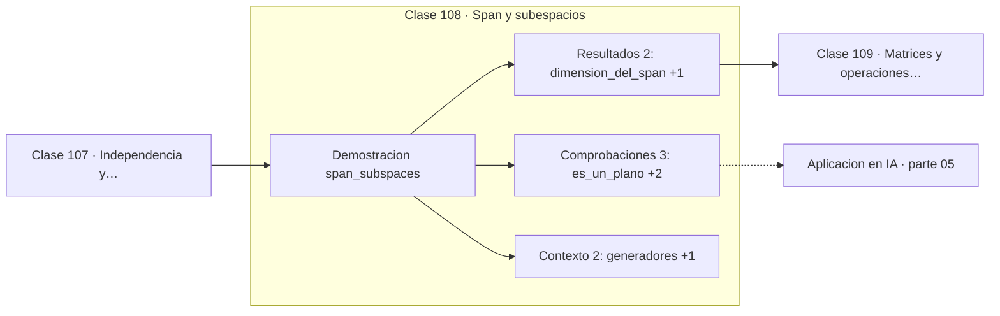

# 108 — Span y subespacios

> [⬅️ 107 Independencia y dependencia lineal](../107-independencia-y-dependencia-lineal/README.md) · [📚 Parte 05](../README.md) · [🏠 Programa](../../../README.md) · [109 Matrices y operaciones básicas ➡️](../109-matrices-y-operaciones-basicas/README.md)

**Parte:** 05 — Álgebra lineal I: vectores y matrices · **Nivel:** `intermedio` · **Horas estimadas:** 4
**Motor:** `engines.part05` · **Demostración:** `span_subspaces` · **Clase 8 de 20** de la parte

---

## 🎯 Propósito

**El span de un conjunto es siempre un subespacio, y su dimensión es el rango del conjunto.**

Vectores, normas, producto punto, independencia, span, sistemas lineales, eliminación de Gauss, rango, inversa, determinante y proyección ortogonal.

## ✅ Resultados de aprendizaje

Al terminar podrás:

1. Explicar **Span y subespacios** con lenguaje cotidiano y con notación matemática.
2. Resolver un caso pequeño a mano y anticipar el orden de magnitud del resultado.
3. Ejecutar y modificar `lab.py`, que corre la demostración `span_subspaces`.
4. Interpretar las 7 salidas del laboratorio y decir qué comprueba cada una.
5. Detectar el error típico de esta parte: confundir dimensión del espacio con número de vectores.

## 🧩 Fórmulas de la clase

```text
span{v₁,...,vₖ} = {Σαᵢvᵢ}
dim(span) = rango del conjunto
```

## 🗺️ Ubicación en el programa



## 📖 Fundamentos

El span de un conjunto de vectores es el conjunto de todas sus combinaciones lineales.
Siempre es un **subespacio**: contiene el vector cero y es cerrado bajo suma y producto
por escalar. Esa cerradura es lo que lo distingue de un subconjunto cualquiera.

Su dimensión —el número de vectores independientes que contiene— determina qué tipo de
objeto geométrico es. En ℝ³, el span de un vector no nulo es una recta por el origen; el
de dos vectores independientes, un plano; el de tres, todo el espacio. Añadir un vector
que ya está en el span no cambia nada, y esa es la definición operativa de redundancia.

La conexión con datos es directa. Si las features de un conjunto de datos generan un
subespacio de dimensión menor que el número de features, hay redundancia, y PCA
(clase 135) encuentra una base de ese subespacio con menos vectores. La «dimensión
intrínseca» de un conjunto de datos es la dimensión de su span aproximado.

En redes neuronales, el espacio columna de la matriz de pesos determina qué salidas son
alcanzables. Si `W` tiene rango deficiente, la capa proyecta sobre un subespacio y pierde
información irrecuperablemente: dos entradas distintas pueden producir la misma salida.

## 🧮 Ejemplo trabajado

Span en ℝ³.

```text
v₁ = (1,0,0),  v₂ = (0,1,0)

span{v₁, v₂}:  dimensión 2  →  el plano z = 0
¿contiene (0,0,1)?  No

Al añadir v₃ = (0,0,1):
  rango pasa de 2 a 3  →  ahora genera todo ℝ³

Propiedades del subespacio:
  contiene el (0,0,0)                  ✓
  cerrado bajo suma y escala           ✓
```

## 🔬 Qué ejecuta el laboratorio

`span_subspaces` — El span de dos vectores en ℝ³ es un plano, no todo el espacio.

| Grupo | Salidas |
|---|---|
| 🔢 Resultados numéricos (2) | `dimension_del_span`, `rango_al_añadirlo` |
| ✅ Comprobaciones de invariante (3) | `es_un_plano`, `ahora_genera_R3`, `subespacio_contiene_al_cero` |

Las claves booleanas no son adorno: si alguna fuera `False`, el resultado numérico
no sería fiable aunque el programa terminase sin error.

```bash
python classes/part-05-algebra-lineal-i-vectores-y-matrices/108-span-y-subespacios/lab.py
compmath run 108
```

> [!TIP]
> Antes de ejecutar, **escribe tu predicción**. Un laboratorio que confirma lo que
> esperabas enseña tanto como uno que te contradice, pero solo si la predicción
> existía antes del resultado.

## ⚠️ Errores conceptuales frecuentes

1. Suponer que el span de k vectores tiene dimensión k sin comprobar la independencia.
2. Olvidar que todo subespacio contiene el vector cero.
3. Confundir el span (infinito) con el conjunto generador (finito).

## 🚀 Dónde se usa de verdad

Dimensión intrínseca de un conjunto de datos, PCA, análisis de capacidad de una capa y
compresión por reducción de rango.

## 🤖 Conexión con IA

Cada capa densa es un producto matriz-vector. Los embeddings viven en subespacios y la similitud entre ellos es producto punto normalizado.

## 📓 Notebooks

| Archivo | Para qué |
|---|---|
| [`notebook.ipynb`](notebook.ipynb) | recorrido guiado con la demostración ejecutada |
| [`notebook_student.ipynb`](notebook_student.ipynb) | versión con `TODO` para resolver |
| [`notebook_solution.ipynb`](notebook_solution.ipynb) | solución de referencia verificada |

## 📝 Evaluación

| Criterio | Peso |
|---|---:|
| Comprensión conceptual | 25 % |
| Resolución manual | 25 % |
| Implementación y verificación | 25 % |
| Interpretación y comunicación | 15 % |
| Conexión con aplicación real | 10 % |

Detalle y criterios de error crítico en [`assessment.md`](assessment.md).

## ❓ Preguntas de comprobación

1. ¿Cuál es la entrada, cuál la salida y qué unidades tienen?
2. ¿Qué operación domina el comportamiento del resultado?
3. ¿Qué caso extremo revelaría un error conceptual?
4. ¿Cómo verificarías el resultado por un método independiente?
5. ¿Dónde aparece esto en sistemas de recomendación?

Si necesitas releer el código para responderlas, la clase todavía no está superada.

## 📥 Entregable

`notebook_student.ipynb` resuelto más un párrafo que explique el resultado **sin citar
código**: qué entra, qué sale, qué invariante se comprueba y qué pasaría en un caso límite.

## 📚 Bibliografía de la clase

Esta clase enseña **Álgebra lineal**. Cada obra dice qué aporta aquí y cómo se comprobó su localizador:

- [Axler, S. *Linear Algebra Done Right*, 4ª ed., Springer, 2024, cap. 2](https://linear.axler.net/) — Álgebra lineal: el tema de esta clase · URL de la fuente primaria comprobada en sitio oficial del autor (2026-08-19).
- [Strang, G. *Introduction to Linear Algebra*, 6ª ed., 2023](https://math.mit.edu/~gs/linearalgebra/) — Álgebra lineal: el tema de esta clase · ISBN-13 `9781733146678` verificado en International ISBN Agency (2026-08-19).

Bibliografía de todas las clases, con el porqué de cada obra, en [`docs/BIBLIOGRAPHY.md`](../../../docs/BIBLIOGRAPHY.md) · localizador y estado de cada obra en [`sources/bibliography.json`](../../../sources/bibliography.json).

## 📂 Material de la clase

[`intuition.md`](intuition.md) · [`theory.md`](theory.md) · [`derivation.md`](derivation.md) · [`exercises.md`](exercises.md) · [`assessment.md`](assessment.md) · [`where-is-this-used.md`](where-is-this-used.md) · [`lesson.yaml`](lesson.yaml)

---

> [⬅️ 107 Independencia y dependencia lineal](../107-independencia-y-dependencia-lineal/README.md) · [📚 Parte 05](../README.md) · [🏠 Programa](../../../README.md) · [109 Matrices y operaciones básicas ➡️](../109-matrices-y-operaciones-basicas/README.md)
