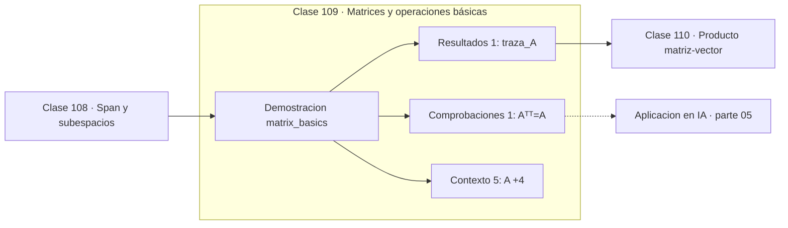

# 109 — Matrices y operaciones básicas

> [⬅️ 108 Span y subespacios](../108-span-y-subespacios/README.md) · [📚 Parte 05](../README.md) · [🏠 Programa](../../../README.md) · [110 Producto matriz-vector ➡️](../110-producto-matriz-vector/README.md)

**Parte:** 05 — Álgebra lineal I: vectores y matrices · **Nivel:** `intermedio` · **Horas estimadas:** 4
**Motor:** `engines.part05` · **Demostración:** `matrix_basics` · **Clase 9 de 20** de la parte

---

## 🎯 Propósito

**Suma, escala y transpuesta operan elemento a elemento; la traza suma la diagonal.**

Vectores, normas, producto punto, independencia, span, sistemas lineales, eliminación de Gauss, rango, inversa, determinante y proyección ortogonal.

## ✅ Resultados de aprendizaje

Al terminar podrás:

1. Explicar **Matrices y operaciones básicas** con lenguaje cotidiano y con notación matemática.
2. Resolver un caso pequeño a mano y anticipar el orden de magnitud del resultado.
3. Ejecutar y modificar `lab.py`, que corre la demostración `matrix_basics`.
4. Interpretar las 7 salidas del laboratorio y decir qué comprueba cada una.
5. Detectar el error típico de esta parte: aplicar producto punto a vectores de escalas incomparables.

## 🧩 Fórmulas de la clase

```text
(A + B)ᵢⱼ = Aᵢⱼ + Bᵢⱼ
(Aᵀ)ᵀ = A
tr(A) = Σ Aᵢᵢ = suma de los autovalores
```

## 🗺️ Ubicación en el programa



## 📖 Fundamentos

Las operaciones básicas con matrices son las que se esperan: suma y escala elemento a
elemento, ambas definidas solo entre matrices del mismo shape. El producto matricial es
la excepción: no es elemento a elemento, y por eso la clase 111 lo trata aparte.

La **traza** —la suma de la diagonal— parece una definición arbitraria y tiene
propiedades notables: es lineal, es invariante bajo transposición y cumple
`tr(AB) = tr(BA)` aunque `AB ≠ BA`. Esa última propiedad la hace invariante bajo cambio
de base, y de ahí que la traza sea igual a la suma de los autovalores (clase 125).

En machine learning la traza aparece con frecuencia en formas cuadráticas y en el
cálculo de gradientes matriciales: `∂tr(AᵀB)/∂A = B`. También es la que define la
**norma de Frobenius**, `‖A‖_F = √tr(AᵀA)`, que es la norma euclídea de la matriz vista
como un vector largo.

La transposición cumple `(Aᵀ)ᵀ = A` y, lo más útil, `(AB)ᵀ = BᵀAᵀ` **con el orden
invertido**. Ese cambio de orden es la causa de la mitad de los errores al derivar
expresiones matriciales, y conviene comprobarlo numéricamente una vez para fijarlo.

## 🧮 Ejemplo trabajado

Operaciones básicas con matrices 2×2.

```text
A = [[1,2],[3,4]]      B = [[0,1],[−1,2]]

A + B = [[1,3],[2,6]]
3A    = [[3,6],[9,12]]

Aᵀ    = [[1,3],[2,4]]
(Aᵀ)ᵀ = A                            ✓

traza(A) = 1 + 4 = 5
```

## 🔬 Qué ejecuta el laboratorio

`matrix_basics` — Suma, escala y transpuesta de matrices.

| Grupo | Salidas |
|---|---|
| 🔢 Resultados numéricos (1) | `traza_A` |
| ✅ Comprobaciones de invariante (1) | `(Aᵀ)ᵀ=A` |

Las claves booleanas no son adorno: si alguna fuera `False`, el resultado numérico
no sería fiable aunque el programa terminase sin error.

```bash
python classes/part-05-algebra-lineal-i-vectores-y-matrices/109-matrices-y-operaciones-basicas/lab.py
compmath run 109
```

> [!TIP]
> Antes de ejecutar, **escribe tu predicción**. Un laboratorio que confirma lo que
> esperabas enseña tanto como uno que te contradice, pero solo si la predicción
> existía antes del resultado.

## ⚠️ Errores conceptuales frecuentes

1. Sumar matrices de shapes distintos.
2. Olvidar invertir el orden en (AB)ᵀ = BᵀAᵀ.
3. Confundir la traza con el determinante.

## 🚀 Dónde se usa de verdad

Norma de Frobenius, cálculo de gradientes matriciales, invariantes bajo cambio de base
y regularización de matrices de pesos.

## 🤖 Conexión con IA

Cada capa densa es un producto matriz-vector. Los embeddings viven en subespacios y la similitud entre ellos es producto punto normalizado.

## 📓 Notebooks

| Archivo | Para qué |
|---|---|
| [`notebook.ipynb`](notebook.ipynb) | recorrido guiado con la demostración ejecutada |
| [`notebook_student.ipynb`](notebook_student.ipynb) | versión con `TODO` para resolver |
| [`notebook_solution.ipynb`](notebook_solution.ipynb) | solución de referencia verificada |

## 📝 Evaluación

| Criterio | Peso |
|---|---:|
| Comprensión conceptual | 25 % |
| Resolución manual | 25 % |
| Implementación y verificación | 25 % |
| Interpretación y comunicación | 15 % |
| Conexión con aplicación real | 10 % |

Detalle y criterios de error crítico en [`assessment.md`](assessment.md).

## ❓ Preguntas de comprobación

1. ¿Cuál es la entrada, cuál la salida y qué unidades tienen?
2. ¿Qué operación domina el comportamiento del resultado?
3. ¿Qué caso extremo revelaría un error conceptual?
4. ¿Cómo verificarías el resultado por un método independiente?
5. ¿Dónde aparece esto en sistemas de recomendación?

Si necesitas releer el código para responderlas, la clase todavía no está superada.

## 📥 Entregable

`notebook_student.ipynb` resuelto más un párrafo que explique el resultado **sin citar
código**: qué entra, qué sale, qué invariante se comprueba y qué pasaría en un caso límite.

## 🔗 Referencias

- [Petersen & Pedersen. *The Matrix Cookbook*, 2012](https://www.math.uwaterloo.ca/~hwolkowi/matrixcookbook.pdf)
- [Strang, G. *Introduction to Linear Algebra*, 6ª ed., 2023](https://math.mit.edu/~gs/linearalgebra/)

Bibliografía completa de la parte en [`../../../docs/BIBLIOGRAPHY.md`](../../../docs/BIBLIOGRAPHY.md).

## 📂 Material de la clase

[`intuition.md`](intuition.md) · [`theory.md`](theory.md) · [`derivation.md`](derivation.md) · [`exercises.md`](exercises.md) · [`assessment.md`](assessment.md) · [`where-is-this-used.md`](where-is-this-used.md) · [`lesson.yaml`](lesson.yaml)

---

> [⬅️ 108 Span y subespacios](../108-span-y-subespacios/README.md) · [📚 Parte 05](../README.md) · [🏠 Programa](../../../README.md) · [110 Producto matriz-vector ➡️](../110-producto-matriz-vector/README.md)
