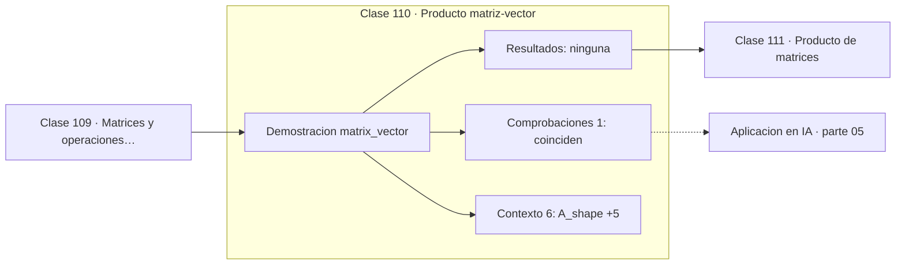

# 110 — Producto matriz-vector

> [⬅️ 109 Matrices y operaciones básicas](../109-matrices-y-operaciones-basicas/README.md) · [📚 Parte 05](../README.md) · [🏠 Programa](../../../README.md) · [111 Producto de matrices ➡️](../111-producto-de-matrices/README.md)

**Parte:** 05 — Álgebra lineal I: vectores y matrices · **Nivel:** `intermedio` · **Horas estimadas:** 4
**Motor:** `engines.part05` · **Demostración:** `matrix_vector` · **Clase 10 de 20** de la parte

---

## 🎯 Propósito

**Ax es una combinación lineal de las columnas de A, y por eso vive en el espacio columna.**

Vectores, normas, producto punto, independencia, span, sistemas lineales, eliminación de Gauss, rango, inversa, determinante y proyección ortogonal.

## ✅ Resultados de aprendizaje

Al terminar podrás:

1. Explicar **Producto matriz-vector** con lenguaje cotidiano y con notación matemática.
2. Resolver un caso pequeño a mano y anticipar el orden de magnitud del resultado.
3. Ejecutar y modificar `lab.py`, que corre la demostración `matrix_vector`.
4. Interpretar las 7 salidas del laboratorio y decir qué comprueba cada una.
5. Detectar el error típico de esta parte: invertir una matriz mal condicionada en lugar de factorizar.

## 🧩 Fórmulas de la clase

```text
Ax = Σ xⱼ · (columna j de A)
Ax = b tiene solución ⟺ b ∈ espacio columna de A
```

## 🗺️ Ubicación en el programa



## 📖 Fundamentos

Hay dos formas de calcular `Ax` y una de entenderlo. La primera —fila por fila, cada
componente del resultado es un producto punto— es la que se enseña para calcular a mano.
La segunda —combinación lineal de las columnas de A con los coeficientes de x— es la que
**explica** qué está ocurriendo.

Esa segunda lectura tiene una consecuencia inmediata y muy útil: `Ax` siempre está en el
span de las columnas de A, es decir, en el **espacio columna**. Y por tanto `Ax = b`
tiene solución si y solo si `b` pertenece a ese espacio. La existencia de solución deja
de ser un misterio y pasa a ser una pregunta sobre pertenencia a un subespacio.

En deep learning, `Wx + b` es exactamente esto: cada fila de `W` define una combinación
de las entradas, o equivalentemente, la salida es una combinación de las columnas de
`W`. Si `W` tiene rango deficiente, la salida está confinada a un subespacio de dimensión
menor que el número de neuronas: hay capacidad desperdiciada.

El coste de `Ax` es `O(mn)`, lineal en el número de elementos de la matriz. Es la
operación básica sobre la que se construye todo lo demás, y por eso las bibliotecas la
implementan en BLAS de nivel 2 con optimizaciones de caché específicas.

## 🧮 Ejemplo trabajado

Ax como combinación de columnas.

```text
A = [[2,1],       x = (4, 5)
     [0,3],
     [1,−1]]

Cálculo por filas:
  (2·4 + 1·5, 0·4 + 3·5, 1·4 + (−1)·5) = (13, 15, −1)

Cálculo por columnas:
  4·(2,0,1) + 5·(1,3,−1) = (8,0,4) + (5,15,−5) = (13,15,−1)   ✓

Ax vive en el span de {(2,0,1), (1,3,−1)}: un plano en ℝ³
```

## 🔬 Qué ejecuta el laboratorio

`matrix_vector` — Ax como combinación lineal de las columnas de A.

| Grupo | Salidas |
|---|---|
| 🔢 Resultados numéricos (0) | — |
| ✅ Comprobaciones de invariante (1) | `coinciden` |

Las claves booleanas no son adorno: si alguna fuera `False`, el resultado numérico
no sería fiable aunque el programa terminase sin error.

```bash
python classes/part-05-algebra-lineal-i-vectores-y-matrices/110-producto-matriz-vector/lab.py
compmath run 110
```

> [!TIP]
> Antes de ejecutar, **escribe tu predicción**. Un laboratorio que confirma lo que
> esperabas enseña tanto como uno que te contradice, pero solo si la predicción
> existía antes del resultado.

## ⚠️ Errores conceptuales frecuentes

1. Multiplicar matrices con dimensiones incompatibles.
2. Olvidar que Ax siempre está en el espacio columna de A.
3. Suponer que Ax = b siempre tiene solución.

## 🚀 Dónde se usa de verdad

Capas densas, transformación de coordenadas, sistemas de ecuaciones y análisis de
capacidad de una red.

## 🤖 Conexión con IA

Cada capa densa es un producto matriz-vector. Los embeddings viven en subespacios y la similitud entre ellos es producto punto normalizado.

## 📓 Notebooks

| Archivo | Para qué |
|---|---|
| [`notebook.ipynb`](notebook.ipynb) | recorrido guiado con la demostración ejecutada |
| [`notebook_student.ipynb`](notebook_student.ipynb) | versión con `TODO` para resolver |
| [`notebook_solution.ipynb`](notebook_solution.ipynb) | solución de referencia verificada |

## 📝 Evaluación

| Criterio | Peso |
|---|---:|
| Comprensión conceptual | 25 % |
| Resolución manual | 25 % |
| Implementación y verificación | 25 % |
| Interpretación y comunicación | 15 % |
| Conexión con aplicación real | 10 % |

Detalle y criterios de error crítico en [`assessment.md`](assessment.md).

## ❓ Preguntas de comprobación

1. ¿Cuál es la entrada, cuál la salida y qué unidades tienen?
2. ¿Qué operación domina el comportamiento del resultado?
3. ¿Qué caso extremo revelaría un error conceptual?
4. ¿Cómo verificarías el resultado por un método independiente?
5. ¿Dónde aparece esto en sistemas de recomendación?

Si necesitas releer el código para responderlas, la clase todavía no está superada.

## 📥 Entregable

`notebook_student.ipynb` resuelto más un párrafo que explique el resultado **sin citar
código**: qué entra, qué sale, qué invariante se comprueba y qué pasaría en un caso límite.

## 📚 Bibliografía de la clase

Esta clase enseña **Álgebra lineal**. Cada obra dice qué aporta aquí y cómo se comprobó su localizador:

- [Strang, G. *Introduction to Linear Algebra*, 6ª ed., 2023, cap. 2](https://math.mit.edu/~gs/linearalgebra/) — Álgebra lineal: el tema de esta clase · ISBN-13 `9781733146678` verificado en International ISBN Agency (2026-08-19).
- [3Blue1Brown. *Matrices as linear transformations*](https://www.3blue1brown.com/lessons/linear-transformations) — Álgebra lineal: el tema de esta clase · URL de la fuente primaria comprobada en www.3blue1brown.com (2026-08-19).

Bibliografía de todas las clases, con el porqué de cada obra, en [`docs/BIBLIOGRAPHY.md`](../../../docs/BIBLIOGRAPHY.md) · localizador y estado de cada obra en [`sources/bibliography.json`](../../../sources/bibliography.json).

## 📂 Material de la clase

[`intuition.md`](intuition.md) · [`theory.md`](theory.md) · [`derivation.md`](derivation.md) · [`exercises.md`](exercises.md) · [`assessment.md`](assessment.md) · [`where-is-this-used.md`](where-is-this-used.md) · [`lesson.yaml`](lesson.yaml)

---

> [⬅️ 109 Matrices y operaciones básicas](../109-matrices-y-operaciones-basicas/README.md) · [📚 Parte 05](../README.md) · [🏠 Programa](../../../README.md) · [111 Producto de matrices ➡️](../111-producto-de-matrices/README.md)
