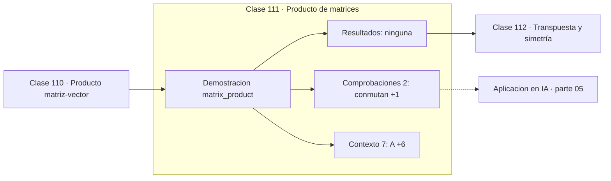

# 111 — Producto de matrices

> [⬅️ 110 Producto matriz-vector](../110-producto-matriz-vector/README.md) · [📚 Parte 05](../README.md) · [🏠 Programa](../../../README.md) · [112 Transpuesta y simetría ➡️](../112-transpuesta-y-simetria/README.md)

**Parte:** 05 — Álgebra lineal I: vectores y matrices · **Nivel:** `intermedio` · **Horas estimadas:** 4
**Motor:** `engines.part05` · **Demostración:** `matrix_product` · **Clase 11 de 20** de la parte

---

## 🎯 Propósito

**El producto matricial compone transformaciones, es asociativo y no conmuta.**

Vectores, normas, producto punto, independencia, span, sistemas lineales, eliminación de Gauss, rango, inversa, determinante y proyección ortogonal.

## ✅ Resultados de aprendizaje

Al terminar podrás:

1. Explicar **Producto de matrices** con lenguaje cotidiano y con notación matemática.
2. Resolver un caso pequeño a mano y anticipar el orden de magnitud del resultado.
3. Ejecutar y modificar `lab.py`, que corre la demostración `matrix_product`.
4. Interpretar las 9 salidas del laboratorio y decir qué comprueba cada una.
5. Detectar el error típico de esta parte: confundir dimensión del espacio con número de vectores.

## 🧩 Fórmulas de la clase

```text
(AB)ᵢⱼ = Σₖ AᵢₖBₖⱼ
(AB)C = A(BC)  pero  AB ≠ BA
(AB)ᵀ = BᵀAᵀ
```

## 🗺️ Ubicación en el programa



## 📖 Fundamentos

El producto matricial no se define elemento a elemento porque no representa una suma:
representa una **composición**. Aplicar B y luego A es aplicar la matriz `AB`, y de esa
definición se deduce la fórmula «filas por columnas», no al revés.

Que sea asociativo pero no conmutativo tiene consecuencias prácticas. La
asociatividad permite elegir el orden de evaluación, y esa elección puede cambiar
radicalmente el coste: calcular `(AB)C` con A de (1000,1000), B de (1000,1) y C de
(1,1000) cuesta muchísimo más que `A(BC)`. Es una optimización real que hacen los
compiladores de grafos de cómputo.

La no conmutatividad es la que hace que el orden de las capas importe, que rotar y luego
escalar difiera de escalar y luego rotar (clase 073), y que las derivadas matriciales
tengan que respetar el orden.

El coste del algoritmo ingenuo es `O(n³)`. Strassen redujo el exponente a 2.807 en 1969,
y el récord teórico actual está por debajo de 2.372, aunque esos algoritmos no son
prácticos por sus constantes. En la práctica, el rendimiento lo determinan la localidad
de caché y el paralelismo, no el exponente asintótico, y esa es la razón de existir de
BLAS y de las unidades tensoriales de las GPU.

## 🧮 Ejemplo trabajado

El producto no conmuta.

```text
A = [[1,2],[3,4]]      B = [[0,1],[1,0]]   (intercambia columnas)

AB = [[2,1],[4,3]]
BA = [[3,4],[1,2]]
¿AB = BA?  No                              ✗

Transpuesta del producto:
  (AB)ᵀ = [[2,4],[1,3]]
  BᵀAᵀ  = [[2,4],[1,3]]                    ✓ con el orden invertido

Coste ingenuo n×n: O(n³)
```

## 🔬 Qué ejecuta el laboratorio

`matrix_product` — AB ≠ BA y el coste cúbico del producto.

| Grupo | Salidas |
|---|---|
| 🔢 Resultados numéricos (0) | — |
| ✅ Comprobaciones de invariante (2) | `conmutan`, `identidad_de_transpuesta` |

Las claves booleanas no son adorno: si alguna fuera `False`, el resultado numérico
no sería fiable aunque el programa terminase sin error.

```bash
python classes/part-05-algebra-lineal-i-vectores-y-matrices/111-producto-de-matrices/lab.py
compmath run 111
```

> [!TIP]
> Antes de ejecutar, **escribe tu predicción**. Un laboratorio que confirma lo que
> esperabas enseña tanto como uno que te contradice, pero solo si la predicción
> existía antes del resultado.

## ⚠️ Errores conceptuales frecuentes

1. Suponer que el producto matricial conmuta.
2. Escribir (AB)ᵀ = AᵀBᵀ sin invertir el orden.
3. Elegir el orden de evaluación sin considerar el coste en cadenas de matrices.

## 🚀 Dónde se usa de verdad

Composición de capas, pipelines de transformación gráfica, optimización del orden de
evaluación en grafos de cómputo y atención multi-cabeza.

## 🤖 Conexión con IA

Cada capa densa es un producto matriz-vector. Los embeddings viven en subespacios y la similitud entre ellos es producto punto normalizado.

## 📓 Notebooks

| Archivo | Para qué |
|---|---|
| [`notebook.ipynb`](notebook.ipynb) | recorrido guiado con la demostración ejecutada |
| [`notebook_student.ipynb`](notebook_student.ipynb) | versión con `TODO` para resolver |
| [`notebook_solution.ipynb`](notebook_solution.ipynb) | solución de referencia verificada |

## 📝 Evaluación

| Criterio | Peso |
|---|---:|
| Comprensión conceptual | 25 % |
| Resolución manual | 25 % |
| Implementación y verificación | 25 % |
| Interpretación y comunicación | 15 % |
| Conexión con aplicación real | 10 % |

Detalle y criterios de error crítico en [`assessment.md`](assessment.md).

## ❓ Preguntas de comprobación

1. ¿Cuál es la entrada, cuál la salida y qué unidades tienen?
2. ¿Qué operación domina el comportamiento del resultado?
3. ¿Qué caso extremo revelaría un error conceptual?
4. ¿Cómo verificarías el resultado por un método independiente?
5. ¿Dónde aparece esto en sistemas de recomendación?

Si necesitas releer el código para responderlas, la clase todavía no está superada.

## 📥 Entregable

`notebook_student.ipynb` resuelto más un párrafo que explique el resultado **sin citar
código**: qué entra, qué sale, qué invariante se comprueba y qué pasaría en un caso límite.

## 🔗 Referencias

- [Golub & Van Loan. *Matrix Computations*, 4ª ed., Johns Hopkins, 2013](https://jhupbooks.press.jhu.edu/title/matrix-computations) — *uso:* obra de referencia consultada en «Producto de matrices».
- [Strassen, V. *Gaussian elimination is not optimal*. Numer. Math., 1969](https://link.springer.com/article/10.1007/BF02165411) — *uso:* artículo de origen consultado en «Producto de matrices».

Bibliografía completa de la parte en [`../../../docs/BIBLIOGRAPHY.md`](../../../docs/BIBLIOGRAPHY.md) · localizador verificable de cada obra en [`sources/bibliography.json`](../../../sources/bibliography.json).

## 📂 Material de la clase

[`intuition.md`](intuition.md) · [`theory.md`](theory.md) · [`derivation.md`](derivation.md) · [`exercises.md`](exercises.md) · [`assessment.md`](assessment.md) · [`where-is-this-used.md`](where-is-this-used.md) · [`lesson.yaml`](lesson.yaml)

---

> [⬅️ 110 Producto matriz-vector](../110-producto-matriz-vector/README.md) · [📚 Parte 05](../README.md) · [🏠 Programa](../../../README.md) · [112 Transpuesta y simetría ➡️](../112-transpuesta-y-simetria/README.md)
