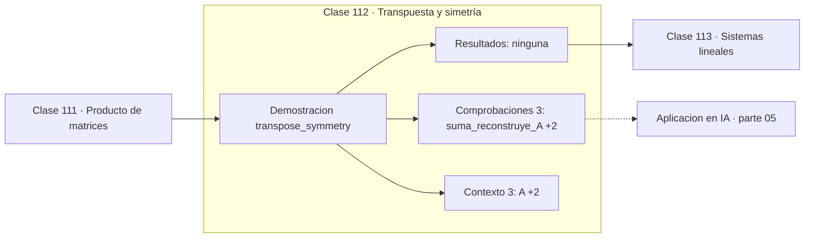

# 112 — Transpuesta y simetría

> [⬅️ 111 Producto de matrices](../111-producto-de-matrices/README.md) · [📚 Parte 05](../README.md) · [🏠 Programa](../../../README.md) · [113 Sistemas lineales ➡️](../113-sistemas-lineales/README.md)

**Parte:** 05 — Álgebra lineal I: vectores y matrices · **Nivel:** `intermedio` · **Horas estimadas:** 4
**Motor:** `engines.part05` · **Demostración:** `transpose_symmetry` · **Clase 12 de 20** de la parte

---

## 🎯 Propósito

**Toda matriz cuadrada se descompone en parte simétrica y antisimétrica, y AᵀA es siempre simétrica.**

Vectores, normas, producto punto, independencia, span, sistemas lineales, eliminación de Gauss, rango, inversa, determinante y proyección ortogonal.

## ✅ Resultados de aprendizaje

Al terminar podrás:

1. Explicar **Transpuesta y simetría** con lenguaje cotidiano y con notación matemática.
2. Resolver un caso pequeño a mano y anticipar el orden de magnitud del resultado.
3. Ejecutar y modificar `lab.py`, que corre la demostración `transpose_symmetry`.
4. Interpretar las 6 salidas del laboratorio y decir qué comprueba cada una.
5. Detectar el error típico de esta parte: aplicar producto punto a vectores de escalas incomparables.

## 🧩 Fórmulas de la clase

```text
A = (A+Aᵀ)/2 + (A−Aᵀ)/2
AᵀA es simétrica y semidefinida positiva
```

## 🗺️ Ubicación en el programa



## 📖 Fundamentos

Una matriz es simétrica si coincide con su transpuesta. Las simétricas tienen
propiedades excepcionales que la parte 06 desarrolla: sus autovalores son **reales**,
sus autovectores son **ortogonales** y siempre son diagonalizables. Nada de eso está
garantizado para una matriz general.

Toda matriz cuadrada se descompone de forma única en una parte simétrica y una
antisimétrica, y esa descomposición es un ejemplo de una idea general: separar un objeto
en componentes con propiedades distintas para tratar cada una por separado. En física,
esa separación distingue deformación de rotación.

El hecho más útil de esta clase es que `AᵀA` es **siempre** simétrica, sea A cuadrada o
no, y además semidefinida positiva. Esa propiedad es la que hace que las ecuaciones
normales de mínimos cuadrados (clase 131) tengan solución, que la matriz de covarianza
(clase 191) sea diagonalizable con autovalores no negativos, y que la SVD exista para
toda matriz (clase 132).

La contrapartida numérica es que `AᵀA` **eleva al cuadrado el número de condición** de A.
Por eso, aunque las ecuaciones normales son correctas en teoría, en la práctica se
prefiere QR o SVD: la clase 234 mide esa diferencia.

## 🧮 Ejemplo trabajado

Descomposición y simetría de AᵀA.

```text
A = [[1,2],[4,5]]

parte simétrica    = (A + Aᵀ)/2 = [[1,3],[3,5]]
parte antisimétrica = (A − Aᵀ)/2 = [[0,−1],[1,0]]
suma = A                                   ✓

simétrica = su transpuesta                 ✓
antisimétrica: diagonal nula, opuestos fuera

AᵀA = [[17,22],[22,29]]
¿es simétrica?  Sí                         ✓
```

## 🔬 Qué ejecuta el laboratorio

`transpose_symmetry` — Toda matriz cuadrada se descompone en parte simétrica y antisimétrica.

| Grupo | Salidas |
|---|---|
| 🔢 Resultados numéricos (0) | — |
| ✅ Comprobaciones de invariante (3) | `suma_reconstruye_A`, `sim_es_simetrica`, `AᵀA_es_simetrica` |

Las claves booleanas no son adorno: si alguna fuera `False`, el resultado numérico
no sería fiable aunque el programa terminase sin error.

```bash
python classes/part-05-algebra-lineal-i-vectores-y-matrices/112-transpuesta-y-simetria/lab.py
compmath run 112
```

> [!TIP]
> Antes de ejecutar, **escribe tu predicción**. Un laboratorio que confirma lo que
> esperabas enseña tanto como uno que te contradice, pero solo si la predicción
> existía antes del resultado.

## ⚠️ Errores conceptuales frecuentes

1. Suponer que una matriz general tiene autovalores reales.
2. Usar las ecuaciones normales con matrices mal condicionadas sin considerar QR.
3. Confundir simétrica (A = Aᵀ) con ortogonal (AᵀA = I).

## 🚀 Dónde se usa de verdad

Matriz de covarianza, ecuaciones normales, Hessiano (siempre simétrico si f es dos
veces derivable con continuidad) y matriz de Gram en métodos kernel.

## 🤖 Conexión con IA

Cada capa densa es un producto matriz-vector. Los embeddings viven en subespacios y la similitud entre ellos es producto punto normalizado.

## 📓 Notebooks

| Archivo | Para qué |
|---|---|
| [`notebook.ipynb`](notebook.ipynb) | recorrido guiado con la demostración ejecutada |
| [`notebook_student.ipynb`](notebook_student.ipynb) | versión con `TODO` para resolver |
| [`notebook_solution.ipynb`](notebook_solution.ipynb) | solución de referencia verificada |

## 📝 Evaluación

| Criterio | Peso |
|---|---:|
| Comprensión conceptual | 25 % |
| Resolución manual | 25 % |
| Implementación y verificación | 25 % |
| Interpretación y comunicación | 15 % |
| Conexión con aplicación real | 10 % |

Detalle y criterios de error crítico en [`assessment.md`](assessment.md).

## ❓ Preguntas de comprobación

1. ¿Cuál es la entrada, cuál la salida y qué unidades tienen?
2. ¿Qué operación domina el comportamiento del resultado?
3. ¿Qué caso extremo revelaría un error conceptual?
4. ¿Cómo verificarías el resultado por un método independiente?
5. ¿Dónde aparece esto en sistemas de recomendación?

Si necesitas releer el código para responderlas, la clase todavía no está superada.

## 📥 Entregable

`notebook_student.ipynb` resuelto más un párrafo que explique el resultado **sin citar
código**: qué entra, qué sale, qué invariante se comprueba y qué pasaría en un caso límite.

## 📚 Bibliografía de la clase

Esta clase enseña **Álgebra lineal**. Cada obra dice qué aporta aquí y cómo se comprobó su localizador:

- [Trefethen & Bau. *Numerical Linear Algebra*, SIAM, 1997](https://epubs.siam.org/doi/book/10.1137/1.9780898719574) — Álgebra lineal: el tema de esta clase · ISBN-13 `9780898719574` verificado en International ISBN Agency (2026-08-19).
- [Strang, G. *Introduction to Linear Algebra*, 6ª ed., 2023, cap. 6](https://math.mit.edu/~gs/linearalgebra/) — Álgebra lineal: el tema de esta clase · ISBN-13 `9781733146678` verificado en International ISBN Agency (2026-08-19).

Bibliografía de todas las clases, con el porqué de cada obra, en [`docs/BIBLIOGRAPHY.md`](../../../docs/BIBLIOGRAPHY.md) · localizador y estado de cada obra en [`sources/bibliography.json`](../../../sources/bibliography.json).

## 📂 Material de la clase

[`intuition.md`](intuition.md) · [`theory.md`](theory.md) · [`derivation.md`](derivation.md) · [`exercises.md`](exercises.md) · [`assessment.md`](assessment.md) · [`where-is-this-used.md`](where-is-this-used.md) · [`lesson.yaml`](lesson.yaml)

---

> [⬅️ 111 Producto de matrices](../111-producto-de-matrices/README.md) · [📚 Parte 05](../README.md) · [🏠 Programa](../../../README.md) · [113 Sistemas lineales ➡️](../113-sistemas-lineales/README.md)
