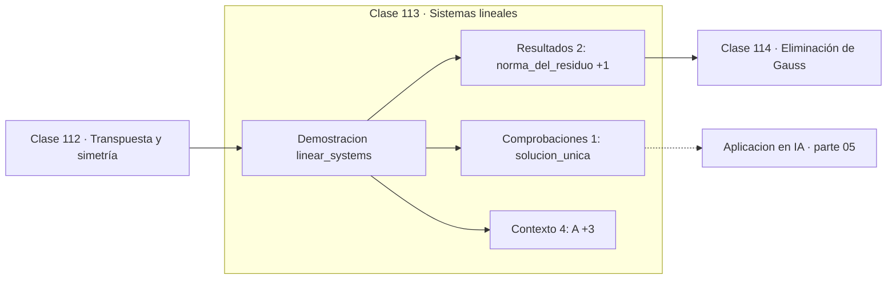

# 113 — Sistemas lineales

> [⬅️ 112 Transpuesta y simetría](../112-transpuesta-y-simetria/README.md) · [📚 Parte 05](../README.md) · [🏠 Programa](../../../README.md) · [114 Eliminación de Gauss ➡️](../114-eliminacion-de-gauss/README.md)

**Parte:** 05 — Álgebra lineal I: vectores y matrices · **Nivel:** `intermedio` · **Horas estimadas:** 4
**Motor:** `engines.part05` · **Demostración:** `linear_systems` · **Clase 13 de 20** de la parte

---

## 🎯 Propósito

**Un sistema lineal tiene solución única si el determinante no es nulo; el residuo es el criterio de aceptación.**

Vectores, normas, producto punto, independencia, span, sistemas lineales, eliminación de Gauss, rango, inversa, determinante y proyección ortogonal.

## ✅ Resultados de aprendizaje

Al terminar podrás:

1. Explicar **Sistemas lineales** con lenguaje cotidiano y con notación matemática.
2. Resolver un caso pequeño a mano y anticipar el orden de magnitud del resultado.
3. Ejecutar y modificar `lab.py`, que corre la demostración `linear_systems`.
4. Interpretar las 7 salidas del laboratorio y decir qué comprueba cada una.
5. Detectar el error típico de esta parte: invertir una matriz mal condicionada en lugar de factorizar.

## 🧩 Fórmulas de la clase

```text
Ax = b
residuo r = Ax − b, debe ser ≈ 0
solución única ⟺ det(A) ≠ 0 ⟺ rango(A) = n
```

## 🗺️ Ubicación en el programa



## 📖 Fundamentos

Resolver `Ax = b` es el problema computacional más frecuente del álgebra lineal, y sus
tres desenlaces posibles —solución única, ninguna o infinitas— se distinguen por el
rango. Con determinante no nulo, la matriz es invertible y la solución es única; con
determinante nulo, hay que comparar el rango de A con el de la matriz ampliada para
distinguir los otros dos casos.

El **residuo** `r = Ax − b` es el criterio de aceptación universal. Un solver puede
devolver un vector sin lanzar ninguna excepción y estar equivocado; calcular el residuo
cuesta una multiplicación matriz-vector y detecta el problema. La regla del programa es
que ningún resultado de un solver se acepta sin comprobar su residuo.

Un residuo pequeño no garantiza que la solución sea precisa: en un sistema mal
condicionado, un residuo minúsculo puede corresponder a una solución muy alejada de la
correcta. La relación entre ambos la da el número de condición (clase 035), y esa es la
razón por la que el residuo es necesario pero no suficiente.

Geométricamente, cada ecuación de un sistema 3×3 es un plano, y la solución es su punto
de intersección. Sin solución significa que no hay punto común; infinitas soluciones,
que los planos se cortan en una recta o coinciden.

## 🧮 Ejemplo trabajado

Sistema 3×3 con solución única.

```text
A = [[ 2,  1, −1],      b = ( 8,
     [−3, −1,  2],           −11,
     [−2,  1,  2]]            −3)

det(A) = −1 ≠ 0  →  solución única

x = (2, 3, −1)

Residuo: Ax − b = (0, 0, 0)     ✓
‖r‖ = 0.0

Verificación por ecuación:
  2·2 + 1·3 − 1·(−1) = 8        ✓
```

## 🔬 Qué ejecuta el laboratorio

`linear_systems` — Sistema 3x3: solución, residuo y unicidad.

| Grupo | Salidas |
|---|---|
| 🔢 Resultados numéricos (2) | `norma_del_residuo`, `determinante` |
| ✅ Comprobaciones de invariante (1) | `solucion_unica` |

Las claves booleanas no son adorno: si alguna fuera `False`, el resultado numérico
no sería fiable aunque el programa terminase sin error.

```bash
python classes/part-05-algebra-lineal-i-vectores-y-matrices/113-sistemas-lineales/lab.py
compmath run 113
```

> [!TIP]
> Antes de ejecutar, **escribe tu predicción**. Un laboratorio que confirma lo que
> esperabas enseña tanto como uno que te contradice, pero solo si la predicción
> existía antes del resultado.

## ⚠️ Errores conceptuales frecuentes

1. Aceptar la salida de un solver sin calcular el residuo.
2. Suponer que un residuo pequeño implica una solución precisa en un sistema mal condicionado.
3. No distinguir entre sistema incompatible e indeterminado cuando el determinante es cero.

## 🚀 Dónde se usa de verdad

Ajuste de modelos lineales, equilibrio en circuitos y estructuras, interpolación,
balance de reacciones y cualquier problema con restricciones lineales.

## 🤖 Conexión con IA

Cada capa densa es un producto matriz-vector. Los embeddings viven en subespacios y la similitud entre ellos es producto punto normalizado.

## 📓 Notebooks

| Archivo | Para qué |
|---|---|
| [`notebook.ipynb`](notebook.ipynb) | recorrido guiado con la demostración ejecutada |
| [`notebook_student.ipynb`](notebook_student.ipynb) | versión con `TODO` para resolver |
| [`notebook_solution.ipynb`](notebook_solution.ipynb) | solución de referencia verificada |

## 📝 Evaluación

| Criterio | Peso |
|---|---:|
| Comprensión conceptual | 25 % |
| Resolución manual | 25 % |
| Implementación y verificación | 25 % |
| Interpretación y comunicación | 15 % |
| Conexión con aplicación real | 10 % |

Detalle y criterios de error crítico en [`assessment.md`](assessment.md).

## ❓ Preguntas de comprobación

1. ¿Cuál es la entrada, cuál la salida y qué unidades tienen?
2. ¿Qué operación domina el comportamiento del resultado?
3. ¿Qué caso extremo revelaría un error conceptual?
4. ¿Cómo verificarías el resultado por un método independiente?
5. ¿Dónde aparece esto en sistemas de recomendación?

Si necesitas releer el código para responderlas, la clase todavía no está superada.

## 📥 Entregable

`notebook_student.ipynb` resuelto más un párrafo que explique el resultado **sin citar
código**: qué entra, qué sale, qué invariante se comprueba y qué pasaría en un caso límite.

## 📚 Bibliografía de la clase

Esta clase enseña **Álgebra lineal**. Cada obra dice qué aporta aquí y cómo se comprobó su localizador:

- [Trefethen & Bau. *Numerical Linear Algebra*, SIAM, 1997](https://epubs.siam.org/doi/book/10.1137/1.9780898719574) — Álgebra lineal: el tema de esta clase · ISBN-13 `9780898719574` verificado en International ISBN Agency (2026-08-19).
- [Strang, G. *Introduction to Linear Algebra*, 6ª ed., 2023, cap. 2](https://math.mit.edu/~gs/linearalgebra/) — Álgebra lineal: el tema de esta clase · ISBN-13 `9781733146678` verificado en International ISBN Agency (2026-08-19).

Bibliografía de todas las clases, con el porqué de cada obra, en [`docs/BIBLIOGRAPHY.md`](../../../docs/BIBLIOGRAPHY.md) · localizador y estado de cada obra en [`sources/bibliography.json`](../../../sources/bibliography.json).

## 📂 Material de la clase

[`intuition.md`](intuition.md) · [`theory.md`](theory.md) · [`derivation.md`](derivation.md) · [`exercises.md`](exercises.md) · [`assessment.md`](assessment.md) · [`where-is-this-used.md`](where-is-this-used.md) · [`lesson.yaml`](lesson.yaml)

---

> [⬅️ 112 Transpuesta y simetría](../112-transpuesta-y-simetria/README.md) · [📚 Parte 05](../README.md) · [🏠 Programa](../../../README.md) · [114 Eliminación de Gauss ➡️](../114-eliminacion-de-gauss/README.md)
