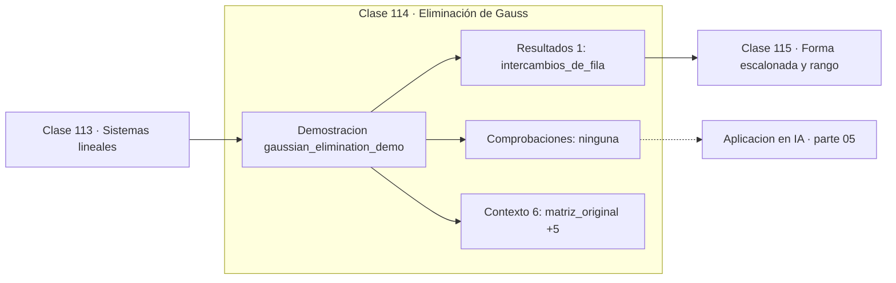

# 114 — Eliminación de Gauss

> [⬅️ 113 Sistemas lineales](../113-sistemas-lineales/README.md) · [📚 Parte 05](../README.md) · [🏠 Programa](../../../README.md) · [115 Forma escalonada y rango ➡️](../115-forma-escalonada-y-rango/README.md)

**Parte:** 05 — Álgebra lineal I: vectores y matrices · **Nivel:** `intermedio` · **Horas estimadas:** 4
**Motor:** `engines.part05` · **Demostración:** `gaussian_elimination_demo` · **Clase 14 de 20** de la parte

---

## 🎯 Propósito

**El pivoteo parcial evita dividir por pivotes casi nulos y hace estable la eliminación.**

Vectores, normas, producto punto, independencia, span, sistemas lineales, eliminación de Gauss, rango, inversa, determinante y proyección ortogonal.

## ✅ Resultados de aprendizaje

Al terminar podrás:

1. Explicar **Eliminación de Gauss** con lenguaje cotidiano y con notación matemática.
2. Resolver un caso pequeño a mano y anticipar el orden de magnitud del resultado.
3. Ejecutar y modificar `lab.py`, que corre la demostración `gaussian_elimination_demo`.
4. Interpretar las 7 salidas del laboratorio y decir qué comprueba cada una.
5. Detectar el error típico de esta parte: confundir dimensión del espacio con número de vectores.

## 🧩 Fórmulas de la clase

```text
coste: ~2n³/3 operaciones
pivote = fila con el mayor |Aᵢⱼ| en la columna actual
```

## 🗺️ Ubicación en el programa



## 📖 Fundamentos

La eliminación de Gauss transforma el sistema en uno triangular mediante operaciones que
no cambian el conjunto solución: intercambiar filas, escalarlas y restarles múltiplos de
otras. Una vez triangular, la sustitución hacia atrás resuelve en `O(n²)`.

El **pivoteo parcial** no es un refinamiento opcional: es lo que hace el método
utilizable. Sin él, un pivote muy pequeño produce factores enormes que amplifican los
errores de redondeo y pueden destruir por completo la precisión. Con pivoteo, se elige
en cada columna la fila con el mayor valor absoluto, garantizando que los factores estén
acotados por 1.

El ejemplo clásico es un sistema de 2×2 con pivote 10⁻²⁰: sin pivoteo la solución
calculada es completamente errónea; con pivoteo es correcta. La diferencia no está en la
matemática —ambas eliminaciones son válidas en ℝ— sino en la aritmética finita.

El coste, `~2n³/3` operaciones, es el mismo que el de la factorización LU, y no es
casualidad: la eliminación de Gauss **es** la factorización LU, expresada de otra forma.
La ventaja de guardarla como LU (clase 129) es poder resolver muchos sistemas con la
misma matriz pagando `O(n²)` cada uno en lugar de `O(n³)`.

## 🧮 Ejemplo trabajado

Eliminación con pivoteo sobre un sistema 3×3.

```text
Matriz original:
  [ 2  1 −1 |   8]
  [−3 −1  2 | −11]
  [−2  1  2 |  −3]

Pivoteo: la mayor |entrada| de la columna 1 es −3 → intercambiar filas
Intercambios realizados: 2

Triangular superior resultante:
  [−3 −1.000  2.000]
  [ 0  1.667  0.667]
  [ 0  0      0.200]

Sustitución hacia atrás → x = (2, 3, −1)
Verificación: Ax = (8, −11, −3) = b     ✓

Coste: O(n³/3) ≈ 9 operaciones para n=3
```

## 🔬 Qué ejecuta el laboratorio

`gaussian_elimination_demo` — Eliminación de Gauss con pivoteo parcial, paso a paso.

| Grupo | Salidas |
|---|---|
| 🔢 Resultados numéricos (1) | `intercambios_de_fila` |
| ✅ Comprobaciones de invariante (0) | — |

Las claves booleanas no son adorno: si alguna fuera `False`, el resultado numérico
no sería fiable aunque el programa terminase sin error.

```bash
python classes/part-05-algebra-lineal-i-vectores-y-matrices/114-eliminacion-de-gauss/lab.py
compmath run 114
```

> [!TIP]
> Antes de ejecutar, **escribe tu predicción**. Un laboratorio que confirma lo que
> esperabas enseña tanto como uno que te contradice, pero solo si la predicción
> existía antes del resultado.

## ⚠️ Errores conceptuales frecuentes

1. Implementar la eliminación sin pivoteo y sorprenderse con resultados erróneos.
2. Elegir el pivote por su valor y no por su valor absoluto.
3. Olvidar aplicar los intercambios de fila también al vector b.

## 🚀 Dónde se usa de verdad

Es el algoritmo que hay dentro de cualquier `solve` de biblioteca. Resolver circuitos,
estructuras, sistemas de equilibrio y ajustes lineales.

## 🤖 Conexión con IA

Cada capa densa es un producto matriz-vector. Los embeddings viven en subespacios y la similitud entre ellos es producto punto normalizado.

## 📓 Notebooks

| Archivo | Para qué |
|---|---|
| [`notebook.ipynb`](notebook.ipynb) | recorrido guiado con la demostración ejecutada |
| [`notebook_student.ipynb`](notebook_student.ipynb) | versión con `TODO` para resolver |
| [`notebook_solution.ipynb`](notebook_solution.ipynb) | solución de referencia verificada |

## 📝 Evaluación

| Criterio | Peso |
|---|---:|
| Comprensión conceptual | 25 % |
| Resolución manual | 25 % |
| Implementación y verificación | 25 % |
| Interpretación y comunicación | 15 % |
| Conexión con aplicación real | 10 % |

Detalle y criterios de error crítico en [`assessment.md`](assessment.md).

## ❓ Preguntas de comprobación

1. ¿Cuál es la entrada, cuál la salida y qué unidades tienen?
2. ¿Qué operación domina el comportamiento del resultado?
3. ¿Qué caso extremo revelaría un error conceptual?
4. ¿Cómo verificarías el resultado por un método independiente?
5. ¿Dónde aparece esto en sistemas de recomendación?

Si necesitas releer el código para responderlas, la clase todavía no está superada.

## 📥 Entregable

`notebook_student.ipynb` resuelto más un párrafo que explique el resultado **sin citar
código**: qué entra, qué sale, qué invariante se comprueba y qué pasaría en un caso límite.

## 📚 Bibliografía de la clase

Esta clase enseña **Álgebra lineal**. Cada obra dice qué aporta aquí y cómo se comprobó su localizador:

- [Trefethen & Bau. *Numerical Linear Algebra*, SIAM, 1997, lecc. 20-22](https://epubs.siam.org/doi/book/10.1137/1.9780898719574) — Álgebra lineal: el tema de esta clase · ISBN-13 `9780898719574` verificado en International ISBN Agency (2026-08-19).
- [Higham, N. J. *Accuracy and Stability of Numerical Algorithms*, 2ª ed., SIAM, 2002](https://epubs.siam.org/doi/book/10.1137/1.9780898718027) — Álgebra lineal numérica y Aritmética de máquina y Métodos numéricos: conexión declarada de esta parte · ISBN-13 `9780898718027`, pendiente de resolver.

Bibliografía de todas las clases, con el porqué de cada obra, en [`docs/BIBLIOGRAPHY.md`](../../../docs/BIBLIOGRAPHY.md) · localizador y estado de cada obra en [`sources/bibliography.json`](../../../sources/bibliography.json).

## 📂 Material de la clase

[`intuition.md`](intuition.md) · [`theory.md`](theory.md) · [`derivation.md`](derivation.md) · [`exercises.md`](exercises.md) · [`assessment.md`](assessment.md) · [`where-is-this-used.md`](where-is-this-used.md) · [`lesson.yaml`](lesson.yaml)

---

> [⬅️ 113 Sistemas lineales](../113-sistemas-lineales/README.md) · [📚 Parte 05](../README.md) · [🏠 Programa](../../../README.md) · [115 Forma escalonada y rango ➡️](../115-forma-escalonada-y-rango/README.md)
