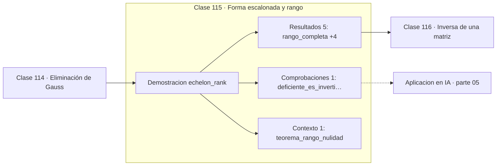

# 115 — Forma escalonada y rango

> [⬅️ 114 Eliminación de Gauss](../114-eliminacion-de-gauss/README.md) · [📚 Parte 05](../README.md) · [🏠 Programa](../../../README.md) · [116 Inversa de una matriz ➡️](../116-inversa-de-una-matriz/README.md)

**Parte:** 05 — Álgebra lineal I: vectores y matrices · **Nivel:** `intermedio` · **Horas estimadas:** 4
**Motor:** `engines.part05` · **Demostración:** `echelon_rank` · **Clase 15 de 20** de la parte

---

## 🎯 Propósito

**El rango es la dimensión efectiva de la salida; rango más nulidad es siempre el número de columnas.**

Vectores, normas, producto punto, independencia, span, sistemas lineales, eliminación de Gauss, rango, inversa, determinante y proyección ortogonal.

## ✅ Resultados de aprendizaje

Al terminar podrás:

1. Explicar **Forma escalonada y rango** con lenguaje cotidiano y con notación matemática.
2. Resolver un caso pequeño a mano y anticipar el orden de magnitud del resultado.
3. Ejecutar y modificar `lab.py`, que corre la demostración `echelon_rank`.
4. Interpretar las 7 salidas del laboratorio y decir qué comprueba cada una.
5. Detectar el error típico de esta parte: aplicar producto punto a vectores de escalas incomparables.

## 🧩 Fórmulas de la clase

```text
rango(A) ≤ mín(m, n)
rango + nulidad = número de columnas
```

## 🗺️ Ubicación en el programa



## 📖 Fundamentos

El rango de una matriz es la dimensión de su espacio columna, es decir, cuántas
direcciones independientes puede alcanzar la transformación. Es el número que realmente
describe una matriz, mucho más que su tamaño: una matriz 1000×1000 de rango 3 contiene
tanta información como una de 3×3.

El **teorema del rango-nulidad** —rango más nulidad igual al número de columnas— dice que
lo que no llega a la imagen se pierde en el núcleo. Si una transformación de ℝ⁵ en ℝ⁵
tiene rango 3, hay un subespacio de dimensión 2 que colapsa al cero: dos direcciones de
información desaparecen sin posibilidad de recuperación.

Numéricamente, el rango es delicado. Una matriz puede ser de rango completo en
aritmética exacta y comportarse como deficiente en punto flotante si sus valores
singulares más pequeños están cerca del ruido. Por eso el **rango numérico** se define
con una tolerancia —cuántos valores singulares superan un umbral— y se calcula con SVD,
no con eliminación.

En machine learning el rango bajo es a la vez un problema y una herramienta. Es un
problema cuando indica features redundantes; es una herramienta cuando se impone a
propósito para comprimir, como en LoRA, que adapta un modelo grande añadiendo matrices
de rango muy bajo.

## 🧮 Ejemplo trabajado

Rango de tres matrices.

```text
A = [[1,2],[3,4]]      rango 2 (completo)     det = −2 ≠ 0
B = [[1,2],[2,4]]      rango 1 (deficiente)   det = 0
C = [[1,2,3],[4,5,6]]  rango 2                máximo posible: mín(2,3) = 2

Teorema del rango-nulidad para B:
  columnas = 2,  rango = 1  →  nulidad = 1
  el núcleo es la recta generada por (2,−1)
  B·(2,−1) = (0,0)                            ✓
```

## 🔬 Qué ejecuta el laboratorio

`echelon_rank` — Rango: la dimensión efectiva de la transformación.

| Grupo | Salidas |
|---|---|
| 🔢 Resultados numéricos (5) | `rango_completa`, `rango_deficiente`, `rango_rectangular_2x3`, `rango_maximo_posible`, `nulidad_de_la_deficiente` |
| ✅ Comprobaciones de invariante (1) | `deficiente_es_invertible` |

Las claves booleanas no son adorno: si alguna fuera `False`, el resultado numérico
no sería fiable aunque el programa terminase sin error.

```bash
python classes/part-05-algebra-lineal-i-vectores-y-matrices/115-forma-escalonada-y-rango/lab.py
compmath run 115
```

> [!TIP]
> Antes de ejecutar, **escribe tu predicción**. Un laboratorio que confirma lo que
> esperabas enseña tanto como uno que te contradice, pero solo si la predicción
> existía antes del resultado.

## ⚠️ Errores conceptuales frecuentes

1. Calcular el rango con eliminación en datos ruidosos en lugar de con SVD y tolerancia.
2. Suponer que una matriz grande tiene rango alto.
3. Olvidar que el rango está acotado por el menor de los dos tamaños.

## 🚀 Dónde se usa de verdad

Detección de redundancia en features, compresión de bajo rango, LoRA, diagnóstico de
sistemas indeterminados y análisis de capacidad de una capa.

## 🤖 Conexión con IA

Cada capa densa es un producto matriz-vector. Los embeddings viven en subespacios y la similitud entre ellos es producto punto normalizado.

## 📓 Notebooks

| Archivo | Para qué |
|---|---|
| [`notebook.ipynb`](notebook.ipynb) | recorrido guiado con la demostración ejecutada |
| [`notebook_student.ipynb`](notebook_student.ipynb) | versión con `TODO` para resolver |
| [`notebook_solution.ipynb`](notebook_solution.ipynb) | solución de referencia verificada |

## 📝 Evaluación

| Criterio | Peso |
|---|---:|
| Comprensión conceptual | 25 % |
| Resolución manual | 25 % |
| Implementación y verificación | 25 % |
| Interpretación y comunicación | 15 % |
| Conexión con aplicación real | 10 % |

Detalle y criterios de error crítico en [`assessment.md`](assessment.md).

## ❓ Preguntas de comprobación

1. ¿Cuál es la entrada, cuál la salida y qué unidades tienen?
2. ¿Qué operación domina el comportamiento del resultado?
3. ¿Qué caso extremo revelaría un error conceptual?
4. ¿Cómo verificarías el resultado por un método independiente?
5. ¿Dónde aparece esto en sistemas de recomendación?

Si necesitas releer el código para responderlas, la clase todavía no está superada.

## 📥 Entregable

`notebook_student.ipynb` resuelto más un párrafo que explique el resultado **sin citar
código**: qué entra, qué sale, qué invariante se comprueba y qué pasaría en un caso límite.

## 🔗 Referencias

- [Strang, G. *Introduction to Linear Algebra*, 6ª ed., 2023, cap. 3](https://math.mit.edu/~gs/linearalgebra/) — *uso:* exposición alternativa del tema en «Forma escalonada y rango».
- [Hu, E. et al. *LoRA: Low-Rank Adaptation of Large Language Models*. ICLR, 2022](https://arxiv.org/abs/2106.09685) — *uso:* artículo de origen consultado en «Forma escalonada y rango».

Bibliografía completa de la parte en [`../../../docs/BIBLIOGRAPHY.md`](../../../docs/BIBLIOGRAPHY.md) · localizador verificable de cada obra en [`sources/bibliography.json`](../../../sources/bibliography.json).

## 📂 Material de la clase

[`intuition.md`](intuition.md) · [`theory.md`](theory.md) · [`derivation.md`](derivation.md) · [`exercises.md`](exercises.md) · [`assessment.md`](assessment.md) · [`where-is-this-used.md`](where-is-this-used.md) · [`lesson.yaml`](lesson.yaml)

---

> [⬅️ 114 Eliminación de Gauss](../114-eliminacion-de-gauss/README.md) · [📚 Parte 05](../README.md) · [🏠 Programa](../../../README.md) · [116 Inversa de una matriz ➡️](../116-inversa-de-una-matriz/README.md)
