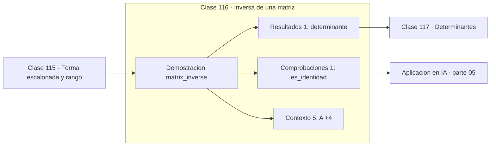

# 116 — Inversa de una matriz

> [⬅️ 115 Forma escalonada y rango](../115-forma-escalonada-y-rango/README.md) · [📚 Parte 05](../README.md) · [🏠 Programa](../../../README.md) · [117 Determinantes ➡️](../117-determinantes/README.md)

**Parte:** 05 — Álgebra lineal I: vectores y matrices · **Nivel:** `intermedio` · **Horas estimadas:** 4
**Motor:** `engines.part05` · **Demostración:** `matrix_inverse` · **Clase 16 de 20** de la parte

---

## 🎯 Propósito

**La inversa existe si el determinante no es nulo, pero resolver un sistema casi nunca debe pasar por ella.**

Vectores, normas, producto punto, independencia, span, sistemas lineales, eliminación de Gauss, rango, inversa, determinante y proyección ortogonal.

## ✅ Resultados de aprendizaje

Al terminar podrás:

1. Explicar **Inversa de una matriz** con lenguaje cotidiano y con notación matemática.
2. Resolver un caso pequeño a mano y anticipar el orden de magnitud del resultado.
3. Ejecutar y modificar `lab.py`, que corre la demostración `matrix_inverse`.
4. Interpretar las 7 salidas del laboratorio y decir qué comprueba cada una.
5. Detectar el error típico de esta parte: invertir una matriz mal condicionada en lugar de factorizar.

## 🧩 Fórmulas de la clase

```text
A·A⁻¹ = I
2×2: A⁻¹ = (1/det)·[[d,−b],[−c,a]]
resolver Ax = b: usar factorización, no A⁻¹b
```

## 🗺️ Ubicación en el programa



## 📖 Fundamentos

La inversa de una matriz es la que deshace su transformación. Existe si y solo si la
matriz es cuadrada y de rango completo, condición equivalente a que su determinante sea
no nulo. Para 2×2 hay fórmula cerrada; para tamaños mayores se calcula con eliminación
de Gauss-Jordan.

El mensaje práctico de esta clase es una recomendación explícita: **no calcules la
inversa para resolver un sistema**. `A⁻¹b` cuesta unas tres veces más que resolver
directamente y es numéricamente peor, porque acumula error en cada entrada de la inversa
antes de multiplicar. Ninguna biblioteca seria lo hace, y ver `inv(A) @ b` en código es
señal de que quien lo escribió no conoce esta distinción.

Hay casos legítimos para calcular la inversa: cuando se necesita explícitamente, como en
la matriz de covarianza inversa (matriz de precisión) de un modelo gaussiano, o al
analizar la sensibilidad de un sistema. Incluso ahí, si la matriz está mal condicionada,
conviene usar la pseudoinversa vía SVD (clase 134).

La comprobación de que la inversa se calculó bien es directa: `A·A⁻¹` debe dar la
identidad dentro de una tolerancia. Que no dé exactamente la identidad es esperado, y la
magnitud de la desviación informa sobre el condicionamiento del problema.

## 🧮 Ejemplo trabajado

Inversa de una matriz 2×2 y su verificación.

```text
A = [[4,7],[2,6]]
det = 4·6 − 7·2 = 10 ≠ 0  →  invertible

A⁻¹ = (1/10)·[[6,−7],[−2,4]] = [[0.6,−0.7],[−0.2,0.4]]

A·A⁻¹ = [[1,0],[0,1]]                    ✓ identidad

Coste comparado para resolver Ax = b:
  vía inversa:      ~n³ + n²  operaciones y peor precisión
  vía factorización: ~n³/3    operaciones
```

## 🔬 Qué ejecuta el laboratorio

`matrix_inverse` — La inversa existe, pero rara vez conviene calcularla.

| Grupo | Salidas |
|---|---|
| 🔢 Resultados numéricos (1) | `determinante` |
| ✅ Comprobaciones de invariante (1) | `es_identidad` |

Las claves booleanas no son adorno: si alguna fuera `False`, el resultado numérico
no sería fiable aunque el programa terminase sin error.

```bash
python classes/part-05-algebra-lineal-i-vectores-y-matrices/116-inversa-de-una-matriz/lab.py
compmath run 116
```

> [!TIP]
> Antes de ejecutar, **escribe tu predicción**. Un laboratorio que confirma lo que
> esperabas enseña tanto como uno que te contradice, pero solo si la predicción
> existía antes del resultado.

## ⚠️ Errores conceptuales frecuentes

1. Escribir inv(A) @ b en lugar de solve(A, b).
2. Invertir una matriz mal condicionada sin usar la pseudoinversa.
3. Suponer que A·A⁻¹ da exactamente la identidad en punto flotante.

## 🚀 Dónde se usa de verdad

Matriz de precisión en modelos gaussianos, análisis de sensibilidad y transformaciones
inversas en gráficos. Para resolver sistemas, siempre factorización.

## 🤖 Conexión con IA

Cada capa densa es un producto matriz-vector. Los embeddings viven en subespacios y la similitud entre ellos es producto punto normalizado.

## 📓 Notebooks

| Archivo | Para qué |
|---|---|
| [`notebook.ipynb`](notebook.ipynb) | recorrido guiado con la demostración ejecutada |
| [`notebook_student.ipynb`](notebook_student.ipynb) | versión con `TODO` para resolver |
| [`notebook_solution.ipynb`](notebook_solution.ipynb) | solución de referencia verificada |

## 📝 Evaluación

| Criterio | Peso |
|---|---:|
| Comprensión conceptual | 25 % |
| Resolución manual | 25 % |
| Implementación y verificación | 25 % |
| Interpretación y comunicación | 15 % |
| Conexión con aplicación real | 10 % |

Detalle y criterios de error crítico en [`assessment.md`](assessment.md).

## ❓ Preguntas de comprobación

1. ¿Cuál es la entrada, cuál la salida y qué unidades tienen?
2. ¿Qué operación domina el comportamiento del resultado?
3. ¿Qué caso extremo revelaría un error conceptual?
4. ¿Cómo verificarías el resultado por un método independiente?
5. ¿Dónde aparece esto en sistemas de recomendación?

Si necesitas releer el código para responderlas, la clase todavía no está superada.

## 📥 Entregable

`notebook_student.ipynb` resuelto más un párrafo que explique el resultado **sin citar
código**: qué entra, qué sale, qué invariante se comprueba y qué pasaría en un caso límite.

## 🔗 Referencias

- [Higham, N. J. *Accuracy and Stability of Numerical Algorithms*, 2ª ed., SIAM, 2002](https://epubs.siam.org/doi/book/10.1137/1.9780898718027) — *uso:* desarrollo formal del tema en «Inversa de una matriz».
- [NumPy: por qué usar `solve` en lugar de `inv`](https://numpy.org/doc/stable/reference/generated/numpy.linalg.solve.html) — *uso:* documentación de la herramienta que ejecuta el laboratorio en «Inversa de una matriz».

Bibliografía completa de la parte en [`../../../docs/BIBLIOGRAPHY.md`](../../../docs/BIBLIOGRAPHY.md) · localizador verificable de cada obra en [`sources/bibliography.json`](../../../sources/bibliography.json).

## 📂 Material de la clase

[`intuition.md`](intuition.md) · [`theory.md`](theory.md) · [`derivation.md`](derivation.md) · [`exercises.md`](exercises.md) · [`assessment.md`](assessment.md) · [`where-is-this-used.md`](where-is-this-used.md) · [`lesson.yaml`](lesson.yaml)

---

> [⬅️ 115 Forma escalonada y rango](../115-forma-escalonada-y-rango/README.md) · [📚 Parte 05](../README.md) · [🏠 Programa](../../../README.md) · [117 Determinantes ➡️](../117-determinantes/README.md)
