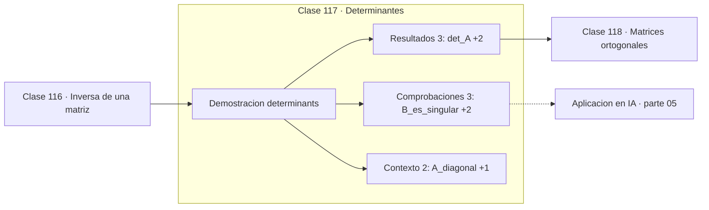

# 117 — Determinantes

> [⬅️ 116 Inversa de una matriz](../116-inversa-de-una-matriz/README.md) · [📚 Parte 05](../README.md) · [🏠 Programa](../../../README.md) · [118 Matrices ortogonales ➡️](../118-matrices-ortogonales/README.md)

**Parte:** 05 — Álgebra lineal I: vectores y matrices · **Nivel:** `intermedio` · **Horas estimadas:** 4
**Motor:** `engines.part05` · **Demostración:** `determinants` · **Clase 17 de 20** de la parte

---

## 🎯 Propósito

**El determinante mide cuánto escala el volumen la transformación; cero significa que la aplasta.**

Vectores, normas, producto punto, independencia, span, sistemas lineales, eliminación de Gauss, rango, inversa, determinante y proyección ortogonal.

## ✅ Resultados de aprendizaje

Al terminar podrás:

1. Explicar **Determinantes** con lenguaje cotidiano y con notación matemática.
2. Resolver un caso pequeño a mano y anticipar el orden de magnitud del resultado.
3. Ejecutar y modificar `lab.py`, que corre la demostración `determinants`.
4. Interpretar las 8 salidas del laboratorio y decir qué comprueba cada una.
5. Detectar el error típico de esta parte: confundir dimensión del espacio con número de vectores.

## 🧩 Fórmulas de la clase

```text
det(AB) = det(A)·det(B)
det(A) = 0 ⟺ A es singular
|det| = factor de escalado del volumen
```

## 🗺️ Ubicación en el programa



## 📖 Fundamentos

El determinante tiene una definición algebraica engorrosa y una interpretación
geométrica limpia: es el factor —con signo— por el que la transformación multiplica el
volumen. En 2D es el área del paralelogramo de las columnas; en 3D, el volumen del
paralelepípedo; en n dimensiones, el volumen n-dimensional.

Desde esa lectura, las propiedades se vuelven evidentes. `det(AB) = det(A)det(B)` porque
aplicar dos transformaciones escala el volumen por el producto de sus factores. Un
determinante nulo significa que la transformación aplasta el espacio en una dimensión
menor, y por eso no es invertible: no se puede recuperar volumen de algo aplastado. Un
determinante negativo indica inversión de orientación.

Computacionalmente, el determinante **no** es un buen indicador de singularidad. Escalar
una matriz por 0.1 divide su determinante por 10ⁿ, así que un determinante minúsculo
puede corresponder a una matriz perfectamente bien condicionada. El indicador correcto
es el número de condición, cociente entre el mayor y el menor valor singular (clase 132).

Donde el determinante sí es imprescindible es en el **cambio de variable**: al
transformar una densidad de probabilidad, el jacobiano corrige el factor de volumen. Sin
esa corrección, la densidad transformada no integraría a 1. Esa es la base de los
normalizing flows.

## 🧮 Ejemplo trabajado

Determinante de tres transformaciones.

```text
A = [[2,0],[0,3]]   diagonal
  det = 6  →  escala las áreas por 6

B = [[1,2],[2,4]]   fila2 = 2·fila1
  det = 0  →  singular, aplasta el plano en una recta

F = [[0,1],[1,0]]   reflexión
  det = −1 →  conserva el área, invierte la orientación

Producto: det(A·M) = det(A)·det(M)      ✓ verificado
```

## 🔬 Qué ejecuta el laboratorio

`determinants` — El determinante mide el escalado de volumen y detecta singularidad.

| Grupo | Salidas |
|---|---|
| 🔢 Resultados numéricos (3) | `det_A`, `escala_areas_por`, `det_B` |
| ✅ Comprobaciones de invariante (3) | `B_es_singular`, `det(AB)=det(A)det(B)`, `det_negativo_invierte_orientacion` |

Las claves booleanas no son adorno: si alguna fuera `False`, el resultado numérico
no sería fiable aunque el programa terminase sin error.

```bash
python classes/part-05-algebra-lineal-i-vectores-y-matrices/117-determinantes/lab.py
compmath run 117
```

> [!TIP]
> Antes de ejecutar, **escribe tu predicción**. Un laboratorio que confirma lo que
> esperabas enseña tanto como uno que te contradice, pero solo si la predicción
> existía antes del resultado.

## ⚠️ Errores conceptuales frecuentes

1. Usar el determinante como medida de condicionamiento.
2. Ignorar el signo y perder la información de orientación.
3. Calcular el determinante por la definición de Laplace: coste O(n!).

## 🚀 Dónde se usa de verdad

Cambio de variable en integrales y en densidades, normalizing flows, detección de
degeneración geométrica y cálculo de volúmenes.

## 🤖 Conexión con IA

Cada capa densa es un producto matriz-vector. Los embeddings viven en subespacios y la similitud entre ellos es producto punto normalizado.

## 📓 Notebooks

| Archivo | Para qué |
|---|---|
| [`notebook.ipynb`](notebook.ipynb) | recorrido guiado con la demostración ejecutada |
| [`notebook_student.ipynb`](notebook_student.ipynb) | versión con `TODO` para resolver |
| [`notebook_solution.ipynb`](notebook_solution.ipynb) | solución de referencia verificada |

## 📝 Evaluación

| Criterio | Peso |
|---|---:|
| Comprensión conceptual | 25 % |
| Resolución manual | 25 % |
| Implementación y verificación | 25 % |
| Interpretación y comunicación | 15 % |
| Conexión con aplicación real | 10 % |

Detalle y criterios de error crítico en [`assessment.md`](assessment.md).

## ❓ Preguntas de comprobación

1. ¿Cuál es la entrada, cuál la salida y qué unidades tienen?
2. ¿Qué operación domina el comportamiento del resultado?
3. ¿Qué caso extremo revelaría un error conceptual?
4. ¿Cómo verificarías el resultado por un método independiente?
5. ¿Dónde aparece esto en sistemas de recomendación?

Si necesitas releer el código para responderlas, la clase todavía no está superada.

## 📥 Entregable

`notebook_student.ipynb` resuelto más un párrafo que explique el resultado **sin citar
código**: qué entra, qué sale, qué invariante se comprueba y qué pasaría en un caso límite.

## 🔗 Referencias

- [Strang, G. *Introduction to Linear Algebra*, 6ª ed., 2023, cap. 5](https://math.mit.edu/~gs/linearalgebra/)
- [3Blue1Brown. *The determinant*](https://www.3blue1brown.com/lessons/determinant)

Bibliografía completa de la parte en [`../../../docs/BIBLIOGRAPHY.md`](../../../docs/BIBLIOGRAPHY.md).

## 📂 Material de la clase

[`intuition.md`](intuition.md) · [`theory.md`](theory.md) · [`derivation.md`](derivation.md) · [`exercises.md`](exercises.md) · [`assessment.md`](assessment.md) · [`where-is-this-used.md`](where-is-this-used.md) · [`lesson.yaml`](lesson.yaml)

---

> [⬅️ 116 Inversa de una matriz](../116-inversa-de-una-matriz/README.md) · [📚 Parte 05](../README.md) · [🏠 Programa](../../../README.md) · [118 Matrices ortogonales ➡️](../118-matrices-ortogonales/README.md)
