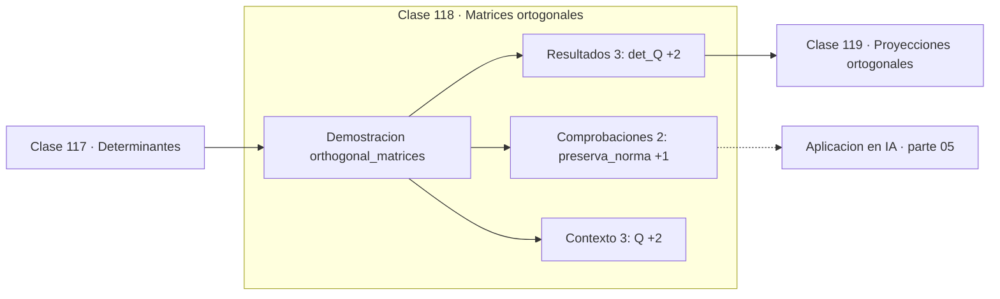

# 118 — Matrices ortogonales

> [⬅️ 117 Determinantes](../117-determinantes/README.md) · [📚 Parte 05](../README.md) · [🏠 Programa](../../../README.md) · [119 Proyecciones ortogonales ➡️](../119-proyecciones-ortogonales/README.md)

**Parte:** 05 — Álgebra lineal I: vectores y matrices · **Nivel:** `intermedio` · **Horas estimadas:** 4
**Motor:** `engines.part05` · **Demostración:** `orthogonal_matrices` · **Clase 18 de 20** de la parte

---

## 🎯 Propósito

**Las matrices ortogonales preservan normas y ángulos, y su número de condición es 1.**

Vectores, normas, producto punto, independencia, span, sistemas lineales, eliminación de Gauss, rango, inversa, determinante y proyección ortogonal.

## ✅ Resultados de aprendizaje

Al terminar podrás:

1. Explicar **Matrices ortogonales** con lenguaje cotidiano y con notación matemática.
2. Resolver un caso pequeño a mano y anticipar el orden de magnitud del resultado.
3. Ejecutar y modificar `lab.py`, que corre la demostración `orthogonal_matrices`.
4. Interpretar las 8 salidas del laboratorio y decir qué comprueba cada una.
5. Detectar el error típico de esta parte: aplicar producto punto a vectores de escalas incomparables.

## 🧩 Fórmulas de la clase

```text
QᵀQ = I ⟹ Q⁻¹ = Qᵀ
‖Qv‖ = ‖v‖
κ(Q) = 1
```

## 🗺️ Ubicación en el programa



## 📖 Fundamentos

Una matriz ortogonal tiene columnas ortonormales: unitarias y perpendiculares entre sí.
La condición `QᵀQ = I` implica que su inversa es su transpuesta, lo que convierte una
operación cara `O(n³)` en una gratuita.

Su propiedad más valiosa es numérica: **preservan la norma**, `‖Qv‖ = ‖v‖`. Como no
estiran ni encogen ningún vector, su número de condición es exactamente 1, el mínimo
posible. Aplicar una transformación ortogonal **no amplifica el error relativo**, y esa
es la razón por la que el análisis numérico serio se construye sobre ellas.

De ahí que los algoritmos estables usen rotaciones de Givens y reflexiones de
Householder en lugar de transformaciones generales: la factorización QR es más estable
que las ecuaciones normales precisamente porque Q es ortogonal (clase 234). Y de ahí que
la SVD, cuya U y V son ortogonales, sea la herramienta más robusta del álgebra lineal
numérica.

Las rotaciones son ortogonales con determinante 1; las reflexiones, con determinante −1.
En deep learning se han propuesto capas con matrices ortogonales precisamente para evitar
que los gradientes se desvanezcan o exploten al propagarse por muchas capas: si la norma
se preserva en cada capa, se preserva en toda la red.

## 🧮 Ejemplo trabajado

Verificar las propiedades de una rotación.

```text
Q = rotación de 37°
  [[0.7986, −0.6018],
   [0.6018,  0.7986]]

QᵀQ = [[1,0],[0,1]]                     ✓ ortogonal
det Q = 1                               ✓ rotación (no reflexión)

v = (3,4),  ‖v‖ = 5
Qv = (0.0887, 4.9992),  ‖Qv‖ = 5.0      ✓ preserva la norma

Q⁻¹ = Qᵀ  →  invertir es transponer, coste O(n²) en lugar de O(n³)
```

## 🔬 Qué ejecuta el laboratorio

`orthogonal_matrices` — Matriz ortogonal: QᵀQ = I, preserva normas y ángulos.

| Grupo | Salidas |
|---|---|
| 🔢 Resultados numéricos (3) | `det_Q`, `|v|`, `|Qv|` |
| ✅ Comprobaciones de invariante (2) | `preserva_norma`, `inversa_es_la_transpuesta` |

Las claves booleanas no son adorno: si alguna fuera `False`, el resultado numérico
no sería fiable aunque el programa terminase sin error.

```bash
python classes/part-05-algebra-lineal-i-vectores-y-matrices/118-matrices-ortogonales/lab.py
compmath run 118
```

> [!TIP]
> Antes de ejecutar, **escribe tu predicción**. Un laboratorio que confirma lo que
> esperabas enseña tanto como uno que te contradice, pero solo si la predicción
> existía antes del resultado.

## ⚠️ Errores conceptuales frecuentes

1. Confundir matriz ortogonal (QᵀQ = I) con matriz simétrica (A = Aᵀ).
2. Invertir una matriz ortogonal en lugar de transponerla.
3. Suponer que cualquier matriz de columnas ortogonales es ortogonal: deben ser además unitarias.

## 🚀 Dónde se usa de verdad

Factorización QR, SVD, rotaciones en gráficos, capas ortogonales en redes profundas y
algoritmos numéricamente estables en general.

## 🤖 Conexión con IA

Cada capa densa es un producto matriz-vector. Los embeddings viven en subespacios y la similitud entre ellos es producto punto normalizado.

## 📓 Notebooks

| Archivo | Para qué |
|---|---|
| [`notebook.ipynb`](notebook.ipynb) | recorrido guiado con la demostración ejecutada |
| [`notebook_student.ipynb`](notebook_student.ipynb) | versión con `TODO` para resolver |
| [`notebook_solution.ipynb`](notebook_solution.ipynb) | solución de referencia verificada |

## 📝 Evaluación

| Criterio | Peso |
|---|---:|
| Comprensión conceptual | 25 % |
| Resolución manual | 25 % |
| Implementación y verificación | 25 % |
| Interpretación y comunicación | 15 % |
| Conexión con aplicación real | 10 % |

Detalle y criterios de error crítico en [`assessment.md`](assessment.md).

## ❓ Preguntas de comprobación

1. ¿Cuál es la entrada, cuál la salida y qué unidades tienen?
2. ¿Qué operación domina el comportamiento del resultado?
3. ¿Qué caso extremo revelaría un error conceptual?
4. ¿Cómo verificarías el resultado por un método independiente?
5. ¿Dónde aparece esto en sistemas de recomendación?

Si necesitas releer el código para responderlas, la clase todavía no está superada.

## 📥 Entregable

`notebook_student.ipynb` resuelto más un párrafo que explique el resultado **sin citar
código**: qué entra, qué sale, qué invariante se comprueba y qué pasaría en un caso límite.

## 📚 Bibliografía de la clase

Esta clase enseña **Álgebra lineal**. Cada obra dice qué aporta aquí y cómo se comprobó su localizador:

- [Trefethen & Bau. *Numerical Linear Algebra*, SIAM, 1997, lecc. 10](https://epubs.siam.org/doi/book/10.1137/1.9780898719574) — Álgebra lineal: el tema de esta clase · ISBN-13 `9780898719574` verificado en International ISBN Agency (2026-08-19).
- [Arjovsky, Shah & Bengio. *Unitary Evolution Recurrent Neural Networks*. ICML, 2016](https://arxiv.org/abs/1511.06464) — Álgebra lineal: el tema de esta clase · DOI `10.48550/arxiv.1511.06464` verificado en DataCite (2026-08-19).

Bibliografía de todas las clases, con el porqué de cada obra, en [`docs/BIBLIOGRAPHY.md`](../../../docs/BIBLIOGRAPHY.md) · localizador y estado de cada obra en [`sources/bibliography.json`](../../../sources/bibliography.json).

## 📂 Material de la clase

[`intuition.md`](intuition.md) · [`theory.md`](theory.md) · [`derivation.md`](derivation.md) · [`exercises.md`](exercises.md) · [`assessment.md`](assessment.md) · [`where-is-this-used.md`](where-is-this-used.md) · [`lesson.yaml`](lesson.yaml)

---

> [⬅️ 117 Determinantes](../117-determinantes/README.md) · [📚 Parte 05](../README.md) · [🏠 Programa](../../../README.md) · [119 Proyecciones ortogonales ➡️](../119-proyecciones-ortogonales/README.md)
