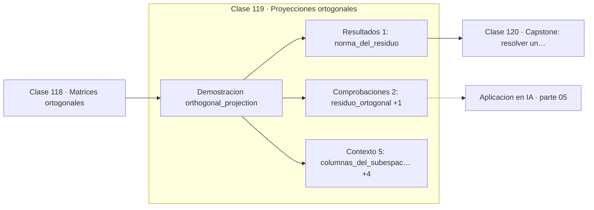

# 119 — Proyecciones ortogonales

> [⬅️ 118 Matrices ortogonales](../118-matrices-ortogonales/README.md) · [📚 Parte 05](../README.md) · [🏠 Programa](../../../README.md) · [120 Capstone: resolver un sistema de recomendación lineal ➡️](../120-capstone-resolver-un-sistema-de-recomendacion-lineal/README.md)

**Parte:** 05 — Álgebra lineal I: vectores y matrices · **Nivel:** `intermedio` · **Horas estimadas:** 4
**Motor:** `engines.part05` · **Demostración:** `orthogonal_projection` · **Clase 19 de 20** de la parte

---

## 🎯 Propósito

**La proyección ortogonal es la mejor aproximación dentro de un subespacio, y su residuo es ortogonal a él.**

Vectores, normas, producto punto, independencia, span, sistemas lineales, eliminación de Gauss, rango, inversa, determinante y proyección ortogonal.

## ✅ Resultados de aprendizaje

Al terminar podrás:

1. Explicar **Proyecciones ortogonales** con lenguaje cotidiano y con notación matemática.
2. Resolver un caso pequeño a mano y anticipar el orden de magnitud del resultado.
3. Ejecutar y modificar `lab.py`, que corre la demostración `orthogonal_projection`.
4. Interpretar las 8 salidas del laboratorio y decir qué comprueba cada una.
5. Detectar el error típico de esta parte: invertir una matriz mal condicionada en lugar de factorizar.

## 🧩 Fórmulas de la clase

```text
p = A(AᵀA)⁻¹Aᵀb
residuo r = b − p, con Aᵀr = 0
‖b‖² = ‖p‖² + ‖r‖²
```

## 🗺️ Ubicación en el programa



## 📖 Fundamentos

Proyectar un vector sobre un subespacio es encontrar el punto del subespacio más cercano
a él. Ese punto es único y se caracteriza por una condición geométrica limpia: el
**residuo es ortogonal al subespacio**. Si no lo fuera, quedaría una componente en el
subespacio que se podría aprovechar para acercarse más.

Esa caracterización es la que se usa para calcular: exigir `Aᵀ(b − Ax) = 0` da las
**ecuaciones normales** `AᵀAx = Aᵀb`, que es exactamente el problema de mínimos cuadrados
de la clase 131. Ajustar una recta a unos datos es proyectar el vector de observaciones
sobre el espacio columna de la matriz de diseño.

El teorema de Pitágoras se cumple: `‖b‖² = ‖p‖² + ‖r‖²`. Esa identidad es la que aparece
en estadística como la descomposición de la varianza —total igual a explicada más
residual— y la que define el R² de una regresión (clase 214). No son tres resultados
distintos: es el mismo, escrito en tres lenguajes.

Verificar una proyección es barato y conviene hacerlo siempre: comprobar que el residuo
es ortogonal a todas las columnas de A. Si no lo es, el cálculo está mal. El motor del
programa lo comprueba explícitamente.

## 🧮 Ejemplo trabajado

Proyectar (6,0,0) sobre el plano generado por dos columnas.

```text
A = [[1,0],    b = (6, 0, 0)
     [1,1],
     [1,2]]

Ecuaciones normales: AᵀA·x = Aᵀb
  [[3,3],[3,5]] x = (6, 0)
  x = (5, −3)

proyección p = A·x = (5, 2, −1)
residuo    r = b − p = (1, −2, 1)

Verificaciones:
  Aᵀr = (0, 0)                      ✓ ortogonal al subespacio
  ‖b‖² = 36
  ‖p‖² + ‖r‖² = 30 + 6 = 36         ✓ Pitágoras
```

## 🔬 Qué ejecuta el laboratorio

`orthogonal_projection` — Proyección sobre un subespacio y descomposición ortogonal.

| Grupo | Salidas |
|---|---|
| 🔢 Resultados numéricos (1) | `norma_del_residuo` |
| ✅ Comprobaciones de invariante (2) | `residuo_ortogonal`, `es_la_mejor_aproximacion_en_L2` |

Las claves booleanas no son adorno: si alguna fuera `False`, el resultado numérico
no sería fiable aunque el programa terminase sin error.

```bash
python classes/part-05-algebra-lineal-i-vectores-y-matrices/119-proyecciones-ortogonales/lab.py
compmath run 119
```

> [!TIP]
> Antes de ejecutar, **escribe tu predicción**. Un laboratorio que confirma lo que
> esperabas enseña tanto como uno que te contradice, pero solo si la predicción
> existía antes del resultado.

## ⚠️ Errores conceptuales frecuentes

1. No comprobar que el residuo es ortogonal al subespacio.
2. Usar las ecuaciones normales con una matriz de diseño mal condicionada.
3. Confundir la proyección (dentro del subespacio) con el residuo (fuera de él).

## 🚀 Dónde se usa de verdad

Mínimos cuadrados, R² de una regresión, PCA, descomposición de la varianza y
eliminación de componentes no deseadas de una señal.

## 🤖 Conexión con IA

Cada capa densa es un producto matriz-vector. Los embeddings viven en subespacios y la similitud entre ellos es producto punto normalizado.

## 📓 Notebooks

| Archivo | Para qué |
|---|---|
| [`notebook.ipynb`](notebook.ipynb) | recorrido guiado con la demostración ejecutada |
| [`notebook_student.ipynb`](notebook_student.ipynb) | versión con `TODO` para resolver |
| [`notebook_solution.ipynb`](notebook_solution.ipynb) | solución de referencia verificada |

## 📝 Evaluación

| Criterio | Peso |
|---|---:|
| Comprensión conceptual | 25 % |
| Resolución manual | 25 % |
| Implementación y verificación | 25 % |
| Interpretación y comunicación | 15 % |
| Conexión con aplicación real | 10 % |

Detalle y criterios de error crítico en [`assessment.md`](assessment.md).

## ❓ Preguntas de comprobación

1. ¿Cuál es la entrada, cuál la salida y qué unidades tienen?
2. ¿Qué operación domina el comportamiento del resultado?
3. ¿Qué caso extremo revelaría un error conceptual?
4. ¿Cómo verificarías el resultado por un método independiente?
5. ¿Dónde aparece esto en sistemas de recomendación?

Si necesitas releer el código para responderlas, la clase todavía no está superada.

## 📥 Entregable

`notebook_student.ipynb` resuelto más un párrafo que explique el resultado **sin citar
código**: qué entra, qué sale, qué invariante se comprueba y qué pasaría en un caso límite.

## 🔗 Referencias

- [Strang, G. *Introduction to Linear Algebra*, 6ª ed., 2023, cap. 4](https://math.mit.edu/~gs/linearalgebra/) — *uso:* exposición alternativa del tema en «Proyecciones ortogonales».
- [Trefethen & Bau. *Numerical Linear Algebra*, SIAM, 1997, lecc. 11](https://epubs.siam.org/doi/book/10.1137/1.9780898719574) — *uso:* desarrollo formal del tema en «Proyecciones ortogonales».

Bibliografía completa de la parte en [`../../../docs/BIBLIOGRAPHY.md`](../../../docs/BIBLIOGRAPHY.md) · localizador verificable de cada obra en [`sources/bibliography.json`](../../../sources/bibliography.json).

## 📂 Material de la clase

[`intuition.md`](intuition.md) · [`theory.md`](theory.md) · [`derivation.md`](derivation.md) · [`exercises.md`](exercises.md) · [`assessment.md`](assessment.md) · [`where-is-this-used.md`](where-is-this-used.md) · [`lesson.yaml`](lesson.yaml)

---

> [⬅️ 118 Matrices ortogonales](../118-matrices-ortogonales/README.md) · [📚 Parte 05](../README.md) · [🏠 Programa](../../../README.md) · [120 Capstone: resolver un sistema de recomendación lineal ➡️](../120-capstone-resolver-un-sistema-de-recomendacion-lineal/README.md)
