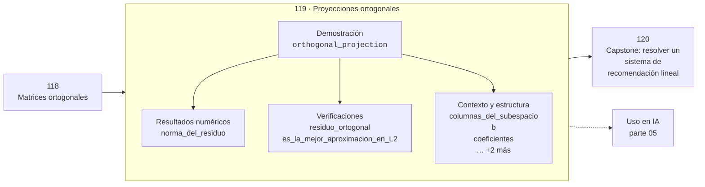

# 119 — Proyecciones ortogonales

> [⬅️ 118 Matrices ortogonales](../118-matrices-ortogonales/README.md) · [📚 Parte 05](../README.md) · [🏠 Programa](../../../README.md) · [120 Capstone: resolver un sistema de recomendación lineal ➡️](../120-capstone-resolver-un-sistema-de-recomendacion-lineal/README.md)

**Parte:** 05 — Álgebra lineal I: vectores y matrices · **Nivel:** `intermedio` · **Horas estimadas:** 4
**Motor:** `engines.part05` · **Demostración:** `orthogonal_projection` · **Clase 19 de 20** de la parte

---

## 🎯 Propósito

Vectores, normas, producto punto, independencia, span, sistemas lineales, eliminación de Gauss, rango, inversa, determinante y proyección ortogonal.

Esta clase concreta ese objetivo sobre **Proyecciones ortogonales**: qué es, cómo se
calcula a mano, cómo se implementa sin ocultar el procedimiento y cómo se verifica
que el resultado es correcto y no solo plausible.

## ✅ Resultados de aprendizaje

Al terminar podrás:

1. Explicar **Proyecciones ortogonales** con lenguaje cotidiano y con notación matemática.
2. Resolver un caso pequeño a mano y anticipar el orden de magnitud del resultado.
3. Ejecutar y modificar `lab.py`, que corre la demostración `orthogonal_projection`.
4. Interpretar las 8 salidas del laboratorio y decir qué comprueba cada una.
5. Detectar el error típico de esta parte: invertir una matriz mal condicionada en lugar de factorizar.

## 🗺️ Ubicación en el programa



## 🧠 Idea rectora de la parte 05

> La proyección ortogonal es la mejor aproximación en norma euclídea.

## 🔬 Qué ejecuta el laboratorio

`orthogonal_projection` — Proyección sobre un subespacio y descomposición ortogonal.

| Grupo | Salidas |
|---|---|
| 🔢 Resultados numéricos (1) | `norma_del_residuo` |
| ✅ Comprobaciones de invariante (2) | `residuo_ortogonal`, `es_la_mejor_aproximacion_en_L2` |

Las claves booleanas no son adorno: si alguna fuera `False`, el resultado numérico
no sería fiable aunque el programa terminase sin error.

```bash
python classes/part-05-algebra-lineal-i-vectores-y-matrices/119-proyecciones-ortogonales/lab.py
compmath run 119
```

> [!TIP]
> Antes de ejecutar, **escribe tu predicción**. Un laboratorio que confirma lo que
> esperabas enseña tanto como uno que te contradice, pero solo si la predicción
> existía antes del resultado.

## ⚠️ Errores frecuentes en esta parte

- Invertir una matriz mal condicionada en lugar de factorizar.
- Confundir dimensión del espacio con número de vectores.
- Aplicar producto punto a vectores de escalas incomparables.

## 🤖 Conexión con IA

Cada capa densa es un producto matriz-vector. Los embeddings viven en subespacios y la similitud entre ellos es producto punto normalizado.

## 📓 Notebooks

| Archivo | Para qué |
|---|---|
| [`notebook.ipynb`](notebook.ipynb) | recorrido guiado con la demostración ejecutada |
| [`notebook_student.ipynb`](notebook_student.ipynb) | versión con `TODO` para resolver |
| [`notebook_solution.ipynb`](notebook_solution.ipynb) | solución de referencia verificada |

## 📝 Evaluación

| Criterio | Peso |
|---|---:|
| Comprensión conceptual | 25 % |
| Resolución manual | 25 % |
| Implementación y verificación | 25 % |
| Interpretación y comunicación | 15 % |
| Conexión con aplicación real | 10 % |

Detalle y criterios de error crítico en [`assessment.md`](assessment.md).

## ❓ Preguntas de comprobación

1. ¿Cuál es la entrada, cuál la salida y qué unidades tienen?
2. ¿Qué operación domina el comportamiento del resultado?
3. ¿Qué caso extremo revelaría un error conceptual?
4. ¿Cómo verificarías el resultado por un método independiente?
5. ¿Dónde aparece esto en sistemas de recomendación?

Si necesitas releer el código para responderlas, la clase todavía no está superada.

## 📥 Entregable

`notebook_student.ipynb` resuelto más un párrafo que explique el resultado **sin citar
código**: qué entra, qué sale, qué invariante se comprueba y qué pasaría en un caso límite.

## 🔗 Referencias

- Strang, G. *Introduction to Linear Algebra*. 6ª ed., Wellesley-Cambridge, 2023.
- Axler, S. *Linear Algebra Done Right*. 4ª ed., Springer, 2024.
- Trefethen, L. N.; Bau, D. *Numerical Linear Algebra*. SIAM, 1997.

## 📂 Material de la clase

[`intuition.md`](intuition.md) · [`theory.md`](theory.md) · [`derivation.md`](derivation.md) · [`exercises.md`](exercises.md) · [`assessment.md`](assessment.md) · [`where-is-this-used.md`](where-is-this-used.md) · [`lesson.yaml`](lesson.yaml)

---

> [⬅️ 118 Matrices ortogonales](../118-matrices-ortogonales/README.md) · [📚 Parte 05](../README.md) · [🏠 Programa](../../../README.md) · [120 Capstone: resolver un sistema de recomendación lineal ➡️](../120-capstone-resolver-un-sistema-de-recomendacion-lineal/README.md)
