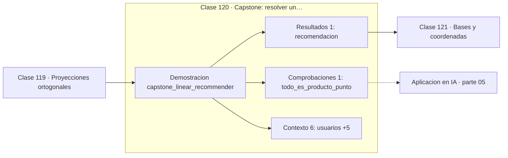

# 120 — Capstone: resolver un sistema de recomendación lineal

> [⬅️ 119 Proyecciones ortogonales](../119-proyecciones-ortogonales/README.md) · [📚 Parte 05](../README.md) · [🏠 Programa](../../../README.md) · [121 Bases y coordenadas ➡️](../../part-06-algebra-lineal-ii-descomposiciones-y-tensores/121-bases-y-coordenadas/README.md)

**Parte:** 05 — Álgebra lineal I: vectores y matrices · **Nivel:** `intermedio` · **Horas estimadas:** 4
**Motor:** `engines.part05` · **Demostración:** `capstone_linear_recommender` · **Clase 20 de 20** de la parte

---

## 🎯 Propósito

**Un recomendador por filtrado colaborativo es producto punto normalizado y media ponderada; nada más.**

Vectores, normas, producto punto, independencia, span, sistemas lineales, eliminación de Gauss, rango, inversa, determinante y proyección ortogonal.

## ✅ Resultados de aprendizaje

Al terminar podrás:

1. Explicar **Capstone: resolver un sistema de recomendación lineal** con lenguaje cotidiano y con notación matemática.
2. Resolver un caso pequeño a mano y anticipar el orden de magnitud del resultado.
3. Ejecutar y modificar `lab.py`, que corre la demostración `capstone_linear_recommender`.
4. Interpretar las 8 salidas del laboratorio y decir qué comprueba cada una.
5. Detectar el error típico de esta parte: confundir dimensión del espacio con número de vectores.

## 🧩 Fórmulas de la clase

```text
similitud(u,v) = u·v / (‖u‖‖v‖)
puntuación(i) = Σ sim(u,w)·rᵥᵢ / Σ |sim(u,w)|
```

## 🗺️ Ubicación en el programa



## 📖 Fundamentos

El capstone construye un sistema de recomendación por filtrado colaborativo basado en
usuarios, y su interés está en lo que **no** usa: ninguna biblioteca de machine
learning, ningún modelo entrenado, ninguna red neuronal. Es producto punto, norma y
media ponderada.

El algoritmo tiene tres pasos. Calcular la similitud coseno entre el usuario objetivo y
todos los demás; usar esas similitudes como pesos para promediar las valoraciones de los
demás sobre los ítems que el objetivo no ha visto; recomendar el ítem con mayor
puntuación estimada. Los pesos se normalizan dividiendo por la suma de similitudes
absolutas para que la escala se conserve.

Las limitaciones son reales y conviene declararlas. El **arranque en frío**: un usuario
nuevo no tiene vector, así que no hay similitud que calcular. La **dispersión**: en un
catálogo real, cada usuario ha valorado una fracción minúscula de los ítems, y los
vectores son casi todo ceros. Y el **coste**: comparar con todos los usuarios es `O(n·d)`
por consulta, inviable con millones de usuarios sin índices aproximados.

Los sistemas industriales resuelven esas limitaciones con factorización matricial —que
es la parte 06— y con embeddings aprendidos, pero la métrica de comparación sigue siendo
la de esta clase. Entender el caso simple es lo que permite entender por qué las
soluciones complejas hacen lo que hacen.

## 🧮 Ejemplo trabajado

Recomendar a «ana» entre cuatro usuarios.

```text
valoraciones (0 = no visto):
  ana    [5, 3, 0, 1]
  beto   [4, 0, 0, 1]
  cata   [1, 1, 0, 5]
  dario  [0, 0, 5, 4]

similitud coseno con ana:
  beto  0.9783    ← el más parecido
  cata  0.4707
  dario 0.0900

ítems no vistos por ana: índice 2

puntuación estimada del ítem 2:
  (0.9783·0 + 0.4707·0 + 0.0900·5) / (0.9783+0.4707+0.0900) = 0.29

recomendación: ítem 2 (el único no visto)
```

## 🔬 Qué ejecuta el laboratorio

`capstone_linear_recommender` — Capstone: recomendación lineal por similitud coseno entre usuarios.

| Grupo | Salidas |
|---|---|
| 🔢 Resultados numéricos (1) | `recomendacion` |
| ✅ Comprobaciones de invariante (1) | `todo_es_producto_punto` |

Las claves booleanas no son adorno: si alguna fuera `False`, el resultado numérico
no sería fiable aunque el programa terminase sin error.

```bash
python classes/part-05-algebra-lineal-i-vectores-y-matrices/120-capstone-resolver-un-sistema-de-recomendacion-lineal/lab.py
compmath run 120
```

> [!TIP]
> Antes de ejecutar, **escribe tu predicción**. Un laboratorio que confirma lo que
> esperabas enseña tanto como uno que te contradice, pero solo si la predicción
> existía antes del resultado.

## ⚠️ Errores conceptuales frecuentes

1. Comparar usuarios sin normalizar y dejar que el número de valoraciones domine.
2. Ignorar el problema del arranque en frío al desplegar.
3. Promediar sin normalizar por la suma de similitudes y romper la escala.

## 🚀 Dónde se usa de verdad

Sistemas de recomendación, búsqueda por similitud, agrupación de usuarios y motores de
contenido relacionado. El mismo cálculo, con embeddings en lugar de valoraciones, es la
base de la recuperación semántica.

## 🤖 Conexión con IA

Cada capa densa es un producto matriz-vector. Los embeddings viven en subespacios y la similitud entre ellos es producto punto normalizado.

## 📓 Notebooks

| Archivo | Para qué |
|---|---|
| [`notebook.ipynb`](notebook.ipynb) | recorrido guiado con la demostración ejecutada |
| [`notebook_student.ipynb`](notebook_student.ipynb) | versión con `TODO` para resolver |
| [`notebook_solution.ipynb`](notebook_solution.ipynb) | solución de referencia verificada |

## 📝 Evaluación

| Criterio | Peso |
|---|---:|
| Comprensión conceptual | 25 % |
| Resolución manual | 25 % |
| Implementación y verificación | 25 % |
| Interpretación y comunicación | 15 % |
| Conexión con aplicación real | 10 % |

Detalle y criterios de error crítico en [`assessment.md`](assessment.md).

## ❓ Preguntas de comprobación

1. ¿Cuál es la entrada, cuál la salida y qué unidades tienen?
2. ¿Qué operación domina el comportamiento del resultado?
3. ¿Qué caso extremo revelaría un error conceptual?
4. ¿Cómo verificarías el resultado por un método independiente?
5. ¿Dónde aparece esto en sistemas de recomendación?

Si necesitas releer el código para responderlas, la clase todavía no está superada.

## 📥 Entregable

`notebook_student.ipynb` resuelto más un párrafo que explique el resultado **sin citar
código**: qué entra, qué sale, qué invariante se comprueba y qué pasaría en un caso límite.

## 🔗 Referencias

- [Ricci, Rokach & Shapira. *Recommender Systems Handbook*, 3ª ed., Springer, 2022](https://link.springer.com/book/10.1007/978-1-0716-2197-4)
- [Koren, Bell & Volinsky. *Matrix Factorization Techniques for Recommender Systems*. IEEE Computer, 2009](https://ieeexplore.ieee.org/document/5197422)

Bibliografía completa de la parte en [`../../../docs/BIBLIOGRAPHY.md`](../../../docs/BIBLIOGRAPHY.md).

## 📂 Material de la clase

[`intuition.md`](intuition.md) · [`theory.md`](theory.md) · [`derivation.md`](derivation.md) · [`exercises.md`](exercises.md) · [`assessment.md`](assessment.md) · [`where-is-this-used.md`](where-is-this-used.md) · [`lesson.yaml`](lesson.yaml)

---

> [⬅️ 119 Proyecciones ortogonales](../119-proyecciones-ortogonales/README.md) · [📚 Parte 05](../README.md) · [🏠 Programa](../../../README.md) · [121 Bases y coordenadas ➡️](../../part-06-algebra-lineal-ii-descomposiciones-y-tensores/121-bases-y-coordenadas/README.md)
