# 🟪 Parte 05 — Álgebra lineal I: vectores y matrices

> [⬅️ Parte 04 — Matemática discreta para computación](../part-04-matematica-discreta-para-computacion/README.md) · [🏠 Programa](../../README.md) · [📇 Catálogo](../README.md) · [Parte 06 — Álgebra lineal II: descomposiciones y tensores ➡️](../part-06-algebra-lineal-ii-descomposiciones-y-tensores/README.md)

**Nivel:** `intermedio` · **Clases:** 20 · **Horas estimadas:** 80 · **Motor:** [`part05.py`](../../src/computational_math/engines/part05.py)

---

## 🎯 De qué trata esta parte

Vectores, normas, producto punto, independencia, span, sistemas lineales, eliminación de Gauss, rango, inversa, determinante y proyección ortogonal.

## 🧠 Ideas centrales

- Una matriz es una función lineal escrita en una base concreta.
- El rango es la dimensión real de la salida, no el tamaño de la tabla.
- Resolver Ax=b casi nunca requiere calcular A⁻¹.
- La proyección ortogonal es la mejor aproximación en norma euclídea.
- El determinante mide cuánto escala el volumen una transformación.

## 🤖 Por qué importa en IA

> [!IMPORTANT]
> Cada capa densa es un producto matriz-vector. Los embeddings viven en subespacios y la similitud entre ellos es producto punto normalizado.

## ⚠️ Errores frecuentes de esta parte

- Invertir una matriz mal condicionada en lugar de factorizar.
- Confundir dimensión del espacio con número de vectores.
- Aplicar producto punto a vectores de escalas incomparables.

## 🧭 Secuencia de la parte

```mermaid
flowchart LR
    subgraph B1["Bloque 1"]
        direction TB
        L101["101<br/>Escalares, vectores y<br/>matrices"]
        L102["102<br/>Operaciones con vectores"]
        L103["103<br/>Producto punto y<br/>similitud"]
        L104["104<br/>Normas y distancias"]
        L105["105<br/>Vectores unitarios"]
        L101 --> L102
        L102 --> L103
        L103 --> L104
        L104 --> L105
    end
    subgraph B2["Bloque 2"]
        direction TB
        L106["106<br/>Combinaciones lineales"]
        L107["107<br/>Independencia y<br/>dependencia lineal"]
        L108["108<br/>Span y subespacios"]
        L109["109<br/>Matrices y operaciones<br/>básicas"]
        L110["110<br/>Producto matriz-vector"]
        L106 --> L107
        L107 --> L108
        L108 --> L109
        L109 --> L110
    end
    subgraph B3["Bloque 3"]
        direction TB
        L111["111<br/>Producto de matrices"]
        L112["112<br/>Transpuesta y simetría"]
        L113["113<br/>Sistemas lineales"]
        L114["114<br/>Eliminación de Gauss"]
        L115["115<br/>Forma escalonada y rango"]
        L111 --> L112
        L112 --> L113
        L113 --> L114
        L114 --> L115
    end
    subgraph B4["Bloque 4"]
        direction TB
        L116["116<br/>Inversa de una matriz"]
        L117["117<br/>Determinantes"]
        L118["118<br/>Matrices ortogonales"]
        L119["119<br/>Proyecciones ortogonales"]
        L120["120<br/>Capstone: resolver un<br/>sistema de recomendación<br/>lineal"]
        L116 --> L117
        L117 --> L118
        L118 --> L119
        L119 --> L120
    end
    L105 --> L106
    L110 --> L111
    L115 --> L116
```



## 📚 Las clases

| # | Clase | Demostración | Idea central |
|---|---|---|---|
| `101` | [Escalares, vectores y matrices](101-escalares-vectores-y-matrices/README.md) | `scalars_vectors_matrices` | Escalar, vector y matriz como objetos con forma y significado. |
| `102` | [Operaciones con vectores](102-operaciones-con-vectores/README.md) | `vector_operations` | Suma, resta y combinación lineal con interpretación geométrica. |
| `103` | [Producto punto y similitud](103-producto-punto-y-similitud/README.md) | `dot_product` | Producto punto: proyección, ángulo y similitud. |
| `104` | [Normas y distancias](104-normas-y-distancias/README.md) | `norms_distances` | L1, L2 e L∞ sobre el mismo vector. |
| `105` | [Vectores unitarios](105-vectores-unitarios/README.md) | `unit_vectors` | Normalizar separa dirección de magnitud. |
| `106` | [Combinaciones lineales](106-combinaciones-lineales/README.md) | `linear_combinations` | Toda combinación lineal de la base canónica reconstruye el vector. |
| `107` | [Independencia y dependencia lineal](107-independencia-y-dependencia-lineal/README.md) | `linear_independence` | Independencia detectada por el rango, no por inspección. |
| `108` | [Span y subespacios](108-span-y-subespacios/README.md) | `span_subspaces` | El span de dos vectores en ℝ³ es un plano, no todo el espacio. |
| `109` | [Matrices y operaciones básicas](109-matrices-y-operaciones-basicas/README.md) | `matrix_basics` | Suma, escala y transpuesta de matrices. |
| `110` | [Producto matriz-vector](110-producto-matriz-vector/README.md) | `matrix_vector` | Ax como combinación lineal de las columnas de A. |
| `111` | [Producto de matrices](111-producto-de-matrices/README.md) | `matrix_product` | AB ≠ BA y el coste cúbico del producto. |
| `112` | [Transpuesta y simetría](112-transpuesta-y-simetria/README.md) | `transpose_symmetry` | Toda matriz cuadrada se descompone en parte simétrica y antisimétrica. |
| `113` | [Sistemas lineales](113-sistemas-lineales/README.md) | `linear_systems` | Sistema 3x3: solución, residuo y unicidad. |
| `114` | [Eliminación de Gauss](114-eliminacion-de-gauss/README.md) | `gaussian_elimination_demo` | Eliminación de Gauss con pivoteo parcial, paso a paso. |
| `115` | [Forma escalonada y rango](115-forma-escalonada-y-rango/README.md) | `echelon_rank` | Rango: la dimensión efectiva de la transformación. |
| `116` | [Inversa de una matriz](116-inversa-de-una-matriz/README.md) | `matrix_inverse` | La inversa existe, pero rara vez conviene calcularla. |
| `117` | [Determinantes](117-determinantes/README.md) | `determinants` | El determinante mide el escalado de volumen y detecta singularidad. |
| `118` | [Matrices ortogonales](118-matrices-ortogonales/README.md) | `orthogonal_matrices` | Matriz ortogonal: QᵀQ = I, preserva normas y ángulos. |
| `119` | [Proyecciones ortogonales](119-proyecciones-ortogonales/README.md) | `orthogonal_projection` | Proyección sobre un subespacio y descomposición ortogonal. |
| `120` | [Capstone: resolver un sistema de recomendación lineal](120-capstone-resolver-un-sistema-de-recomendacion-lineal/README.md) | `capstone_linear_recommender` | Capstone: recomendación lineal por similitud coseno entre usuarios. |

## 🧰 Stack de referencia

`math`, `numpy (opcional)`

Los laboratorios se ejecutan con biblioteca estándar; estas herramientas aparecen
como contraste profesional, no como requisito.

## 🧪 Ejecutar toda la parte

```bash
compmath run --part 05
compmath catalog --part 05
```

## 📊 Evaluación de la parte

| Componente | Peso |
|---|---:|
| Clases y ejercicios | 40 % |
| Laboratorios y notebooks | 25 % |
| Explicación oral o escrita | 15 % |
| Capstone ([120](120-capstone-resolver-un-sistema-de-recomendacion-lineal/README.md)) | 20 % |

## 📖 Bibliografía

- Strang, G. *Introduction to Linear Algebra*. 6ª ed., Wellesley-Cambridge, 2023.
- Axler, S. *Linear Algebra Done Right*. 4ª ed., Springer, 2024.
- Trefethen, L. N.; Bau, D. *Numerical Linear Algebra*. SIAM, 1997.

---

> [⬅️ Parte 04 — Matemática discreta para computación](../part-04-matematica-discreta-para-computacion/README.md) · [🏠 Programa](../../README.md) · [📇 Catálogo](../README.md) · [Parte 06 — Álgebra lineal II: descomposiciones y tensores ➡️](../part-06-algebra-lineal-ii-descomposiciones-y-tensores/README.md)
