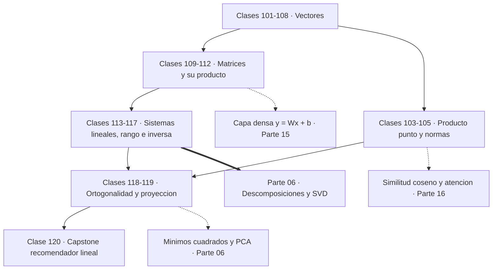

# 🟪 Parte 05 — Álgebra lineal I: vectores y matrices

> [⬅️ Parte 04 — Matemática discreta para computación](../part-04-matematica-discreta-para-computacion/README.md) · [🏠 Programa](../../README.md) · [📇 Catálogo](../README.md) · [Parte 06 — Álgebra lineal II: descomposiciones y tensores ➡️](../part-06-algebra-lineal-ii-descomposiciones-y-tensores/README.md)

**Nivel:** `intermedio` · **Clases:** 20 · **Horas estimadas:** 80 · **Motor:** [`part05.py`](../../src/computational_math/engines/part05.py)

---

## 🎯 De qué trata esta parte

Vectores, normas, producto punto, independencia, span, sistemas lineales, eliminación de Gauss, rango, inversa, determinante y proyección ortogonal.

Si hubiera que elegir **una** parte del programa como la más rentable para alguien que
quiere entender IA, sería esta. Todo modelo moderno —desde la regresión lineal hasta un
Transformer de cien mil millones de parámetros— opera sobre vectores y matrices, y casi
toda su computación es producto matricial. Quien no distingue un espacio columna de un
espacio fila no puede depurar un error de dimensiones ni entender por qué una capa pierde
información.

El cambio de perspectiva que propone la parte es concreto: **dejar de ver una matriz como
una tabla y verla como una función**. Una matriz `A` de tamaño m×n es una transformación
lineal de ℝⁿ en ℝᵐ, y sus columnas son las imágenes de los vectores de la base. Con esa
lectura, `Ax` deja de ser «filas por columnas» y pasa a ser una combinación lineal de las
columnas de A con los coeficientes de x —que es exactamente lo que hace una capa densa
con sus pesos—.

Las clases 101 a 108 construyen el vocabulario vectorial: operaciones, producto punto,
normas, independencia y span. El producto punto es el protagonista: mide alineación, define
ortogonalidad y es la operación que ejecutan miles de millones de veces por segundo los
aceleradores. La similitud coseno de un buscador semántico es un producto punto
normalizado, ni más ni menos.

Las clases 109 a 117 pasan a las matrices: producto, transpuesta, sistemas lineales,
eliminación de Gauss, rango, inversa y determinante. Aquí aparece el mensaje práctico más
importante de la parte: **resolver `Ax = b` casi nunca requiere calcular `A⁻¹`**. Invertir
es más caro y numéricamente peor que factorizar; ninguna biblioteca seria invierte una
matriz para resolver un sistema, y saber por qué distingue a quien entiende de quien
recita.

Las clases 118 y 119 introducen la ortogonalidad como propiedad numérica privilegiada: las
transformaciones ortogonales no amplifican el error, y la proyección ortogonal es la mejor
aproximación posible en norma euclídea. Ese resultado es el que sostiene los mínimos
cuadrados (parte 06), PCA (clase 135) y la descomposición de la varianza en estadística.

El capstone construye un sistema de recomendación por similitud coseno entre usuarios. No
usa ninguna biblioteca de machine learning: es todo producto punto y norma. Ese es el
punto de la parte.

## 🗺️ Mapa conceptual



## 🧠 Ideas centrales

- Una matriz es una función lineal escrita en una base concreta.
- El rango es la dimensión real de la salida, no el tamaño de la tabla.
- Resolver Ax=b casi nunca requiere calcular A⁻¹.
- La proyección ortogonal es la mejor aproximación en norma euclídea.
- El determinante mide cuánto escala el volumen una transformación.

## 🤖 Por qué importa en IA

> [!IMPORTANT]
> Cada capa densa es un producto matriz-vector. Los embeddings viven en subespacios y la similitud entre ellos es producto punto normalizado.

## ⚠️ Errores frecuentes de esta parte

- Invertir una matriz mal condicionada en lugar de factorizar.
- Confundir dimensión del espacio con número de vectores.
- Aplicar producto punto a vectores de escalas incomparables.

## 🧭 Secuencia de la parte

```mermaid
flowchart LR
    subgraph B1["Bloque 1"]
        direction TB
        L101["101 · Escalares, vectores y matrices"]
        L102["102 · Operaciones con vectores"]
        L103["103 · Producto punto y similitud"]
        L104["104 · Normas y distancias"]
        L105["105 · Vectores unitarios"]
        L101 --> L102
        L102 --> L103
        L103 --> L104
        L104 --> L105
    end
    subgraph B2["Bloque 2"]
        direction TB
        L106["106 · Combinaciones lineales"]
        L107["107 · Independencia y dependencia…"]
        L108["108 · Span y subespacios"]
        L109["109 · Matrices y operaciones básicas"]
        L110["110 · Producto matriz-vector"]
        L106 --> L107
        L107 --> L108
        L108 --> L109
        L109 --> L110
    end
    subgraph B3["Bloque 3"]
        direction TB
        L111["111 · Producto de matrices"]
        L112["112 · Transpuesta y simetría"]
        L113["113 · Sistemas lineales"]
        L114["114 · Eliminación de Gauss"]
        L115["115 · Forma escalonada y rango"]
        L111 --> L112
        L112 --> L113
        L113 --> L114
        L114 --> L115
    end
    subgraph B4["Bloque 4"]
        direction TB
        L116["116 · Inversa de una matriz"]
        L117["117 · Determinantes"]
        L118["118 · Matrices ortogonales"]
        L119["119 · Proyecciones ortogonales"]
        L120["120 · Capstone: resolver un…"]
        L116 --> L117
        L117 --> L118
        L118 --> L119
        L119 --> L120
    end
    L105 --> L106
    L110 --> L111
    L115 --> L116
```



## 📚 Las clases

| # | Clase | Demostración | Idea central |
|---|---|---|---|
| `101` | [Escalares, vectores y matrices](101-escalares-vectores-y-matrices/README.md) | `scalars_vectors_matrices` | Escalar, vector, matriz y tensor son el mismo objeto con distinto número de índices. |
| `102` | [Operaciones con vectores](102-operaciones-con-vectores/README.md) | `vector_operations` | La suma de vectores es componente a componente, y la desigualdad triangular acota la norma del resultado. |
| `103` | [Producto punto y similitud](103-producto-punto-y-similitud/README.md) | `dot_product` | El producto punto mide alineación; su normalización es la similitud coseno de los embeddings. |
| `104` | [Normas y distancias](104-normas-y-distancias/README.md) | `norms_distances` | La norma elegida determina qué se penaliza: L1 induce dispersión, L2 penaliza los valores grandes. |
| `105` | [Vectores unitarios](105-vectores-unitarios/README.md) | `unit_vectors` | Normalizar separa dirección de magnitud; el vector cero no tiene dirección definida. |
| `106` | [Combinaciones lineales](106-combinaciones-lineales/README.md) | `linear_combinations` | Una combinación lineal es la operación fundamental del álgebra lineal, y una capa densa es exactamente eso. |
| `107` | [Independencia y dependencia lineal](107-independencia-y-dependencia-lineal/README.md) | `linear_independence` | La independencia lineal se detecta por el rango, no por inspección visual. |
| `108` | [Span y subespacios](108-span-y-subespacios/README.md) | `span_subspaces` | El span de un conjunto es siempre un subespacio, y su dimensión es el rango del conjunto. |
| `109` | [Matrices y operaciones básicas](109-matrices-y-operaciones-basicas/README.md) | `matrix_basics` | Suma, escala y transpuesta operan elemento a elemento; la traza suma la diagonal. |
| `110` | [Producto matriz-vector](110-producto-matriz-vector/README.md) | `matrix_vector` | Ax es una combinación lineal de las columnas de A, y por eso vive en el espacio columna. |
| `111` | [Producto de matrices](111-producto-de-matrices/README.md) | `matrix_product` | El producto matricial compone transformaciones, es asociativo y no conmuta. |
| `112` | [Transpuesta y simetría](112-transpuesta-y-simetria/README.md) | `transpose_symmetry` | Toda matriz cuadrada se descompone en parte simétrica y antisimétrica, y AᵀA es siempre simétrica. |
| `113` | [Sistemas lineales](113-sistemas-lineales/README.md) | `linear_systems` | Un sistema lineal tiene solución única si el determinante no es nulo; el residuo es el criterio de aceptación. |
| `114` | [Eliminación de Gauss](114-eliminacion-de-gauss/README.md) | `gaussian_elimination_demo` | El pivoteo parcial evita dividir por pivotes casi nulos y hace estable la eliminación. |
| `115` | [Forma escalonada y rango](115-forma-escalonada-y-rango/README.md) | `echelon_rank` | El rango es la dimensión efectiva de la salida; rango más nulidad es siempre el número de columnas. |
| `116` | [Inversa de una matriz](116-inversa-de-una-matriz/README.md) | `matrix_inverse` | La inversa existe si el determinante no es nulo, pero resolver un sistema casi nunca debe pasar por ella. |
| `117` | [Determinantes](117-determinantes/README.md) | `determinants` | El determinante mide cuánto escala el volumen la transformación; cero significa que la aplasta. |
| `118` | [Matrices ortogonales](118-matrices-ortogonales/README.md) | `orthogonal_matrices` | Las matrices ortogonales preservan normas y ángulos, y su número de condición es 1. |
| `119` | [Proyecciones ortogonales](119-proyecciones-ortogonales/README.md) | `orthogonal_projection` | La proyección ortogonal es la mejor aproximación dentro de un subespacio, y su residuo es ortogonal a él. |
| `120` | [Capstone: resolver un sistema de recomendación lineal](120-capstone-resolver-un-sistema-de-recomendacion-lineal/README.md) | `capstone_linear_recommender` | Un recomendador por filtrado colaborativo es producto punto normalizado y media ponderada; nada más. |

## 📖 Glosario de la parte (19 términos)

Definiciones precisas en [`GLOSARIO.md`](GLOSARIO.md).

## 🧰 Stack de referencia

`math`, `numpy (opcional)`

Los laboratorios se ejecutan con biblioteca estándar; estas herramientas aparecen
como contraste profesional, no como requisito.

## 🧪 Ejecutar toda la parte

```bash
compmath run --part 05
compmath catalog --part 05
```

## 📊 Evaluación de la parte

| Componente | Peso |
|---|---:|
| Clases y ejercicios | 40 % |
| Laboratorios y notebooks | 25 % |
| Explicación oral o escrita | 15 % |
| Capstone ([120](120-capstone-resolver-un-sistema-de-recomendacion-lineal/README.md)) | 20 % |

## 📖 Bibliografía

Obras de referencia de la parte:

- Strang, G. *Introduction to Linear Algebra*. 6ª ed., Wellesley-Cambridge, 2023.
- Axler, S. *Linear Algebra Done Right*. 4ª ed., Springer, 2024.
- Trefethen, L. N.; Bau, D. *Numerical Linear Algebra*. SIAM, 1997.

Las 20 clases de esta parte citan 21 obras distintas. Cuál sostiene cada clase, y por qué, en [`docs/BIBLIOGRAPHY.md`](../../docs/BIBLIOGRAPHY.md#parte-05-algebra-lineal-i-vectores-y-matrices).

---

> [⬅️ Parte 04 — Matemática discreta para computación](../part-04-matematica-discreta-para-computacion/README.md) · [🏠 Programa](../../README.md) · [📇 Catálogo](../README.md) · [Parte 06 — Álgebra lineal II: descomposiciones y tensores ➡️](../part-06-algebra-lineal-ii-descomposiciones-y-tensores/README.md)
