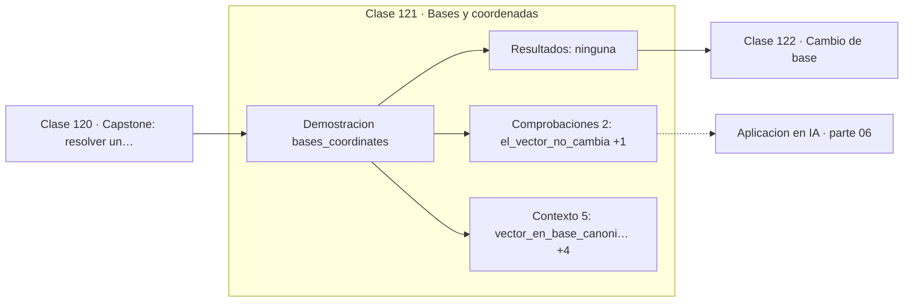

# 121 — Bases y coordenadas

> [⬅️ 120 Capstone: resolver un sistema de recomendación lineal](../../part-05-algebra-lineal-i-vectores-y-matrices/120-capstone-resolver-un-sistema-de-recomendacion-lineal/README.md) · [📚 Parte 06](../README.md) · [🏠 Programa](../../../README.md) · [122 Cambio de base ➡️](../122-cambio-de-base/README.md)

**Parte:** 06 — Álgebra lineal II: descomposiciones y tensores · **Nivel:** `intermedio-avanzado` · **Horas estimadas:** 4
**Motor:** `engines.part06` · **Demostración:** `bases_coordinates` · **Clase 1 de 20** de la parte

---

## 🎯 Propósito

**Las coordenadas de un vector dependen de la base; el vector no.**

Cambio de base, autovalores, diagonalización, LU, QR, mínimos cuadrados, SVD, pseudoinversa, PCA y álgebra tensorial.

## ✅ Resultados de aprendizaje

Al terminar podrás:

1. Explicar **Bases y coordenadas** con lenguaje cotidiano y con notación matemática.
2. Resolver un caso pequeño a mano y anticipar el orden de magnitud del resultado.
3. Ejecutar y modificar `lab.py`, que corre la demostración `bases_coordinates`.
4. Interpretar las 7 salidas del laboratorio y decir qué comprueba cada una.
5. Detectar el error típico de esta parte: aplicar pca sin centrar (ni escalar) los datos.

## 🧩 Fórmulas de la clase

```text
v = Σ cᵢ bᵢ  con bᵢ los vectores de la base
coordenadas: c = B⁻¹v, donde B tiene las bᵢ por columnas
```

## 🗺️ Ubicación en el programa



## 📖 Fundamentos

La confusión más persistente del álgebra lineal es identificar un vector con su lista
de números. La lista son sus **coordenadas en una base concreta**, casi siempre la
canónica, y cambiar de base cambia la lista sin cambiar el objeto. El vector `(3,1)` es
el mismo punto del plano se mire desde donde se mire.

Calcular las coordenadas en otra base es resolver un sistema: si `B` es la matriz cuyas
columnas son los vectores de la nueva base, las coordenadas `c` cumplen `Bc = v`. Que
ese sistema tenga solución única es exactamente la condición de que los vectores formen
base: independientes y generadores.

La utilidad de cambiar de base es que **algunos problemas son triviales en la base
correcta**. Una matriz cualquiera es difícil de elevar a la centésima potencia; en la
base de sus autovectores es diagonal y basta elevar números. Ese es el programa completo
de las clases 125 y 126.

En machine learning el cambio de base es omnipresente aunque no se nombre: PCA cambia a
la base de componentes principales, la transformada de Fourier cambia a la base de
frecuencias, y una capa de embedding cambia de la base «one-hot» a una base densa
aprendida. Todas son la misma operación.

## 🧮 Ejemplo trabajado

El mismo vector en dos bases.

```text
base canónica: (3, 1)

nueva base: b₁ = (1,1),  b₂ = (1,−1)

Resolver B·c = v:
  [[1, 1],  [c₁]   [3]
   [1,−1]]  [c₂] = [1]

  c = (2, 1)

Comprobación: 2·(1,1) + 1·(1,−1) = (3,1)    ✓

El vector no cambió; cambió su lista de coordenadas.
```

## 🔬 Qué ejecuta el laboratorio

`bases_coordinates` — Las coordenadas dependen de la base elegida.

| Grupo | Salidas |
|---|---|
| 🔢 Resultados numéricos (0) | — |
| ✅ Comprobaciones de invariante (2) | `el_vector_no_cambia`, `base_es_independiente` |

Las claves booleanas no son adorno: si alguna fuera `False`, el resultado numérico
no sería fiable aunque el programa terminase sin error.

```bash
python classes/part-06-algebra-lineal-ii-descomposiciones-y-tensores/121-bases-y-coordenadas/lab.py
compmath run 121
```

> [!TIP]
> Antes de ejecutar, **escribe tu predicción**. Un laboratorio que confirma lo que
> esperabas enseña tanto como uno que te contradice, pero solo si la predicción
> existía antes del resultado.

## ⚠️ Errores conceptuales frecuentes

1. Identificar el vector con su lista de coordenadas.
2. Olvidar declarar en qué base están expresadas unas coordenadas.
3. Suponer que cualquier conjunto de n vectores en ℝⁿ es base: deben ser independientes.

## 🚀 Dónde se usa de verdad

PCA, transformada de Fourier, embeddings, cambio de sistema de referencia en robótica y
cualquier representación alternativa de los mismos datos.

## 🤖 Conexión con IA

LoRA factoriza matrices de bajo rango, la atención se define con productos tensoriales y la estabilidad del entrenamiento depende del espectro de los pesos.

## 📓 Notebooks

| Archivo | Para qué |
|---|---|
| [`notebook.ipynb`](notebook.ipynb) | recorrido guiado con la demostración ejecutada |
| [`notebook_student.ipynb`](notebook_student.ipynb) | versión con `TODO` para resolver |
| [`notebook_solution.ipynb`](notebook_solution.ipynb) | solución de referencia verificada |

## 📝 Evaluación

| Criterio | Peso |
|---|---:|
| Comprensión conceptual | 25 % |
| Resolución manual | 25 % |
| Implementación y verificación | 25 % |
| Interpretación y comunicación | 15 % |
| Conexión con aplicación real | 10 % |

Detalle y criterios de error crítico en [`assessment.md`](assessment.md).

## ❓ Preguntas de comprobación

1. ¿Cuál es la entrada, cuál la salida y qué unidades tienen?
2. ¿Qué operación domina el comportamiento del resultado?
3. ¿Qué caso extremo revelaría un error conceptual?
4. ¿Cómo verificarías el resultado por un método independiente?
5. ¿Dónde aparece esto en compresión?

Si necesitas releer el código para responderlas, la clase todavía no está superada.

## 📥 Entregable

`notebook_student.ipynb` resuelto más un párrafo que explique el resultado **sin citar
código**: qué entra, qué sale, qué invariante se comprueba y qué pasaría en un caso límite.

## 🔗 Referencias

- [Axler, S. *Linear Algebra Done Right*, 4ª ed., Springer, 2024, cap. 2](https://linear.axler.net/)
- [Strang, G. *Introduction to Linear Algebra*, 6ª ed., 2023](https://math.mit.edu/~gs/linearalgebra/)

Bibliografía completa de la parte en [`../../../docs/BIBLIOGRAPHY.md`](../../../docs/BIBLIOGRAPHY.md).

## 📂 Material de la clase

[`intuition.md`](intuition.md) · [`theory.md`](theory.md) · [`derivation.md`](derivation.md) · [`exercises.md`](exercises.md) · [`assessment.md`](assessment.md) · [`where-is-this-used.md`](where-is-this-used.md) · [`lesson.yaml`](lesson.yaml)

---

> [⬅️ 120 Capstone: resolver un sistema de recomendación lineal](../../part-05-algebra-lineal-i-vectores-y-matrices/120-capstone-resolver-un-sistema-de-recomendacion-lineal/README.md) · [📚 Parte 06](../README.md) · [🏠 Programa](../../../README.md) · [122 Cambio de base ➡️](../122-cambio-de-base/README.md)
