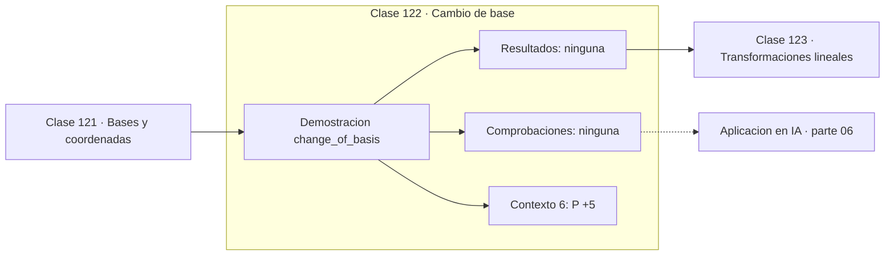

# 122 — Cambio de base

> [⬅️ 121 Bases y coordenadas](../121-bases-y-coordenadas/README.md) · [📚 Parte 06](../README.md) · [🏠 Programa](../../../README.md) · [123 Transformaciones lineales ➡️](../123-transformaciones-lineales/README.md)

**Parte:** 06 — Álgebra lineal II: descomposiciones y tensores · **Nivel:** `intermedio-avanzado` · **Horas estimadas:** 4
**Motor:** `engines.part06` · **Demostración:** `change_of_basis` · **Clase 2 de 20** de la parte

---

## 🎯 Propósito

**A y P⁻¹AP representan la misma transformación en bases distintas y comparten sus invariantes.**

Cambio de base, autovalores, diagonalización, LU, QR, mínimos cuadrados, SVD, pseudoinversa, PCA y álgebra tensorial.

## ✅ Resultados de aprendizaje

Al terminar podrás:

1. Explicar **Cambio de base** con lenguaje cotidiano y con notación matemática.
2. Resolver un caso pequeño a mano y anticipar el orden de magnitud del resultado.
3. Ejecutar y modificar `lab.py`, que corre la demostración `change_of_basis`.
4. Interpretar las 6 salidas del laboratorio y decir qué comprueba cada una.
5. Detectar el error típico de esta parte: interpretar autovalores complejos como error de cálculo.

## 🧩 Fórmulas de la clase

```text
A' = P⁻¹AP  (semejanza)
tr(A') = tr(A),  det(A') = det(A),  autovalores iguales
```

## 🗺️ Ubicación en el programa



## 📖 Fundamentos

Si `P` es la matriz cuyas columnas son los vectores de la nueva base, entonces `P⁻¹AP`
es la misma transformación expresada en esa base. La lectura de la fórmula, de derecha a
izquierda, es literal: pasar de la nueva base a la canónica (`P`), aplicar la
transformación (`A`) y volver (`P⁻¹`).

Las matrices relacionadas así se llaman **semejantes**, y comparten todo lo que no
depende de la base: traza, determinante, rango, polinomio característico y autovalores.
Esos son los **invariantes** de la transformación, y son las magnitudes que describen la
transformación en sí, no su representación.

Que la traza y el determinante sean invariantes explica por qué son iguales a la suma y
al producto de los autovalores respectivamente: los autovalores tampoco dependen de la
base, y en la base diagonal la traza es su suma y el determinante su producto.

La diagonalización de la clase 126 es el caso particular en que la nueva base está
formada por autovectores y `A'` resulta diagonal. No siempre existe esa base —hay
matrices no diagonalizables— pero para las simétricas sí, y siempre ortonormal.

## 🧮 Ejemplo trabajado

Cambio de base con P y su inversa.

```text
P = [[1, 1],     P⁻¹ = [[0.5,  0.5],
     [1,−1]]            [0.5, −0.5]]

P·P⁻¹ = I                                  ✓

v = (3,1) en base canónica
coordenadas nuevas: P⁻¹v = (2, 1)
vuelta:             P·(2,1) = (3,1)        ✓

Semejanza: A' = P⁻¹AP
  misma transformación, otra representación
  mismos autovalores, traza y determinante
```

## 🔬 Qué ejecuta el laboratorio

`change_of_basis` — Matriz de cambio de base y su inversa.

| Grupo | Salidas |
|---|---|
| 🔢 Resultados numéricos (0) | — |
| ✅ Comprobaciones de invariante (0) | — |

Las claves booleanas no son adorno: si alguna fuera `False`, el resultado numérico
no sería fiable aunque el programa terminase sin error.

```bash
python classes/part-06-algebra-lineal-ii-descomposiciones-y-tensores/122-cambio-de-base/lab.py
compmath run 122
```

> [!TIP]
> Antes de ejecutar, **escribe tu predicción**. Un laboratorio que confirma lo que
> esperabas enseña tanto como uno que te contradice, pero solo si la predicción
> existía antes del resultado.

## ⚠️ Errores conceptuales frecuentes

1. Escribir PAP⁻¹ cuando corresponde P⁻¹AP (o al revés) sin fijar la convención.
2. Suponer que matrices semejantes son iguales entrada a entrada.
3. Comparar matrices de transformaciones expresadas en bases distintas.

## 🚀 Dónde se usa de verdad

Diagonalización, análisis de sistemas dinámicos, cambio de sistema de referencia y
reducción de una forma cuadrática a ejes principales.

## 🤖 Conexión con IA

LoRA factoriza matrices de bajo rango, la atención se define con productos tensoriales y la estabilidad del entrenamiento depende del espectro de los pesos.

## 📓 Notebooks

| Archivo | Para qué |
|---|---|
| [`notebook.ipynb`](notebook.ipynb) | recorrido guiado con la demostración ejecutada |
| [`notebook_student.ipynb`](notebook_student.ipynb) | versión con `TODO` para resolver |
| [`notebook_solution.ipynb`](notebook_solution.ipynb) | solución de referencia verificada |

## 📝 Evaluación

| Criterio | Peso |
|---|---:|
| Comprensión conceptual | 25 % |
| Resolución manual | 25 % |
| Implementación y verificación | 25 % |
| Interpretación y comunicación | 15 % |
| Conexión con aplicación real | 10 % |

Detalle y criterios de error crítico en [`assessment.md`](assessment.md).

## ❓ Preguntas de comprobación

1. ¿Cuál es la entrada, cuál la salida y qué unidades tienen?
2. ¿Qué operación domina el comportamiento del resultado?
3. ¿Qué caso extremo revelaría un error conceptual?
4. ¿Cómo verificarías el resultado por un método independiente?
5. ¿Dónde aparece esto en compresión?

Si necesitas releer el código para responderlas, la clase todavía no está superada.

## 📥 Entregable

`notebook_student.ipynb` resuelto más un párrafo que explique el resultado **sin citar
código**: qué entra, qué sale, qué invariante se comprueba y qué pasaría en un caso límite.

## 📚 Bibliografía de la clase

Esta clase enseña **Álgebra lineal · Álgebra lineal numérica**. Cada obra dice qué aporta aquí y cómo se comprobó su localizador:

- [Axler, S. *Linear Algebra Done Right*, 4ª ed., Springer, 2024](https://linear.axler.net/) — Álgebra lineal: el tema de esta clase · URL de la fuente primaria comprobada en sitio oficial del autor (2026-08-19).
- [Strang, G. *Introduction to Linear Algebra*, 6ª ed., 2023, cap. 6](https://math.mit.edu/~gs/linearalgebra/) — Álgebra lineal: el tema de esta clase · ISBN-13 `9781733146678` verificado en International ISBN Agency (2026-08-19).

Bibliografía de todas las clases, con el porqué de cada obra, en [`docs/BIBLIOGRAPHY.md`](../../../docs/BIBLIOGRAPHY.md) · localizador y estado de cada obra en [`sources/bibliography.json`](../../../sources/bibliography.json).

## 📂 Material de la clase

[`intuition.md`](intuition.md) · [`theory.md`](theory.md) · [`derivation.md`](derivation.md) · [`exercises.md`](exercises.md) · [`assessment.md`](assessment.md) · [`where-is-this-used.md`](where-is-this-used.md) · [`lesson.yaml`](lesson.yaml)

---

> [⬅️ 121 Bases y coordenadas](../121-bases-y-coordenadas/README.md) · [📚 Parte 06](../README.md) · [🏠 Programa](../../../README.md) · [123 Transformaciones lineales ➡️](../123-transformaciones-lineales/README.md)
