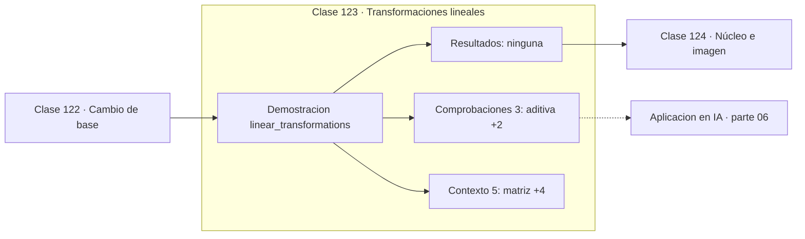

# 123 — Transformaciones lineales

> [⬅️ 122 Cambio de base](../122-cambio-de-base/README.md) · [📚 Parte 06](../README.md) · [🏠 Programa](../../../README.md) · [124 Núcleo e imagen ➡️](../124-nucleo-e-imagen/README.md)

**Parte:** 06 — Álgebra lineal II: descomposiciones y tensores · **Nivel:** `intermedio-avanzado` · **Horas estimadas:** 4
**Motor:** `engines.part06` · **Demostración:** `linear_transformations` · **Clase 3 de 20** de la parte

---

## 🎯 Propósito

**Una transformación es lineal si preserva sumas y escalados; sus columnas son las imágenes de la base.**

Cambio de base, autovalores, diagonalización, LU, QR, mínimos cuadrados, SVD, pseudoinversa, PCA y álgebra tensorial.

## ✅ Resultados de aprendizaje

Al terminar podrás:

1. Explicar **Transformaciones lineales** con lenguaje cotidiano y con notación matemática.
2. Resolver un caso pequeño a mano y anticipar el orden de magnitud del resultado.
3. Ejecutar y modificar `lab.py`, que corre la demostración `linear_transformations`.
4. Interpretar las 8 salidas del laboratorio y decir qué comprueba cada una.
5. Detectar el error típico de esta parte: confundir el orden de los índices al reordenar un tensor.

## 🧩 Fórmulas de la clase

```text
T(u+v) = T(u) + T(v)
T(ku) = k·T(u)
T(0) = 0  (condición necesaria)
```

## 🗺️ Ubicación en el programa



## 📖 Fundamentos

Una transformación lineal es la que respeta la estructura del espacio vectorial:
transformar una suma es sumar las transformaciones, y transformar un múltiplo es
multiplicar la transformación. Ambas condiciones juntas equivalen a preservar
combinaciones lineales.

De ahí se deduce inmediatamente que `T(0) = 0`. Esa condición necesaria es la que
excluye la traslación: mover el origen no es una transformación lineal, y por eso las
coordenadas homogéneas de la clase 073 tuvieron que ampliar la dimensión.

El resultado que hace todo esto operativo es que **toda transformación lineal está
determinada por lo que hace con los vectores de la base**. Si se sabe a dónde va cada
`eᵢ`, se sabe a dónde va cualquier vector, porque todo vector es combinación de la base.
Y esas imágenes son precisamente las columnas de la matriz.

La consecuencia práctica al leer código: para entender qué hace una matriz de pesos,
mirar sus columnas dice a dónde manda cada entrada; mirar sus filas dice de qué depende
cada salida. Las dos lecturas son útiles y responden preguntas distintas.

## 🧮 Ejemplo trabajado

Verificar linealidad de una escala.

```text
A = [[2,0],[0,3]]   (escala x2 en x, x3 en y)

u = (1,2),  v = (3,−1),  k = 4

Aditividad:
  A(u+v) = A(4,1) = (8,3)
  Au + Av = (2,6) + (6,−3) = (8,3)          ✓

Homogeneidad:
  A(4u) = A(4,8) = (8,24)
  4·Au  = 4·(2,6) = (8,24)                  ✓

T(0) = (0,0)                                ✓

Columnas de A: (2,0) y (0,3)
  son las imágenes de e₁ y e₂
```

## 🔬 Qué ejecuta el laboratorio

`linear_transformations` — Una transformación lineal preserva sumas y escalados.

| Grupo | Salidas |
|---|---|
| 🔢 Resultados numéricos (0) | — |
| ✅ Comprobaciones de invariante (3) | `aditiva`, `homogenea`, `T(0)=0` |

Las claves booleanas no son adorno: si alguna fuera `False`, el resultado numérico
no sería fiable aunque el programa terminase sin error.

```bash
python classes/part-06-algebra-lineal-ii-descomposiciones-y-tensores/123-transformaciones-lineales/lab.py
compmath run 123
```

> [!TIP]
> Antes de ejecutar, **escribe tu predicción**. Un laboratorio que confirma lo que
> esperabas enseña tanto como uno que te contradice, pero solo si la predicción
> existía antes del resultado.

## ⚠️ Errores conceptuales frecuentes

1. Llamar lineal a una transformación afín Wx + b.
2. Verificar solo una de las dos condiciones.
3. Olvidar que las columnas son las imágenes de la base, no las filas.

## 🚀 Dónde se usa de verdad

Capas densas, transformaciones geométricas, filtros lineales y cualquier operación que
deba conmutar con la suma de sus entradas.

## 🤖 Conexión con IA

LoRA factoriza matrices de bajo rango, la atención se define con productos tensoriales y la estabilidad del entrenamiento depende del espectro de los pesos.

## 📓 Notebooks

| Archivo | Para qué |
|---|---|
| [`notebook.ipynb`](notebook.ipynb) | recorrido guiado con la demostración ejecutada |
| [`notebook_student.ipynb`](notebook_student.ipynb) | versión con `TODO` para resolver |
| [`notebook_solution.ipynb`](notebook_solution.ipynb) | solución de referencia verificada |

## 📝 Evaluación

| Criterio | Peso |
|---|---:|
| Comprensión conceptual | 25 % |
| Resolución manual | 25 % |
| Implementación y verificación | 25 % |
| Interpretación y comunicación | 15 % |
| Conexión con aplicación real | 10 % |

Detalle y criterios de error crítico en [`assessment.md`](assessment.md).

## ❓ Preguntas de comprobación

1. ¿Cuál es la entrada, cuál la salida y qué unidades tienen?
2. ¿Qué operación domina el comportamiento del resultado?
3. ¿Qué caso extremo revelaría un error conceptual?
4. ¿Cómo verificarías el resultado por un método independiente?
5. ¿Dónde aparece esto en compresión?

Si necesitas releer el código para responderlas, la clase todavía no está superada.

## 📥 Entregable

`notebook_student.ipynb` resuelto más un párrafo que explique el resultado **sin citar
código**: qué entra, qué sale, qué invariante se comprueba y qué pasaría en un caso límite.

## 🔗 Referencias

- [Axler, S. *Linear Algebra Done Right*, 4ª ed., Springer, 2024, cap. 3](https://linear.axler.net/) — *uso:* obra de referencia consultada en «Transformaciones lineales».
- [3Blue1Brown. *Linear transformations and matrices*](https://www.3blue1brown.com/lessons/linear-transformations) — *uso:* exposición alternativa del tema en «Transformaciones lineales».

Bibliografía completa de la parte en [`../../../docs/BIBLIOGRAPHY.md`](../../../docs/BIBLIOGRAPHY.md) · localizador verificable de cada obra en [`sources/bibliography.json`](../../../sources/bibliography.json).

## 📂 Material de la clase

[`intuition.md`](intuition.md) · [`theory.md`](theory.md) · [`derivation.md`](derivation.md) · [`exercises.md`](exercises.md) · [`assessment.md`](assessment.md) · [`where-is-this-used.md`](where-is-this-used.md) · [`lesson.yaml`](lesson.yaml)

---

> [⬅️ 122 Cambio de base](../122-cambio-de-base/README.md) · [📚 Parte 06](../README.md) · [🏠 Programa](../../../README.md) · [124 Núcleo e imagen ➡️](../124-nucleo-e-imagen/README.md)
