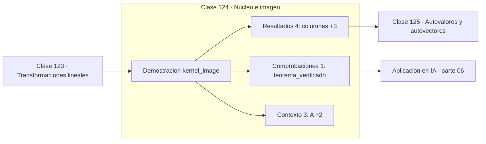

# 124 — Núcleo e imagen

> [⬅️ 123 Transformaciones lineales](../123-transformaciones-lineales/README.md) · [📚 Parte 06](../README.md) · [🏠 Programa](../../../README.md) · [125 Autovalores y autovectores ➡️](../125-autovalores-y-autovectores/README.md)

**Parte:** 06 — Álgebra lineal II: descomposiciones y tensores · **Nivel:** `intermedio-avanzado` · **Horas estimadas:** 4
**Motor:** `engines.part06` · **Demostración:** `kernel_image` · **Clase 4 de 20** de la parte

---

## 🎯 Propósito

**Lo que no llega a la imagen se pierde en el núcleo: rango más nulidad es el número de columnas.**

Cambio de base, autovalores, diagonalización, LU, QR, mínimos cuadrados, SVD, pseudoinversa, PCA y álgebra tensorial.

## ✅ Resultados de aprendizaje

Al terminar podrás:

1. Explicar **Núcleo e imagen** con lenguaje cotidiano y con notación matemática.
2. Resolver un caso pequeño a mano y anticipar el orden de magnitud del resultado.
3. Ejecutar y modificar `lab.py`, que corre la demostración `kernel_image`.
4. Interpretar las 8 salidas del laboratorio y decir qué comprueba cada una.
5. Detectar el error típico de esta parte: aplicar pca sin centrar (ni escalar) los datos.

## 🧩 Fórmulas de la clase

```text
núcleo = {x : Ax = 0}
imagen = espacio columna
rango + nulidad = n
```

## 🗺️ Ubicación en el programa



## 📖 Fundamentos

El **núcleo** de una transformación es el conjunto de vectores que manda al cero, y la
**imagen** es el conjunto de vectores alcanzables. Ambos son subespacios, y el teorema
del rango-nulidad los relaciona: la suma de sus dimensiones es el número de columnas.

La lectura es de conservación: cada dimensión de entrada o bien sobrevive en la imagen o
bien colapsa en el núcleo. No hay una tercera opción. Si una transformación de ℝ³ en ℝ²
tiene rango 2, su núcleo tiene dimensión 1: hay una recta entera de vectores distintos
que producen la misma salida.

Esa pérdida es irreversible. Si el núcleo no es trivial, la transformación no es
inyectiva y no se puede invertir: dada una salida, no se sabe de qué entrada vino. Es la
versión lineal de la inyectividad de la clase 086, y es la razón por la que una capa que
reduce dimensión pierde información necesariamente.

El núcleo también describe la **no unicidad** de la solución de un sistema: si `x₀`
resuelve `Ax = b`, entonces `x₀ + k` también lo resuelve para cualquier `k` del núcleo.
Por eso un sistema con núcleo no trivial tiene infinitas soluciones, y por eso la
pseudoinversa (clase 134) elige entre ellas la de norma mínima.

## 🧮 Ejemplo trabajado

Núcleo e imagen de una matriz 2×3 de rango 1.

```text
A = [[1, 2, 3],
     [2, 4, 6]]        (fila2 = 2·fila1)

rango = 1     (dimensión de la imagen)
columnas = 3
nulidad = 3 − 1 = 2                        ✓ teorema

Un vector del núcleo: (2, −1, 0)
  A·(2,−1,0) = (2−2+0, 4−4+0) = (0,0)      ✓

Consecuencia: A no es inyectiva.
Infinitos vectores distintos dan la misma salida.
```

## 🔬 Qué ejecuta el laboratorio

`kernel_image` — Núcleo, imagen y teorema del rango-nulidad.

| Grupo | Salidas |
|---|---|
| 🔢 Resultados numéricos (4) | `columnas`, `rango_(dim_imagen)`, `nulidad_(dim_nucleo)`, `rango+nulidad` |
| ✅ Comprobaciones de invariante (1) | `teorema_verificado` |

Las claves booleanas no son adorno: si alguna fuera `False`, el resultado numérico
no sería fiable aunque el programa terminase sin error.

```bash
python classes/part-06-algebra-lineal-ii-descomposiciones-y-tensores/124-nucleo-e-imagen/lab.py
compmath run 124
```

> [!TIP]
> Antes de ejecutar, **escribe tu predicción**. Un laboratorio que confirma lo que
> esperabas enseña tanto como uno que te contradice, pero solo si la predicción
> existía antes del resultado.

## ⚠️ Errores conceptuales frecuentes

1. Confundir el núcleo (en el dominio) con la imagen (en el codominio).
2. Suponer que núcleo trivial implica sobreyectividad.
3. Olvidar que el teorema cuenta las columnas, no las filas.

## 🚀 Dónde se usa de verdad

Unicidad de soluciones, pérdida de información en capas con reducción de dimensión,
análisis de identificabilidad de modelos y espacios nulos en optimización con
restricciones.

## 🤖 Conexión con IA

LoRA factoriza matrices de bajo rango, la atención se define con productos tensoriales y la estabilidad del entrenamiento depende del espectro de los pesos.

## 📓 Notebooks

| Archivo | Para qué |
|---|---|
| [`notebook.ipynb`](notebook.ipynb) | recorrido guiado con la demostración ejecutada |
| [`notebook_student.ipynb`](notebook_student.ipynb) | versión con `TODO` para resolver |
| [`notebook_solution.ipynb`](notebook_solution.ipynb) | solución de referencia verificada |

## 📝 Evaluación

| Criterio | Peso |
|---|---:|
| Comprensión conceptual | 25 % |
| Resolución manual | 25 % |
| Implementación y verificación | 25 % |
| Interpretación y comunicación | 15 % |
| Conexión con aplicación real | 10 % |

Detalle y criterios de error crítico en [`assessment.md`](assessment.md).

## ❓ Preguntas de comprobación

1. ¿Cuál es la entrada, cuál la salida y qué unidades tienen?
2. ¿Qué operación domina el comportamiento del resultado?
3. ¿Qué caso extremo revelaría un error conceptual?
4. ¿Cómo verificarías el resultado por un método independiente?
5. ¿Dónde aparece esto en compresión?

Si necesitas releer el código para responderlas, la clase todavía no está superada.

## 📥 Entregable

`notebook_student.ipynb` resuelto más un párrafo que explique el resultado **sin citar
código**: qué entra, qué sale, qué invariante se comprueba y qué pasaría en un caso límite.

## 📚 Bibliografía de la clase

Esta clase enseña **Álgebra lineal · Álgebra lineal numérica**. Cada obra dice qué aporta aquí y cómo se comprobó su localizador:

- [Strang, G. *Introduction to Linear Algebra*, 6ª ed., 2023, cap. 3](https://math.mit.edu/~gs/linearalgebra/) — Álgebra lineal: el tema de esta clase · ISBN-13 `9781733146678` verificado en International ISBN Agency (2026-08-19).
- [Axler, S. *Linear Algebra Done Right*, 4ª ed., Springer, 2024](https://linear.axler.net/) — Álgebra lineal: el tema de esta clase · URL de la fuente primaria comprobada en sitio oficial del autor (2026-08-19).

Bibliografía de todas las clases, con el porqué de cada obra, en [`docs/BIBLIOGRAPHY.md`](../../../docs/BIBLIOGRAPHY.md) · localizador y estado de cada obra en [`sources/bibliography.json`](../../../sources/bibliography.json).

## 📂 Material de la clase

[`intuition.md`](intuition.md) · [`theory.md`](theory.md) · [`derivation.md`](derivation.md) · [`exercises.md`](exercises.md) · [`assessment.md`](assessment.md) · [`where-is-this-used.md`](where-is-this-used.md) · [`lesson.yaml`](lesson.yaml)

---

> [⬅️ 123 Transformaciones lineales](../123-transformaciones-lineales/README.md) · [📚 Parte 06](../README.md) · [🏠 Programa](../../../README.md) · [125 Autovalores y autovectores ➡️](../125-autovalores-y-autovectores/README.md)
