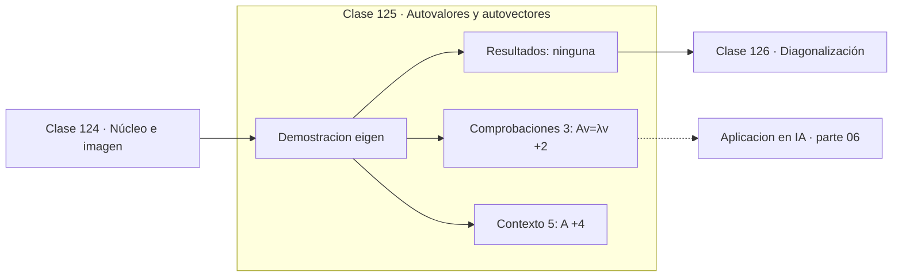

# 125 — Autovalores y autovectores

> [⬅️ 124 Núcleo e imagen](../124-nucleo-e-imagen/README.md) · [📚 Parte 06](../README.md) · [🏠 Programa](../../../README.md) · [126 Diagonalización ➡️](../126-diagonalizacion/README.md)

**Parte:** 06 — Álgebra lineal II: descomposiciones y tensores · **Nivel:** `intermedio-avanzado` · **Horas estimadas:** 4
**Motor:** `engines.part06` · **Demostración:** `eigen` · **Clase 5 de 20** de la parte

---

## 🎯 Propósito

**Un autovector es una dirección que la transformación solo escala; su factor es el autovalor.**

Cambio de base, autovalores, diagonalización, LU, QR, mínimos cuadrados, SVD, pseudoinversa, PCA y álgebra tensorial.

## ✅ Resultados de aprendizaje

Al terminar podrás:

1. Explicar **Autovalores y autovectores** con lenguaje cotidiano y con notación matemática.
2. Resolver un caso pequeño a mano y anticipar el orden de magnitud del resultado.
3. Ejecutar y modificar `lab.py`, que corre la demostración `eigen`.
4. Interpretar las 8 salidas del laboratorio y decir qué comprueba cada una.
5. Detectar el error típico de esta parte: interpretar autovalores complejos como error de cálculo.

## 🧩 Fórmulas de la clase

```text
Av = λv,  v ≠ 0
Σλᵢ = tr(A),   Πλᵢ = det(A)
```

## 🗺️ Ubicación en el programa



## 📖 Fundamentos

Casi todo vector cambia de dirección al aplicarle una transformación. Los **autovectores**
son las excepciones: direcciones que solo se estiran o encogen, con factor el
**autovalor**. Encontrarlas es encontrar los ejes naturales de la transformación.

Las dos identidades que conectan autovalores con invariantes son muy útiles como
verificación: su suma es la traza y su producto el determinante. Comprobarlas cuesta
nada y detecta errores de cálculo de inmediato, que es por lo que el laboratorio las
incluye.

Para matrices **simétricas** —el caso que más importa aquí— los autovalores son reales y
los autovectores ortogonales. Ese resultado, el teorema espectral, no vale para matrices
generales: una rotación en el plano no tiene autovectores reales, porque ninguna
dirección se conserva. Sus autovalores son complejos, y su parte imaginaria codifica el
ángulo.

El método de cálculo del motor es la **iteración de Jacobi**, que anula sistemáticamente
los elementos fuera de la diagonal mediante rotaciones. Es estable, converge siempre
para simétricas y es fácil de leer, aunque no sea el más rápido. En la práctica
profesional se usa el algoritmo QR con desplazamientos.

## 🧮 Ejemplo trabajado

Autovalores de una matriz simétrica 2×2.

```text
A = [[4, 1],
     [1, 3]]

autovalores: λ₁ = 4.6180,  λ₂ = 2.3820
autovector dominante: (0.8507, 0.5257)

Verificación Av = λv:
  A·v = (3.9284, 2.4272)
  λ₁·v = (3.9284, 2.4272)                  ✓

Invariantes:
  suma  4.6180 + 2.3820 = 7 = tr(A)        ✓
  producto 4.6180 · 2.3820 = 11 = det(A)   ✓
```

## 🔬 Qué ejecuta el laboratorio

`eigen` — Autovalores: direcciones que la transformación solo escala.

| Grupo | Salidas |
|---|---|
| 🔢 Resultados numéricos (0) | — |
| ✅ Comprobaciones de invariante (3) | `Av=λv`, `traza_es_suma_de_autovalores`, `det_es_producto_de_autovalores` |

Las claves booleanas no son adorno: si alguna fuera `False`, el resultado numérico
no sería fiable aunque el programa terminase sin error.

```bash
python classes/part-06-algebra-lineal-ii-descomposiciones-y-tensores/125-autovalores-y-autovectores/lab.py
compmath run 125
```

> [!TIP]
> Antes de ejecutar, **escribe tu predicción**. Un laboratorio que confirma lo que
> esperabas enseña tanto como uno que te contradice, pero solo si la predicción
> existía antes del resultado.

## ⚠️ Errores conceptuales frecuentes

1. Buscar autovectores reales en matrices de rotación.
2. Olvidar normalizar los autovectores al compararlos.
3. No verificar con la traza y el determinante.

## 🚀 Dónde se usa de verdad

PCA, análisis de estabilidad de sistemas dinámicos, PageRank, modos de vibración y
curvatura del Hessiano en optimización.

## 🤖 Conexión con IA

LoRA factoriza matrices de bajo rango, la atención se define con productos tensoriales y la estabilidad del entrenamiento depende del espectro de los pesos.

## 📓 Notebooks

| Archivo | Para qué |
|---|---|
| [`notebook.ipynb`](notebook.ipynb) | recorrido guiado con la demostración ejecutada |
| [`notebook_student.ipynb`](notebook_student.ipynb) | versión con `TODO` para resolver |
| [`notebook_solution.ipynb`](notebook_solution.ipynb) | solución de referencia verificada |

## 📝 Evaluación

| Criterio | Peso |
|---|---:|
| Comprensión conceptual | 25 % |
| Resolución manual | 25 % |
| Implementación y verificación | 25 % |
| Interpretación y comunicación | 15 % |
| Conexión con aplicación real | 10 % |

Detalle y criterios de error crítico en [`assessment.md`](assessment.md).

## ❓ Preguntas de comprobación

1. ¿Cuál es la entrada, cuál la salida y qué unidades tienen?
2. ¿Qué operación domina el comportamiento del resultado?
3. ¿Qué caso extremo revelaría un error conceptual?
4. ¿Cómo verificarías el resultado por un método independiente?
5. ¿Dónde aparece esto en compresión?

Si necesitas releer el código para responderlas, la clase todavía no está superada.

## 📥 Entregable

`notebook_student.ipynb` resuelto más un párrafo que explique el resultado **sin citar
código**: qué entra, qué sale, qué invariante se comprueba y qué pasaría en un caso límite.

## 🔗 Referencias

- [Trefethen & Bau. *Numerical Linear Algebra*, SIAM, 1997, lecc. 24-29](https://epubs.siam.org/doi/book/10.1137/1.9780898719574)
- [Strang, G. *Introduction to Linear Algebra*, 6ª ed., 2023, cap. 6](https://math.mit.edu/~gs/linearalgebra/)

Bibliografía completa de la parte en [`../../../docs/BIBLIOGRAPHY.md`](../../../docs/BIBLIOGRAPHY.md).

## 📂 Material de la clase

[`intuition.md`](intuition.md) · [`theory.md`](theory.md) · [`derivation.md`](derivation.md) · [`exercises.md`](exercises.md) · [`assessment.md`](assessment.md) · [`where-is-this-used.md`](where-is-this-used.md) · [`lesson.yaml`](lesson.yaml)

---

> [⬅️ 124 Núcleo e imagen](../124-nucleo-e-imagen/README.md) · [📚 Parte 06](../README.md) · [🏠 Programa](../../../README.md) · [126 Diagonalización ➡️](../126-diagonalizacion/README.md)
