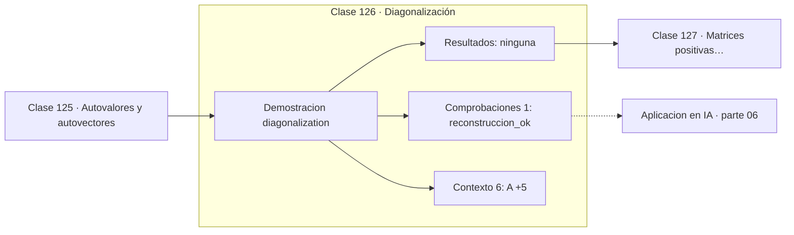

# 126 — Diagonalización

> [⬅️ 125 Autovalores y autovectores](../125-autovalores-y-autovectores/README.md) · [📚 Parte 06](../README.md) · [🏠 Programa](../../../README.md) · [127 Matrices positivas definidas ➡️](../127-matrices-positivas-definidas/README.md)

**Parte:** 06 — Álgebra lineal II: descomposiciones y tensores · **Nivel:** `intermedio-avanzado` · **Horas estimadas:** 4
**Motor:** `engines.part06` · **Demostración:** `diagonalization` · **Clase 6 de 20** de la parte

---

## 🎯 Propósito

**Diagonalizar es elegir la base donde la transformación solo escala, y ahí las potencias son triviales.**

Cambio de base, autovalores, diagonalización, LU, QR, mínimos cuadrados, SVD, pseudoinversa, PCA y álgebra tensorial.

## ✅ Resultados de aprendizaje

Al terminar podrás:

1. Explicar **Diagonalización** con lenguaje cotidiano y con notación matemática.
2. Resolver un caso pequeño a mano y anticipar el orden de magnitud del resultado.
3. Ejecutar y modificar `lab.py`, que corre la demostración `diagonalization`.
4. Interpretar las 7 salidas del laboratorio y decir qué comprueba cada una.
5. Detectar el error típico de esta parte: confundir el orden de los índices al reordenar un tensor.

## 🧩 Fórmulas de la clase

```text
A = PDP⁻¹,  D diagonal de autovalores
simétrica: A = QDQᵀ con Q ortogonal
Aᵏ = PDᵏP⁻¹
```

## 🗺️ Ubicación en el programa



## 📖 Fundamentos

Si una matriz tiene una base completa de autovectores, se puede escribir como `PDP⁻¹`
con `D` diagonal. Esa factorización es un cambio de base: pasar a la base de
autovectores, escalar cada eje por su autovalor y volver.

La ganancia práctica más visible está en las potencias. `A¹⁰⁰ = PD¹⁰⁰P⁻¹`, y elevar una
diagonal a la centésima es elevar sus entradas. De multiplicar cien matrices se pasa a
elevar n números. Es lo que permite analizar el comportamiento a largo plazo de una
cadena de Markov (clase 199) sin simularla.

Para matrices simétricas el resultado es aún mejor: la base de autovectores puede
elegirse **ortonormal**, así que `P` es ortogonal y `P⁻¹ = Pᵀ`. La factorización queda
`A = QDQᵀ`, sin necesidad de invertir nada. Es el teorema espectral, y es la razón por la
que las matrices simétricas son tan cómodas.

No toda matriz es diagonalizable. Las que tienen autovalores repetidos sin suficientes
autovectores independientes no lo son, y para ellas existe la forma de Jordan. En la
práctica numérica ese caso es inestable y se prefiere la SVD, que siempre existe.

## 🧮 Ejemplo trabajado

Diagonalizar una simétrica y elevarla a la décima.

```text
A = [[4,1],[1,3]]

D = diag(4.6180, 2.3820)
Q = matriz ortogonal de autovectores

QDQᵀ reconstruye A                         ✓

A¹⁰ vía diagonalización:
  Q·diag(4.6180¹⁰, 2.3820¹⁰)·Qᵀ
  = [[ 4 259 552, 2 632 158],
     [ 2 632 158, 1 627 394]]

Coste: 2 exponenciaciones frente a 10 productos de matrices
```

## 🔬 Qué ejecuta el laboratorio

`diagonalization` — A = PDP⁻¹: la base donde la transformación solo escala.

| Grupo | Salidas |
|---|---|
| 🔢 Resultados numéricos (0) | — |
| ✅ Comprobaciones de invariante (1) | `reconstruccion_ok` |

Las claves booleanas no son adorno: si alguna fuera `False`, el resultado numérico
no sería fiable aunque el programa terminase sin error.

```bash
python classes/part-06-algebra-lineal-ii-descomposiciones-y-tensores/126-diagonalizacion/lab.py
compmath run 126
```

> [!TIP]
> Antes de ejecutar, **escribe tu predicción**. Un laboratorio que confirma lo que
> esperabas enseña tanto como uno que te contradice, pero solo si la predicción
> existía antes del resultado.

## ⚠️ Errores conceptuales frecuentes

1. Suponer que toda matriz es diagonalizable.
2. Invertir P cuando la matriz es simétrica y bastaría transponer.
3. Usar diagonalización en matrices no simétricas mal condicionadas: preferir SVD.

## 🚀 Dónde se usa de verdad

Potencias de matrices, cadenas de Markov, análisis modal, PCA y ecuaciones diferenciales
lineales.

## 🤖 Conexión con IA

LoRA factoriza matrices de bajo rango, la atención se define con productos tensoriales y la estabilidad del entrenamiento depende del espectro de los pesos.

## 📓 Notebooks

| Archivo | Para qué |
|---|---|
| [`notebook.ipynb`](notebook.ipynb) | recorrido guiado con la demostración ejecutada |
| [`notebook_student.ipynb`](notebook_student.ipynb) | versión con `TODO` para resolver |
| [`notebook_solution.ipynb`](notebook_solution.ipynb) | solución de referencia verificada |

## 📝 Evaluación

| Criterio | Peso |
|---|---:|
| Comprensión conceptual | 25 % |
| Resolución manual | 25 % |
| Implementación y verificación | 25 % |
| Interpretación y comunicación | 15 % |
| Conexión con aplicación real | 10 % |

Detalle y criterios de error crítico en [`assessment.md`](assessment.md).

## ❓ Preguntas de comprobación

1. ¿Cuál es la entrada, cuál la salida y qué unidades tienen?
2. ¿Qué operación domina el comportamiento del resultado?
3. ¿Qué caso extremo revelaría un error conceptual?
4. ¿Cómo verificarías el resultado por un método independiente?
5. ¿Dónde aparece esto en compresión?

Si necesitas releer el código para responderlas, la clase todavía no está superada.

## 📥 Entregable

`notebook_student.ipynb` resuelto más un párrafo que explique el resultado **sin citar
código**: qué entra, qué sale, qué invariante se comprueba y qué pasaría en un caso límite.

## 🔗 Referencias

- [Strang, G. *Introduction to Linear Algebra*, 6ª ed., 2023, cap. 6](https://math.mit.edu/~gs/linearalgebra/) — *uso:* exposición alternativa del tema en «Diagonalización».
- [Golub & Van Loan. *Matrix Computations*, 4ª ed., 2013](https://jhupbooks.press.jhu.edu/title/matrix-computations) — *uso:* obra de referencia consultada en «Diagonalización».

Bibliografía completa de la parte en [`../../../docs/BIBLIOGRAPHY.md`](../../../docs/BIBLIOGRAPHY.md) · localizador verificable de cada obra en [`sources/bibliography.json`](../../../sources/bibliography.json).

## 📂 Material de la clase

[`intuition.md`](intuition.md) · [`theory.md`](theory.md) · [`derivation.md`](derivation.md) · [`exercises.md`](exercises.md) · [`assessment.md`](assessment.md) · [`where-is-this-used.md`](where-is-this-used.md) · [`lesson.yaml`](lesson.yaml)

---

> [⬅️ 125 Autovalores y autovectores](../125-autovalores-y-autovectores/README.md) · [📚 Parte 06](../README.md) · [🏠 Programa](../../../README.md) · [127 Matrices positivas definidas ➡️](../127-matrices-positivas-definidas/README.md)
