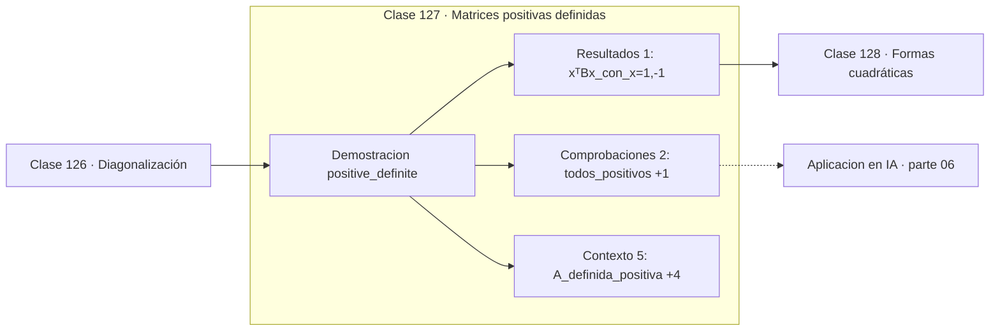

# 127 — Matrices positivas definidas

> [⬅️ 126 Diagonalización](../126-diagonalizacion/README.md) · [📚 Parte 06](../README.md) · [🏠 Programa](../../../README.md) · [128 Formas cuadráticas ➡️](../128-formas-cuadraticas/README.md)

**Parte:** 06 — Álgebra lineal II: descomposiciones y tensores · **Nivel:** `intermedio-avanzado` · **Horas estimadas:** 4
**Motor:** `engines.part06` · **Demostración:** `positive_definite` · **Clase 7 de 20** de la parte

---

## 🎯 Propósito

**Definida positiva significa todos los autovalores positivos, y equivale a que xᵀAx sea siempre positivo.**

Cambio de base, autovalores, diagonalización, LU, QR, mínimos cuadrados, SVD, pseudoinversa, PCA y álgebra tensorial.

## ✅ Resultados de aprendizaje

Al terminar podrás:

1. Explicar **Matrices positivas definidas** con lenguaje cotidiano y con notación matemática.
2. Resolver un caso pequeño a mano y anticipar el orden de magnitud del resultado.
3. Ejecutar y modificar `lab.py`, que corre la demostración `positive_definite`.
4. Interpretar las 8 salidas del laboratorio y decir qué comprueba cada una.
5. Detectar el error típico de esta parte: aplicar pca sin centrar (ni escalar) los datos.

## 🧩 Fórmulas de la clase

```text
A ≻ 0 ⟺ xᵀAx > 0 para todo x ≠ 0 ⟺ todos los λᵢ > 0
criterio de Sylvester: todos los menores principales positivos
```

## 🗺️ Ubicación en el programa



## 📖 Fundamentos

Una matriz simétrica es definida positiva si su forma cuadrática es siempre positiva
salvo en el origen. Las tres caracterizaciones —forma cuadrática, autovalores y menores
principales— son equivalentes, y cada una es la más cómoda en un contexto distinto.

Esta propiedad es la que hace «bien portados» a los objetos donde aparece. Una **matriz
de covarianza** es siempre semidefinida positiva, porque su forma cuadrática es la
varianza de una combinación lineal, que no puede ser negativa. Un **Hessiano definido
positivo** en un punto crítico garantiza que es un mínimo (clase 169). Una **matriz de
Gram** de un kernel válido debe ser semidefinida positiva, y esa es la condición de
Mercer (clase 290).

La distinción entre definida y semidefinida importa: semidefinida permite autovalores
nulos, lo que significa direcciones planas. Una covarianza semidefinida pero no definida
indica que hay una combinación lineal de las variables con varianza cero, es decir,
dependencia lineal exacta entre features.

Numéricamente, la comprobación robusta no es calcular autovalores sino intentar la
**factorización de Cholesky**: existe si y solo si la matriz es definida positiva, y
cuesta la mitad que una LU. Es lo que hacen las bibliotecas para comprobar la condición.

## 🧮 Ejemplo trabajado

Una definida positiva y una indefinida.

```text
A = [[4,1],[1,3]]        autovalores 4.618, 2.382   → todos > 0  ✓ definida positiva
B = [[1,2],[2,1]]        autovalores 3, −1          → signos mixtos ✗ indefinida

Forma cuadrática con x = (1,−1):
  xᵀBx = 1 − 2 − 2 + 1 = −2 < 0          ✗ confirma que B no es definida positiva

Criterio de Sylvester para A:
  menor 1×1: 4 > 0                       ✓
  menor 2×2: det = 11 > 0                ✓
```

## 🔬 Qué ejecuta el laboratorio

`positive_definite` — Definida positiva: todos los autovalores positivos, xᵀAx > 0.

| Grupo | Salidas |
|---|---|
| 🔢 Resultados numéricos (1) | `xᵀBx_con_x=(1,-1)` |
| ✅ Comprobaciones de invariante (2) | `todos_positivos`, `criterio_de_Sylvester_A` |

Las claves booleanas no son adorno: si alguna fuera `False`, el resultado numérico
no sería fiable aunque el programa terminase sin error.

```bash
python classes/part-06-algebra-lineal-ii-descomposiciones-y-tensores/127-matrices-positivas-definidas/lab.py
compmath run 127
```

> [!TIP]
> Antes de ejecutar, **escribe tu predicción**. Un laboratorio que confirma lo que
> esperabas enseña tanto como uno que te contradice, pero solo si la predicción
> existía antes del resultado.

## ⚠️ Errores conceptuales frecuentes

1. Comprobar la condición solo en algunos vectores x en lugar de usar los autovalores.
2. Confundir definida positiva con «todas las entradas positivas».
3. Olvidar que la propiedad solo está definida para matrices simétricas.

## 🚀 Dónde se usa de verdad

Matrices de covarianza, condición de mínimo en optimización, kernels válidos, métodos de
Newton y muestreo de gaussianas multivariantes por Cholesky.

## 🤖 Conexión con IA

LoRA factoriza matrices de bajo rango, la atención se define con productos tensoriales y la estabilidad del entrenamiento depende del espectro de los pesos.

## 📓 Notebooks

| Archivo | Para qué |
|---|---|
| [`notebook.ipynb`](notebook.ipynb) | recorrido guiado con la demostración ejecutada |
| [`notebook_student.ipynb`](notebook_student.ipynb) | versión con `TODO` para resolver |
| [`notebook_solution.ipynb`](notebook_solution.ipynb) | solución de referencia verificada |

## 📝 Evaluación

| Criterio | Peso |
|---|---:|
| Comprensión conceptual | 25 % |
| Resolución manual | 25 % |
| Implementación y verificación | 25 % |
| Interpretación y comunicación | 15 % |
| Conexión con aplicación real | 10 % |

Detalle y criterios de error crítico en [`assessment.md`](assessment.md).

## ❓ Preguntas de comprobación

1. ¿Cuál es la entrada, cuál la salida y qué unidades tienen?
2. ¿Qué operación domina el comportamiento del resultado?
3. ¿Qué caso extremo revelaría un error conceptual?
4. ¿Cómo verificarías el resultado por un método independiente?
5. ¿Dónde aparece esto en compresión?

Si necesitas releer el código para responderlas, la clase todavía no está superada.

## 📥 Entregable

`notebook_student.ipynb` resuelto más un párrafo que explique el resultado **sin citar
código**: qué entra, qué sale, qué invariante se comprueba y qué pasaría en un caso límite.

## 🔗 Referencias

- [Boyd & Vandenberghe. *Convex Optimization*. Cambridge, 2004, apéndice A](https://web.stanford.edu/~boyd/cvxbook/)
- [Horn & Johnson. *Matrix Analysis*, 2ª ed., Cambridge, 2012](https://www.cambridge.org/core/books/matrix-analysis/8C8B0C4A0C8E4B9C0C0C0C0C0C0C0C0C)

Bibliografía completa de la parte en [`../../../docs/BIBLIOGRAPHY.md`](../../../docs/BIBLIOGRAPHY.md).

## 📂 Material de la clase

[`intuition.md`](intuition.md) · [`theory.md`](theory.md) · [`derivation.md`](derivation.md) · [`exercises.md`](exercises.md) · [`assessment.md`](assessment.md) · [`where-is-this-used.md`](where-is-this-used.md) · [`lesson.yaml`](lesson.yaml)

---

> [⬅️ 126 Diagonalización](../126-diagonalizacion/README.md) · [📚 Parte 06](../README.md) · [🏠 Programa](../../../README.md) · [128 Formas cuadráticas ➡️](../128-formas-cuadraticas/README.md)
