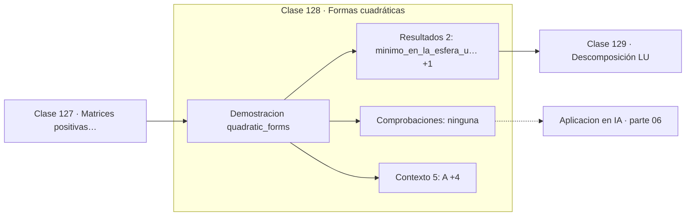

# 128 — Formas cuadráticas

> [⬅️ 127 Matrices positivas definidas](../127-matrices-positivas-definidas/README.md) · [📚 Parte 06](../README.md) · [🏠 Programa](../../../README.md) · [129 Descomposición LU ➡️](../129-descomposicion-lu/README.md)

**Parte:** 06 — Álgebra lineal II: descomposiciones y tensores · **Nivel:** `intermedio-avanzado` · **Horas estimadas:** 4
**Motor:** `engines.part06` · **Demostración:** `quadratic_forms` · **Clase 8 de 20** de la parte

---

## 🎯 Propósito

**Una forma cuadrática tiene curvas de nivel elípticas cuando su matriz es definida positiva, y los ejes son los autovectores.**

Cambio de base, autovalores, diagonalización, LU, QR, mínimos cuadrados, SVD, pseudoinversa, PCA y álgebra tensorial.

## ✅ Resultados de aprendizaje

Al terminar podrás:

1. Explicar **Formas cuadráticas** con lenguaje cotidiano y con notación matemática.
2. Resolver un caso pequeño a mano y anticipar el orden de magnitud del resultado.
3. Ejecutar y modificar `lab.py`, que corre la demostración `quadratic_forms`.
4. Interpretar las 7 salidas del laboratorio y decir qué comprueba cada una.
5. Detectar el error típico de esta parte: interpretar autovalores complejos como error de cálculo.

## 🧩 Fórmulas de la clase

```text
q(x) = xᵀAx
∇q = 2Ax  (A simétrica)
máx y mín sobre ‖x‖=1: mayor y menor autovalor
```

## 🗺️ Ubicación en el programa



## 📖 Fundamentos

Una forma cuadrática es un polinomio homogéneo de grado dos escrito matricialmente. Su
geometría la determinan los autovalores de `A`: si todos son positivos, las curvas de
nivel son elipses; si hay signos mixtos, hiperbolas; si alguno es cero, la forma es
degenerada en esa dirección.

Los **ejes de las elipses son los autovectores** y sus longitudes dependen de los
autovalores. Cuanto más dispares sean los autovalores, más alargadas son las elipses, y
esa excentricidad es exactamente el número de condición. Ese es el vínculo entre álgebra
lineal y velocidad de convergencia: el descenso de gradiente zigzaguea en valles
alargados (clase 244).

El gradiente de una forma cuadrática es `2Ax` cuando A es simétrica, y ese es el ejemplo
canónico de derivada matricial (clase 177). Igualar a cero da `Ax = 0`, lo que confirma
que el único punto crítico de una forma definida positiva es el origen, y es un mínimo.

Los valores extremos sobre la esfera unitaria son el mayor y el menor autovalor,
resultado conocido como cociente de Rayleigh. Es lo que hace que la primera componente
principal maximice la varianza proyectada (clase 135): maximizar `xᵀΣx` con `‖x‖=1` da
el autovector dominante.

## 🧮 Ejemplo trabajado

Forma cuadrática con matriz definida positiva.

```text
A = [[4,1],[1,3]]
q(x) = 4x₁² + 2x₁x₂ + 3x₂²

valores en cuatro direcciones unitarias:
  (1,0)  → 4
  (0,1)  → 3
  (1,1)  → 10
  (1,−1) → 6

Extremos sobre ‖x‖ = 1:
  mínimo = λ_min = 2.3820
  máximo = λ_max = 4.6180

Gradiente en (1,1): 2A(1,1) = (10, 8)

Curvas de nivel: elipses (A es definida positiva)
```

## 🔬 Qué ejecuta el laboratorio

`quadratic_forms` — La forma cuadrática xᵀAx y sus curvas de nivel.

| Grupo | Salidas |
|---|---|
| 🔢 Resultados numéricos (2) | `minimo_en_la_esfera_unitaria`, `maximo_en_la_esfera_unitaria` |
| ✅ Comprobaciones de invariante (0) | — |

Las claves booleanas no son adorno: si alguna fuera `False`, el resultado numérico
no sería fiable aunque el programa terminase sin error.

```bash
python classes/part-06-algebra-lineal-ii-descomposiciones-y-tensores/128-formas-cuadraticas/lab.py
compmath run 128
```

> [!TIP]
> Antes de ejecutar, **escribe tu predicción**. Un laboratorio que confirma lo que
> esperabas enseña tanto como uno que te contradice, pero solo si la predicción
> existía antes del resultado.

## ⚠️ Errores conceptuales frecuentes

1. Escribir la forma cuadrática con una matriz no simétrica sin simetrizarla.
2. Olvidar el factor 2 en el gradiente.
3. Suponer que las curvas de nivel son circulares cuando los autovalores difieren.

## 🚀 Dónde se usa de verdad

Función objetivo de mínimos cuadrados, energía en física, análisis de curvatura y
diagnóstico de velocidad de convergencia en optimización.

## 🤖 Conexión con IA

LoRA factoriza matrices de bajo rango, la atención se define con productos tensoriales y la estabilidad del entrenamiento depende del espectro de los pesos.

## 📓 Notebooks

| Archivo | Para qué |
|---|---|
| [`notebook.ipynb`](notebook.ipynb) | recorrido guiado con la demostración ejecutada |
| [`notebook_student.ipynb`](notebook_student.ipynb) | versión con `TODO` para resolver |
| [`notebook_solution.ipynb`](notebook_solution.ipynb) | solución de referencia verificada |

## 📝 Evaluación

| Criterio | Peso |
|---|---:|
| Comprensión conceptual | 25 % |
| Resolución manual | 25 % |
| Implementación y verificación | 25 % |
| Interpretación y comunicación | 15 % |
| Conexión con aplicación real | 10 % |

Detalle y criterios de error crítico en [`assessment.md`](assessment.md).

## ❓ Preguntas de comprobación

1. ¿Cuál es la entrada, cuál la salida y qué unidades tienen?
2. ¿Qué operación domina el comportamiento del resultado?
3. ¿Qué caso extremo revelaría un error conceptual?
4. ¿Cómo verificarías el resultado por un método independiente?
5. ¿Dónde aparece esto en compresión?

Si necesitas releer el código para responderlas, la clase todavía no está superada.

## 📥 Entregable

`notebook_student.ipynb` resuelto más un párrafo que explique el resultado **sin citar
código**: qué entra, qué sale, qué invariante se comprueba y qué pasaría en un caso límite.

## 🔗 Referencias

- [Nocedal & Wright. *Numerical Optimization*, 2ª ed., Springer, 2006](https://link.springer.com/book/10.1007/978-0-387-40065-5)
- [Strang, G. *Introduction to Linear Algebra*, 6ª ed., 2023, cap. 6](https://math.mit.edu/~gs/linearalgebra/)

Bibliografía completa de la parte en [`../../../docs/BIBLIOGRAPHY.md`](../../../docs/BIBLIOGRAPHY.md).

## 📂 Material de la clase

[`intuition.md`](intuition.md) · [`theory.md`](theory.md) · [`derivation.md`](derivation.md) · [`exercises.md`](exercises.md) · [`assessment.md`](assessment.md) · [`where-is-this-used.md`](where-is-this-used.md) · [`lesson.yaml`](lesson.yaml)

---

> [⬅️ 127 Matrices positivas definidas](../127-matrices-positivas-definidas/README.md) · [📚 Parte 06](../README.md) · [🏠 Programa](../../../README.md) · [129 Descomposición LU ➡️](../129-descomposicion-lu/README.md)
