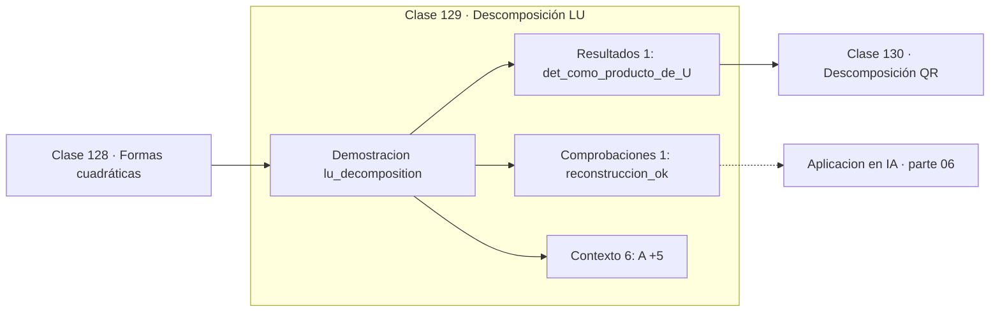

# 129 — Descomposición LU

> [⬅️ 128 Formas cuadráticas](../128-formas-cuadraticas/README.md) · [📚 Parte 06](../README.md) · [🏠 Programa](../../../README.md) · [130 Descomposición QR ➡️](../130-descomposicion-qr/README.md)

**Parte:** 06 — Álgebra lineal II: descomposiciones y tensores · **Nivel:** `intermedio-avanzado` · **Horas estimadas:** 4
**Motor:** `engines.part06` · **Demostración:** `lu_decomposition` · **Clase 9 de 20** de la parte

---

## 🎯 Propósito

**LU factoriza una vez y resuelve muchos sistemas: O(n³) una sola vez, O(n²) por cada b.**

Cambio de base, autovalores, diagonalización, LU, QR, mínimos cuadrados, SVD, pseudoinversa, PCA y álgebra tensorial.

## ✅ Resultados de aprendizaje

Al terminar podrás:

1. Explicar **Descomposición LU** con lenguaje cotidiano y con notación matemática.
2. Resolver un caso pequeño a mano y anticipar el orden de magnitud del resultado.
3. Ejecutar y modificar `lab.py`, que corre la demostración `lu_decomposition`.
4. Interpretar las 8 salidas del laboratorio y decir qué comprueba cada una.
5. Detectar el error típico de esta parte: confundir el orden de los índices al reordenar un tensor.

## 🧩 Fórmulas de la clase

```text
A = LU
resolver: Ly = b (hacia delante), luego Ux = y (hacia atrás)
det(A) = Π uᵢᵢ
```

## 🗺️ Ubicación en el programa



## 📖 Fundamentos

La factorización LU descompone una matriz en el producto de una triangular inferior con
unos en la diagonal y una triangular superior. No es un algoritmo nuevo: es la
eliminación de Gauss guardando los multiplicadores en lugar de descartarlos.

Su valor está en la reutilización. Factorizar cuesta `O(n³/3)`, pero una vez hecho,
resolver `Ax = b` para cada nuevo `b` cuesta solo `O(n²)`: dos sustituciones
triangulares. Si hay que resolver mil sistemas con la misma matriz —caso frecuente en
simulación y en métodos implícitos— la diferencia es de tres órdenes de magnitud.

Como subproducto, el determinante sale gratis: es el producto de la diagonal de `U`,
corregido por el signo de los intercambios de fila. Calcularlo así cuesta `O(n³)` en
lugar del `O(n!)` de la definición de Laplace.

La versión sin pivoteo que implementa el motor —Doolittle— falla si aparece un pivote
nulo, y es numéricamente frágil con pivotes pequeños. Las bibliotecas reales usan LU con
pivoteo parcial (`PA = LU`), y por eso `scipy.linalg.lu` devuelve también una matriz de
permutación.

## 🧮 Ejemplo trabajado

Factorizar una matriz 2×2.

```text
A = [[4,3],[6,3]]

L = [[1,   0],      U = [[4,  3],
     [1.5, 1]]           [0, −1.5]]

L·U = [[4,3],[6,3]] = A                    ✓

det(A) = 4 · (−1.5) = −6                   ✓

Coste:
  factorizar:               O(n³/3)
  cada sistema adicional:   O(n²)
```

## 🔬 Qué ejecuta el laboratorio

`lu_decomposition` — LU: factorizar una vez, resolver muchos sistemas.

| Grupo | Salidas |
|---|---|
| 🔢 Resultados numéricos (1) | `det_como_producto_de_U` |
| ✅ Comprobaciones de invariante (1) | `reconstruccion_ok` |

Las claves booleanas no son adorno: si alguna fuera `False`, el resultado numérico
no sería fiable aunque el programa terminase sin error.

```bash
python classes/part-06-algebra-lineal-ii-descomposiciones-y-tensores/129-descomposicion-lu/lab.py
compmath run 129
```

> [!TIP]
> Antes de ejecutar, **escribe tu predicción**. Un laboratorio que confirma lo que
> esperabas enseña tanto como uno que te contradice, pero solo si la predicción
> existía antes del resultado.

## ⚠️ Errores conceptuales frecuentes

1. Usar LU sin pivoteo con matrices que lo requieren.
2. Refactorizar la matriz para cada nuevo lado derecho.
3. Olvidar el signo de los intercambios al calcular el determinante.

## 🚀 Dónde se usa de verdad

Solvers de sistemas lineales, métodos implícitos en EDO, simulación con la misma matriz
y muchos lados derechos, y cálculo eficiente de determinantes.

## 🤖 Conexión con IA

LoRA factoriza matrices de bajo rango, la atención se define con productos tensoriales y la estabilidad del entrenamiento depende del espectro de los pesos.

## 📓 Notebooks

| Archivo | Para qué |
|---|---|
| [`notebook.ipynb`](notebook.ipynb) | recorrido guiado con la demostración ejecutada |
| [`notebook_student.ipynb`](notebook_student.ipynb) | versión con `TODO` para resolver |
| [`notebook_solution.ipynb`](notebook_solution.ipynb) | solución de referencia verificada |

## 📝 Evaluación

| Criterio | Peso |
|---|---:|
| Comprensión conceptual | 25 % |
| Resolución manual | 25 % |
| Implementación y verificación | 25 % |
| Interpretación y comunicación | 15 % |
| Conexión con aplicación real | 10 % |

Detalle y criterios de error crítico en [`assessment.md`](assessment.md).

## ❓ Preguntas de comprobación

1. ¿Cuál es la entrada, cuál la salida y qué unidades tienen?
2. ¿Qué operación domina el comportamiento del resultado?
3. ¿Qué caso extremo revelaría un error conceptual?
4. ¿Cómo verificarías el resultado por un método independiente?
5. ¿Dónde aparece esto en compresión?

Si necesitas releer el código para responderlas, la clase todavía no está superada.

## 📥 Entregable

`notebook_student.ipynb` resuelto más un párrafo que explique el resultado **sin citar
código**: qué entra, qué sale, qué invariante se comprueba y qué pasaría en un caso límite.

## 🔗 Referencias

- [Golub & Van Loan. *Matrix Computations*, 4ª ed., 2013, cap. 3](https://jhupbooks.press.jhu.edu/title/matrix-computations)
- [SciPy: `scipy.linalg.lu`](https://docs.scipy.org/doc/scipy/reference/generated/scipy.linalg.lu.html)

Bibliografía completa de la parte en [`../../../docs/BIBLIOGRAPHY.md`](../../../docs/BIBLIOGRAPHY.md).

## 📂 Material de la clase

[`intuition.md`](intuition.md) · [`theory.md`](theory.md) · [`derivation.md`](derivation.md) · [`exercises.md`](exercises.md) · [`assessment.md`](assessment.md) · [`where-is-this-used.md`](where-is-this-used.md) · [`lesson.yaml`](lesson.yaml)

---

> [⬅️ 128 Formas cuadráticas](../128-formas-cuadraticas/README.md) · [📚 Parte 06](../README.md) · [🏠 Programa](../../../README.md) · [130 Descomposición QR ➡️](../130-descomposicion-qr/README.md)
