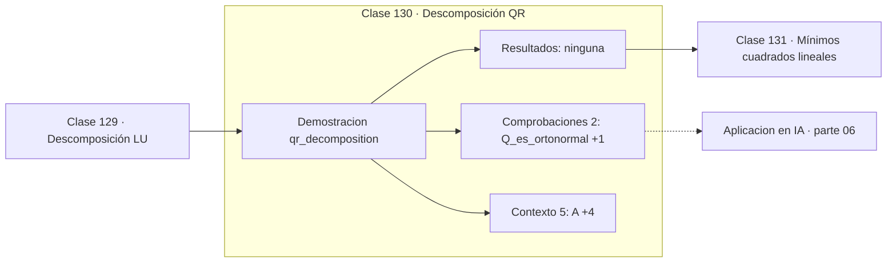

# 130 — Descomposición QR

> [⬅️ 129 Descomposición LU](../129-descomposicion-lu/README.md) · [📚 Parte 06](../README.md) · [🏠 Programa](../../../README.md) · [131 Mínimos cuadrados lineales ➡️](../131-minimos-cuadrados-lineales/README.md)

**Parte:** 06 — Álgebra lineal II: descomposiciones y tensores · **Nivel:** `intermedio-avanzado` · **Horas estimadas:** 4
**Motor:** `engines.part06` · **Demostración:** `qr_decomposition` · **Clase 10 de 20** de la parte

---

## 🎯 Propósito

**QR produce una base ortonormal del espacio columna y es la vía estable para mínimos cuadrados.**

Cambio de base, autovalores, diagonalización, LU, QR, mínimos cuadrados, SVD, pseudoinversa, PCA y álgebra tensorial.

## ✅ Resultados de aprendizaje

Al terminar podrás:

1. Explicar **Descomposición QR** con lenguaje cotidiano y con notación matemática.
2. Resolver un caso pequeño a mano y anticipar el orden de magnitud del resultado.
3. Ejecutar y modificar `lab.py`, que corre la demostración `qr_decomposition`.
4. Interpretar las 7 salidas del laboratorio y decir qué comprueba cada una.
5. Detectar el error típico de esta parte: aplicar pca sin centrar (ni escalar) los datos.

## 🧩 Fórmulas de la clase

```text
A = QR,  QᵀQ = I,  R triangular superior
resolver mínimos cuadrados: Rx = Qᵀb
```

## 🗺️ Ubicación en el programa



## 📖 Fundamentos

La factorización QR escribe una matriz como el producto de una ortogonal y una
triangular superior. Las columnas de `Q` son una base ortonormal del espacio columna de
`A`, obtenida ortonormalizando sus columnas.

Su importancia es numérica. Resolver mínimos cuadrados por las ecuaciones normales exige
formar `AᵀA`, lo que **eleva al cuadrado el número de condición** (clase 112). Con QR no
hace falta: el problema se reduce a `Rx = Qᵀb`, una sustitución triangular, y la
condición se conserva. La diferencia es la que separa seis dígitos correctos de doce.

El método de Gram-Schmidt que implementa el motor es el más legible pero no el más
estable: la ortogonalidad se degrada con matrices mal condicionadas. Las bibliotecas
usan reflexiones de Householder, que son ortogonales exactas salvo redondeo. La versión
«modificada» de Gram-Schmidt es un punto intermedio.

QR también es la base del algoritmo estándar para calcular autovalores: iterar
`A ← RQ` converge a una forma triangular cuya diagonal son los autovalores. Es uno de los
algoritmos más influyentes del siglo XX.

## 🧮 Ejemplo trabajado

QR de una matriz 3×2.

```text
A = [[1,1],
     [1,0],
     [0,1]]

Q (3×2, columnas ortonormales):
  [[0.7071,  0.4082],
   [0.7071, −0.4082],
   [0,       0.8165]]

R = [[1.4142, 0.7071],
     [0,      1.2247]]

QᵀQ = I                                    ✓ ortonormal
QR  = A                                    ✓ reconstruye
R triangular superior                      ✓
```

## 🔬 Qué ejecuta el laboratorio

`qr_decomposition` — QR por Gram-Schmidt: base ortonormal del espacio columna.

| Grupo | Salidas |
|---|---|
| 🔢 Resultados numéricos (0) | — |
| ✅ Comprobaciones de invariante (2) | `Q_es_ortonormal`, `R_es_triangular_superior` |

Las claves booleanas no son adorno: si alguna fuera `False`, el resultado numérico
no sería fiable aunque el programa terminase sin error.

```bash
python classes/part-06-algebra-lineal-ii-descomposiciones-y-tensores/130-descomposicion-qr/lab.py
compmath run 130
```

> [!TIP]
> Antes de ejecutar, **escribe tu predicción**. Un laboratorio que confirma lo que
> esperabas enseña tanto como uno que te contradice, pero solo si la predicción
> existía antes del resultado.

## ⚠️ Errores conceptuales frecuentes

1. Usar Gram-Schmidt clásico en matrices mal condicionadas.
2. Formar AᵀA cuando QR resuelve el mismo problema mejor.
3. Suponer que Q es cuadrada: en la QR reducida tiene el shape de A.

## 🚀 Dónde se usa de verdad

Mínimos cuadrados estables, cálculo de autovalores por el algoritmo QR,
ortonormalización de bases y regresión numéricamente robusta.

## 🤖 Conexión con IA

LoRA factoriza matrices de bajo rango, la atención se define con productos tensoriales y la estabilidad del entrenamiento depende del espectro de los pesos.

## 📓 Notebooks

| Archivo | Para qué |
|---|---|
| [`notebook.ipynb`](notebook.ipynb) | recorrido guiado con la demostración ejecutada |
| [`notebook_student.ipynb`](notebook_student.ipynb) | versión con `TODO` para resolver |
| [`notebook_solution.ipynb`](notebook_solution.ipynb) | solución de referencia verificada |

## 📝 Evaluación

| Criterio | Peso |
|---|---:|
| Comprensión conceptual | 25 % |
| Resolución manual | 25 % |
| Implementación y verificación | 25 % |
| Interpretación y comunicación | 15 % |
| Conexión con aplicación real | 10 % |

Detalle y criterios de error crítico en [`assessment.md`](assessment.md).

## ❓ Preguntas de comprobación

1. ¿Cuál es la entrada, cuál la salida y qué unidades tienen?
2. ¿Qué operación domina el comportamiento del resultado?
3. ¿Qué caso extremo revelaría un error conceptual?
4. ¿Cómo verificarías el resultado por un método independiente?
5. ¿Dónde aparece esto en compresión?

Si necesitas releer el código para responderlas, la clase todavía no está superada.

## 📥 Entregable

`notebook_student.ipynb` resuelto más un párrafo que explique el resultado **sin citar
código**: qué entra, qué sale, qué invariante se comprueba y qué pasaría en un caso límite.

## 📚 Bibliografía de la clase

Esta clase enseña **Álgebra lineal · Álgebra lineal numérica**. Cada obra dice qué aporta aquí y cómo se comprobó su localizador:

- [Trefethen & Bau. *Numerical Linear Algebra*, SIAM, 1997, lecc. 7-10](https://epubs.siam.org/doi/book/10.1137/1.9780898719574) — Álgebra lineal y Álgebra lineal numérica: el tema de esta clase · ISBN-13 `9780898719574` verificado en International ISBN Agency (2026-08-19).
- [Golub & Van Loan. *Matrix Computations*, 4ª ed., 2013, cap. 5](https://jhupbooks.press.jhu.edu/title/matrix-computations) — Álgebra lineal y Álgebra lineal numérica: el tema de esta clase · ISBN-13 `9781421407944` verificado en International ISBN Agency (2026-08-19).

Bibliografía de todas las clases, con el porqué de cada obra, en [`docs/BIBLIOGRAPHY.md`](../../../docs/BIBLIOGRAPHY.md) · localizador y estado de cada obra en [`sources/bibliography.json`](../../../sources/bibliography.json).

## 📂 Material de la clase

[`intuition.md`](intuition.md) · [`theory.md`](theory.md) · [`derivation.md`](derivation.md) · [`exercises.md`](exercises.md) · [`assessment.md`](assessment.md) · [`where-is-this-used.md`](where-is-this-used.md) · [`lesson.yaml`](lesson.yaml)

---

> [⬅️ 129 Descomposición LU](../129-descomposicion-lu/README.md) · [📚 Parte 06](../README.md) · [🏠 Programa](../../../README.md) · [131 Mínimos cuadrados lineales ➡️](../131-minimos-cuadrados-lineales/README.md)
