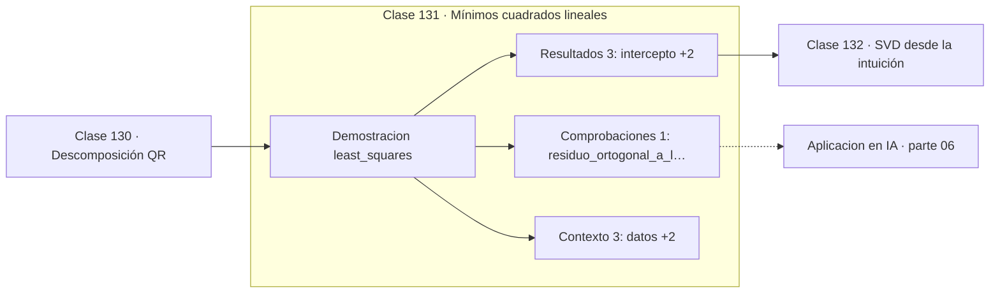

# 131 — Mínimos cuadrados lineales

> [⬅️ 130 Descomposición QR](../130-descomposicion-qr/README.md) · [📚 Parte 06](../README.md) · [🏠 Programa](../../../README.md) · [132 SVD desde la intuición ➡️](../132-svd-desde-la-intuicion/README.md)

**Parte:** 06 — Álgebra lineal II: descomposiciones y tensores · **Nivel:** `intermedio-avanzado` · **Horas estimadas:** 4
**Motor:** `engines.part06` · **Demostración:** `least_squares` · **Clase 11 de 20** de la parte

---

## 🎯 Propósito

**Mínimos cuadrados es la proyección de b sobre el espacio columna, y su residuo es ortogonal a él.**

Cambio de base, autovalores, diagonalización, LU, QR, mínimos cuadrados, SVD, pseudoinversa, PCA y álgebra tensorial.

## ✅ Resultados de aprendizaje

Al terminar podrás:

1. Explicar **Mínimos cuadrados lineales** con lenguaje cotidiano y con notación matemática.
2. Resolver un caso pequeño a mano y anticipar el orden de magnitud del resultado.
3. Ejecutar y modificar `lab.py`, que corre la demostración `least_squares`.
4. Interpretar las 7 salidas del laboratorio y decir qué comprueba cada una.
5. Detectar el error típico de esta parte: interpretar autovalores complejos como error de cálculo.

## 🧩 Fórmulas de la clase

```text
min ‖Ax − b‖²
ecuaciones normales: AᵀAx = Aᵀb
residuo ortogonal: Aᵀ(Ax − b) = 0
```

## 🗺️ Ubicación en el programa



## 📖 Fundamentos

Cuando un sistema tiene más ecuaciones que incógnitas, en general no hay solución exacta.
Mínimos cuadrados busca la que minimiza la norma del residuo, y esa solución tiene una
caracterización geométrica limpia: es la **proyección ortogonal** de `b` sobre el espacio
columna de `A` (clase 119).

Derivar el objetivo `‖Ax − b‖²` e igualar a cero da directamente las ecuaciones
normales. La condición de ortogonalidad del residuo no es un requisito adicional: es
equivalente a que el gradiente se anule. Álgebra y geometría dicen lo mismo.

Por qué se minimiza el **cuadrado** del residuo y no su valor absoluto tiene dos razones.
La analítica: el cuadrado es derivable en todas partes y da solución cerrada, mientras
que el valor absoluto exige programación lineal. Y la estadística: bajo error gaussiano,
minimizar el error cuadrático **es** maximizar la verosimilitud (clase 215). No es una
elección arbitraria, es la consecuencia de un supuesto.

La contrapartida es la sensibilidad a valores atípicos: elevar al cuadrado da mucho peso
a los errores grandes. Cuando eso es un problema, se usan pérdidas robustas como Huber
(clase 304), a costa de perder la solución cerrada.

## 🧮 Ejemplo trabajado

Ajustar una recta a cinco puntos.

```text
datos: (0,1.0) (1,3.1) (2,4.9) (3,7.2) (4,8.9)

A = [[1,0],[1,1],[1,2],[1,3],[1,4]]
b = (1.0, 3.1, 4.9, 7.2, 8.9)

Ecuaciones normales AᵀA x = Aᵀb:
  intercepto = 1.02,  pendiente = 2.00

residuos: (−0.02, 0.08, −0.13, 0.16, −0.09)
SSE = 0.058

Verificación: Aᵀ·residuo = (0, 0)         ✓ ortogonal
```

## 🔬 Qué ejecuta el laboratorio

`least_squares` — Mínimos cuadrados por ecuaciones normales.

| Grupo | Salidas |
|---|---|
| 🔢 Resultados numéricos (3) | `intercepto`, `pendiente`, `SSE` |
| ✅ Comprobaciones de invariante (1) | `residuo_ortogonal_a_las_columnas` |

Las claves booleanas no son adorno: si alguna fuera `False`, el resultado numérico
no sería fiable aunque el programa terminase sin error.

```bash
python classes/part-06-algebra-lineal-ii-descomposiciones-y-tensores/131-minimos-cuadrados-lineales/lab.py
compmath run 131
```

> [!TIP]
> Antes de ejecutar, **escribe tu predicción**. Un laboratorio que confirma lo que
> esperabas enseña tanto como uno que te contradice, pero solo si la predicción
> existía antes del resultado.

## ⚠️ Errores conceptuales frecuentes

1. Usar mínimos cuadrados con valores atípicos sin considerar una pérdida robusta.
2. Resolver por ecuaciones normales cuando la matriz está mal condicionada.
3. Interpretar el SSE sin normalizar por el número de datos ni compararlo con una línea base.

## 🚀 Dónde se usa de verdad

Regresión lineal, calibración de sensores, ajuste de curvas, estimación de parámetros y
resolución de sistemas sobredeterminados.

## 🤖 Conexión con IA

LoRA factoriza matrices de bajo rango, la atención se define con productos tensoriales y la estabilidad del entrenamiento depende del espectro de los pesos.

## 📓 Notebooks

| Archivo | Para qué |
|---|---|
| [`notebook.ipynb`](notebook.ipynb) | recorrido guiado con la demostración ejecutada |
| [`notebook_student.ipynb`](notebook_student.ipynb) | versión con `TODO` para resolver |
| [`notebook_solution.ipynb`](notebook_solution.ipynb) | solución de referencia verificada |

## 📝 Evaluación

| Criterio | Peso |
|---|---:|
| Comprensión conceptual | 25 % |
| Resolución manual | 25 % |
| Implementación y verificación | 25 % |
| Interpretación y comunicación | 15 % |
| Conexión con aplicación real | 10 % |

Detalle y criterios de error crítico en [`assessment.md`](assessment.md).

## ❓ Preguntas de comprobación

1. ¿Cuál es la entrada, cuál la salida y qué unidades tienen?
2. ¿Qué operación domina el comportamiento del resultado?
3. ¿Qué caso extremo revelaría un error conceptual?
4. ¿Cómo verificarías el resultado por un método independiente?
5. ¿Dónde aparece esto en compresión?

Si necesitas releer el código para responderlas, la clase todavía no está superada.

## 📥 Entregable

`notebook_student.ipynb` resuelto más un párrafo que explique el resultado **sin citar
código**: qué entra, qué sale, qué invariante se comprueba y qué pasaría en un caso límite.

## 📚 Bibliografía de la clase

Esta clase enseña **Álgebra lineal · Álgebra lineal numérica**. Cada obra dice qué aporta aquí y cómo se comprobó su localizador:

- [Björck, Å. *Numerical Methods for Least Squares Problems*. SIAM, 1996](https://epubs.siam.org/doi/book/10.1137/1.9781611971484) — Álgebra lineal numérica: el tema de esta clase · ISBN-13 `9781611971484` verificado en International ISBN Agency (2026-08-20).
- [Strang, G. *Introduction to Linear Algebra*, 6ª ed., 2023, cap. 4](https://math.mit.edu/~gs/linearalgebra/) — Álgebra lineal: el tema de esta clase · ISBN-13 `9781733146678` verificado en International ISBN Agency (2026-08-19).

Bibliografía de todas las clases, con el porqué de cada obra, en [`docs/BIBLIOGRAPHY.md`](../../../docs/BIBLIOGRAPHY.md) · localizador y estado de cada obra en [`sources/bibliography.json`](../../../sources/bibliography.json).

## 📂 Material de la clase

[`intuition.md`](intuition.md) · [`theory.md`](theory.md) · [`derivation.md`](derivation.md) · [`exercises.md`](exercises.md) · [`assessment.md`](assessment.md) · [`where-is-this-used.md`](where-is-this-used.md) · [`lesson.yaml`](lesson.yaml)

---

> [⬅️ 130 Descomposición QR](../130-descomposicion-qr/README.md) · [📚 Parte 06](../README.md) · [🏠 Programa](../../../README.md) · [132 SVD desde la intuición ➡️](../132-svd-desde-la-intuicion/README.md)
