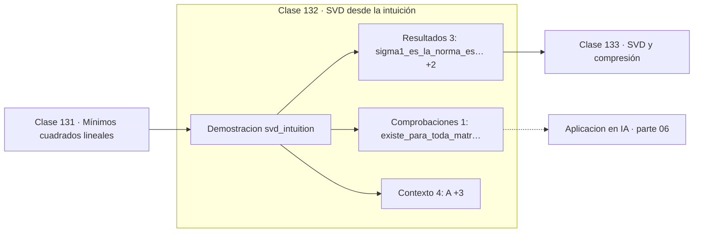

# 132 — SVD desde la intuición

> [⬅️ 131 Mínimos cuadrados lineales](../131-minimos-cuadrados-lineales/README.md) · [📚 Parte 06](../README.md) · [🏠 Programa](../../../README.md) · [133 SVD y compresión ➡️](../133-svd-y-compresion/README.md)

**Parte:** 06 — Álgebra lineal II: descomposiciones y tensores · **Nivel:** `intermedio-avanzado` · **Horas estimadas:** 4
**Motor:** `engines.part06` · **Demostración:** `svd_intuition` · **Clase 12 de 20** de la parte

---

## 🎯 Propósito

**La SVD existe para toda matriz y de ella se leen rango, condición y estructura.**

Cambio de base, autovalores, diagonalización, LU, QR, mínimos cuadrados, SVD, pseudoinversa, PCA y álgebra tensorial.

## ✅ Resultados de aprendizaje

Al terminar podrás:

1. Explicar **SVD desde la intuición** con lenguaje cotidiano y con notación matemática.
2. Resolver un caso pequeño a mano y anticipar el orden de magnitud del resultado.
3. Ejecutar y modificar `lab.py`, que corre la demostración `svd_intuition`.
4. Interpretar las 8 salidas del laboratorio y decir qué comprueba cada una.
5. Detectar el error típico de esta parte: confundir el orden de los índices al reordenar un tensor.

## 🧩 Fórmulas de la clase

```text
A = UΣVᵀ
σᵢ = √(autovalores de AᵀA)
κ(A) = σ_max / σ_min
```

## 🗺️ Ubicación en el programa



## 📖 Fundamentos

La descomposición en valores singulares escribe cualquier matriz —cuadrada o no,
invertible o no— como el producto de una rotación, un escalado por ejes y otra rotación.
Esa universalidad es lo que la hace la herramienta más útil del álgebra lineal aplicada:
donde la diagonalización falla, la SVD funciona.

Los **valores singulares** son las cantidades por las que la matriz estira cada dirección
principal, ordenados de mayor a menor. Su lectura es directa: el mayor es la norma
espectral de la matriz, el número de no nulos es el rango, y el cociente entre el mayor y
el menor es el **número de condición**. Tres diagnósticos de una sola descomposición.

El número de condición es el indicador correcto de mal condicionamiento, no el
determinante (clase 117). Una matriz puede tener determinante minúsculo y condición 1
—si está simplemente escalada— o determinante razonable y condición 10¹² —si tiene una
dirección casi degenerada—. Solo el segundo caso es problemático.

El rango **numérico** se define con la SVD y una tolerancia: cuántos valores singulares
superan un umbral relativo al mayor. Es la definición que usan las bibliotecas, porque
en datos reales el rango exacto casi siempre es completo por culpa del ruido, aunque la
estructura sea de rango bajo.

## 🧮 Ejemplo trabajado

SVD de una matriz 2×2.

```text
A = [[3,0],
     [4,5]]

valores singulares: σ₁ = 6.7082,  σ₂ = 2.2361

norma espectral   = σ₁ = 6.7082
número de condición = 6.7082/2.2361 = 3.0
rango numérico    = 2  (ambos σ > tolerancia)

A = UΣVᵀ reconstruye la matriz              ✓

Existe para TODA matriz, incluso rectangular y singular.
```

## 🔬 Qué ejecuta el laboratorio

`svd_intuition` — SVD: rotar, escalar, rotar. Existe siempre.

| Grupo | Salidas |
|---|---|
| 🔢 Resultados numéricos (3) | `sigma1_es_la_norma_espectral`, `numero_de_condicion`, `rango_numerico` |
| ✅ Comprobaciones de invariante (1) | `existe_para_toda_matriz` |

Las claves booleanas no son adorno: si alguna fuera `False`, el resultado numérico
no sería fiable aunque el programa terminase sin error.

```bash
python classes/part-06-algebra-lineal-ii-descomposiciones-y-tensores/132-svd-desde-la-intuicion/lab.py
compmath run 132
```

> [!TIP]
> Antes de ejecutar, **escribe tu predicción**. Un laboratorio que confirma lo que
> esperabas enseña tanto como uno que te contradice, pero solo si la predicción
> existía antes del resultado.

## ⚠️ Errores conceptuales frecuentes

1. Usar el determinante como indicador de condicionamiento.
2. Calcular la SVD vía AᵀA con matrices mal condicionadas: eleva la condición al cuadrado.
3. Suponer que los valores singulares son los autovalores: coinciden solo si A es simétrica semidefinida positiva.

## 🚀 Dónde se usa de verdad

Diagnóstico de condicionamiento, rango numérico, pseudoinversa, compresión, PCA,
recomendación por factorización y regularización truncada.

## 🤖 Conexión con IA

LoRA factoriza matrices de bajo rango, la atención se define con productos tensoriales y la estabilidad del entrenamiento depende del espectro de los pesos.

## 📓 Notebooks

| Archivo | Para qué |
|---|---|
| [`notebook.ipynb`](notebook.ipynb) | recorrido guiado con la demostración ejecutada |
| [`notebook_student.ipynb`](notebook_student.ipynb) | versión con `TODO` para resolver |
| [`notebook_solution.ipynb`](notebook_solution.ipynb) | solución de referencia verificada |

## 📝 Evaluación

| Criterio | Peso |
|---|---:|
| Comprensión conceptual | 25 % |
| Resolución manual | 25 % |
| Implementación y verificación | 25 % |
| Interpretación y comunicación | 15 % |
| Conexión con aplicación real | 10 % |

Detalle y criterios de error crítico en [`assessment.md`](assessment.md).

## ❓ Preguntas de comprobación

1. ¿Cuál es la entrada, cuál la salida y qué unidades tienen?
2. ¿Qué operación domina el comportamiento del resultado?
3. ¿Qué caso extremo revelaría un error conceptual?
4. ¿Cómo verificarías el resultado por un método independiente?
5. ¿Dónde aparece esto en compresión?

Si necesitas releer el código para responderlas, la clase todavía no está superada.

## 📥 Entregable

`notebook_student.ipynb` resuelto más un párrafo que explique el resultado **sin citar
código**: qué entra, qué sale, qué invariante se comprueba y qué pasaría en un caso límite.

## 🔗 Referencias

- [Trefethen & Bau. *Numerical Linear Algebra*, SIAM, 1997, lecc. 4-5](https://epubs.siam.org/doi/book/10.1137/1.9780898719574)
- [Golub & Van Loan. *Matrix Computations*, 4ª ed., 2013, cap. 2](https://jhupbooks.press.jhu.edu/title/matrix-computations)

Bibliografía completa de la parte en [`../../../docs/BIBLIOGRAPHY.md`](../../../docs/BIBLIOGRAPHY.md).

## 📂 Material de la clase

[`intuition.md`](intuition.md) · [`theory.md`](theory.md) · [`derivation.md`](derivation.md) · [`exercises.md`](exercises.md) · [`assessment.md`](assessment.md) · [`where-is-this-used.md`](where-is-this-used.md) · [`lesson.yaml`](lesson.yaml)

---

> [⬅️ 131 Mínimos cuadrados lineales](../131-minimos-cuadrados-lineales/README.md) · [📚 Parte 06](../README.md) · [🏠 Programa](../../../README.md) · [133 SVD y compresión ➡️](../133-svd-y-compresion/README.md)
